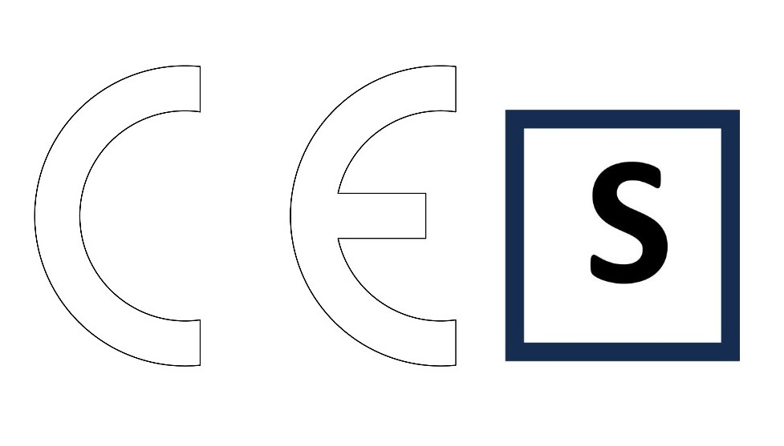

<!--

author:   Hilke Domsch
email:    hilke.domsch@gkz-ev.de
version:  0.0.15
language: de
narrator: Deutsch Male

comment:  Löten und Schweißen

edit:     true
date:     2025-07-23

logo:     https://raw.githubusercontent.com/Ifi-DiAgnostiK-Project/LiaScript-Courses/refs/heads/main/courses/img/burning.jpg
icon:     https://raw.githubusercontent.com/Ifi-DiAgnostiK-Project/LiaScript-Courses/refs/heads/main/img/Logo_234px.png

link:     style.css
import:   https://raw.githubusercontent.com/Ifi-DiAgnostiK-Project/Piktogramme/refs/heads/main/makros.md
          https://raw.githubusercontent.com/Ifi-DiAgnostiK-Project/LiaScript_DragAndDrop_Template/refs/heads/main/README.md
          https://raw.githubusercontent.com/Ifi-DiAgnostiK-Project/LiaScript_ImageQuiz/refs/heads/main/README.md

title:    Arbeits- und Gesundheitsschutz SHK-Anlagenmechaniker

tags:     [ SHK, Arbeitsschutz, Gesundheitsschutz, Anlagenmechaniker ]

-->

# Arbeits- und Gesundheitsschutz beim Löten und Schweißen 🦺

<section class="flex-container">

Im SHK-Handwerk arbeiten Sie mit Werkzeugen, Maschinen, Strom, Wasser und Gas – da ist Sicherheit besonders wichtig.

Arbeits- und Gesundheitsschutz bedeutet:

<!-- class="thumbup"-->
- Unfälle vermeiden
- gesund bleiben 
- aufeinander achten

Dazu gehören, z.B.:

<!--class="checkmark"-->
- das Tragen von Schutzkleidung
- sicheres Heben
- sauberes Arbeiten
- das Beachten von Regeln auf der Baustelle

<!-- style="width: 500px" -->

</section>

<!--class="highlight"-->
__Sicheres Arbeiten ist Teamarbeit – und Sie sind ein wichtiger Teil davon.__

## 1. Welche persönliche Schutzausrüstung (PSA) ist beim Schweißen unbedingt erforderlich?

<!-- class="highlight" -->
__Ziehe alle richtigen Symbole in das Antwortfeld. 🤔__

@dragdropmultiple(@uid,@Gebotszeichen.Gesichtsschutz.src|@Gebotszeichen.Augenschutz.src|@Gebotszeichen.Handschuh.src,@Gebotszeichen.Rettungsweste_benutzen.src|@Gebotszeichen.Rueckhaltesystem.src)

_Piktogramme Quelle: BGHM_

## 2. Wichtige Schutzmaßnahmen beim Schweißen und Löten

> __Hinweis:__ Es können mehrere Antworten richtig sein.

<section class="flex-container border">

<!-- class="highlight" -->
__Entscheiden Sie, welche Maßnahmen des Arbeitssicherheit und Gesundheitsschutz für Löt- und Schweißarbeiten zu beachten sind.  🤔__

<!-- data-randomize -->
- [[X]] Schutzausrüstung
- [[X]] Belüftung
- [[ ]] Abstimmung mit den Kollegen
- [[X]] Löschmittel in unmittelbarer Nähe
- [[X]] gereinigte Arbeitsstücke
- [[ ]] Beaufsichtigung der Arbeiten durch einen erfahrenen Fachmann

</section> 

<!-- class="highlight" -->
__Welche Schutzausrüstung und Sicherheitsmaßnahmen sind beim Löten zu beachten? Ziehen Sie die richtigen Bilder ins Antwortfeld. 🤔__

<!-- data-randomize -->
@dragdropmultiple(@uid,@Gebotszeichen.Augenschutz.src|@Gebotszeichen.Handschuh.src|@Gebotszeichen.Schutzkleidung.src|@Brandschutzzeichen.Feuerloescher.src|@Gebotszeichen.Haende_waschen.src,@Gebotszeichen.Rettungsweste_benutzen.src|@Warnzeichen.Brandfoerdernde_Stoffe.src|@Warnzeichen.Heisse_Oberflaeche.src|@Warnzeichen.Laserstrahl.src|@Gebotszeichen.Kopfschutz.src)

_Piktogramme Quelle: BGHM_

## 3. Gefahren beim Schweißen

> __Hinweis:__ Es können mehrere Antworten richtig sein.

<section class="flex-container border">

<!-- class="highlight" -->
__Sind besondere Schutzmaßnahmen gegen elektrischen Strom beim Schweißen notwendig? 🤔__

<!-- data-randomize -->
- [[X]] Ja. Zum Beispiel durch eine Isoliermatte unter den Füßen
- [[X]] Ja. Zum Beispiel durch elektrisch isolierende Schutzhandschuhe und Sicherheitsschuhe
- [[ ]] Es sind keine besonderen Maßnahmen notwendig.

</section> 

<section class="flex-container border">

<!-- class="highlight" -->
__Welche Risiken bestehen beim Schweißen?  🤔__

<!-- data-randomize -->
- [[X]] Gase und Dämpfe
- [[X]] Lärm
- [[X]] Elektrischer Schlag
- [[X]] UV-Strahlung
- [[X]] Brände und Explosionen

")<!-- style="max-width: 550px; width: 100%; margin-left: -60px; margin-top:50px;" -->

</section>

<section class="flex-container border">

<!-- class="highlight" -->
__Was ist beim Elektroschweißen zum Schutz vor elektrischem Strom zu beachten? 🤔__

<!-- data-randomize -->
- [[ ]] Ein Schweißeranzug bietet ausreichenden Schutz gegen elektrische Gefährdung.
- [[X]] Bei Schweißarbeiten auf metallenem Untergrund setze ich Isoliermatten ein.
- [[X]] Nasse und durchschwitzte Kleidung hat eine erhöhte elektrische Leitfähigkeit und sollte gewechselt werden.
- [[ ]] Beim Tragen von Sicherheitsschuhen mit isollierender Sohle kann es zu keiner elektrischen Körperdurchströmung kommen.

</section>

## 4. Weitere Quizfragen zum Thema Schweißen I

> __Hinweis:__ Es können mehrere Antworten richtig sein.

<section class="flex-container border">

<!-- class="highlight" -->
__Wie zünde ich die Flamme eines Gasschweißgeräts korrekt an?__

<!-- data-randomize -->
- [( )] Mit einem herkömmlichen Feuerzeug
- [(X)] Mit einem speziellen Gasanzünder
- [( )] Mit einem Streichholz

")<!-- style="max-width: 250px; width: 100%; margin-left: 0px; margin-top:50px;" -->

</section>

<section class="flex-container border">

<!-- class="highlight" -->
__Was ist beim Elektro-Handschweißen zu beachten? 🤔__

<!-- data-randomize -->
- [[ ]] Das Massekabel kann ich beliebig verlängern.
- [[X]] Ich nehme die Elektrode aus dem Elektrodenhalter und lege beides isoliert ab.
- [[X]] Zu meiner eigenen Sicherheit habe ich vor Arbeitsbeginn das Schweißgerät und die Leitung auf äußere Beschädigungen zu prüfen.
- [[ ]] Mit einem beschädigten Elektrodenhalter darf ich weiterarbeiten, wenn ich isolierende Schutzhandschuhe trage.
- [[ ]] Die elektrische Prüfung der Schweißstromquelle ist meine Aufgabe als Schweißer/Schweißerin.
- [[X]] Auch bei kurzfristigen Schweißarbeiten habe ich ein Schutzschild, einen Schutzschirm oder eine Schweißerschutzhaube zu tragen.

")<!-- style="max-width: 250px; width: 100%; margin-left: 0px; margin-top:100px;" -->

</section>

<section class="flex-container border">

<!-- class="highlight" -->
__Was ist beim Arbeiten mit dem Schweißbrenner zu beachten? 🤔__

<!-- data-randomize -->
- [[ ]] Das Ausmachen des Brenners erfolgt in der Reihenfolge: 1. Schließen des Sauerstoffventils, 2. Schließen des Brenngasventils
- [[X]] Der Schweißbrenner wird in folgender Reihenfolge gezündet: 1. Öffnen des Sauerstoffventil, 2. Öffnen des Brenngasventils
- [[X]] Heiße Brenner, die direkt an der Brenngasflasche angehängt werden, können zu einer punktförmigen Erhitzung der Flaschenwand führen und die gefährliche Zersetzung des Gases einleiten.

")<!-- style="max-width: 250px; width: 100%; margin-left: 20px; margin-top:30px;" -->

</section>

## 5. Weitere Quizfragen zum Schweißen II

> __Hinweis:__ Es können mehrere Antworten richtig sein.

<section class="flex-container border">

<!-- class="highlight" -->
__Welche Maßnahmen sind bei Schweißarbeiten an Behältern, die entzündbare oder explosive Stoffe enthalten, zu beachten? 🤔__

<!-- data-randomize -->
- [[ ]] Reste der Stoffe sind ungefährlich, solange diese nicht mit dem Lichtbogen des Schweißapparates in Berührung kommen.
- [[X]] Schweißarbeiten an geschlossenen Behältern darf ich nur unter Aufsicht ausführen.
- [[X]] Die Behälter müssen gereinigt und mit Wasser oder Schutzgas geflutet werden.
- [[ ]] Eine gründliche Reinigung der Behälter ist ausreichend.

")<!-- style="max-width: 250px; width: 100%; margin-left: 0px; margin-top:50px;" -->

</section>

<section class="flex-container border">

<!-- class="highlight" -->
__Welche Gefahren ergeben sich beim Autogenschweißen? Wie verhalten Sie sich? 🤔__

<!-- data-randomize -->
- [[X]] Durch die Enden der langen Schweißdrähte können Augen- und Gesichtsverletzungen verursacht werden. Deshalb biege ich die Enden rund.
- [[X]] Von der Schweißflamme und dem Schweißbad geht infrarote Strahlung aus. Deshalb ist das Tragen einer Schutzbrille mit Seitenschutz Pflicht.
- [[ ]] Die Stärke der schädlichen Strahlung ist höher als beim Schutzgasschweißen, ich sollte deshalb einen kompletten Kopfschutz tragen.
- [[ ]] Wegspritzende Schweißperlen kühlen so schnell ab, dass diese keine Verbrennungen verursachen.

")<!-- style="max-width: 250px; width: 100%; margin-left: 0px; margin-top:50px;" -->

</section>

<section class="flex-container border">

<!-- class="highlight" -->
__Wie verhalten Sie sich bei Entstehungsbränden in der Nähe von Gasflaschen? 🤔__

<!-- data-randomize -->
- [[X]] Wenn möglich, schließe ich geöffnete Flaschenventile, warne die Kollegen/Kolleginnen, räume die Umgebung und alarmiere die Feuerwehr.
- [[ ]] Hat eine Acetylenzersetzung bereits begonnen, versuche ich das Sauerstoffventil zu schließen.
- [[X]] Ich lösche die Flamme mit Pulver- oder CO2-Löscher, und kühle bei Bränden in der Nähe von Acetylenflaschen die Flasche bis zum Eintreffen der Feuerwehr mit kaltem Wasser.

")<!-- style="max-width: 150px; width: 100%; margin-left: 20px; margin-top:50px;" -->

</section>

## 6. Weitere Quizfragen zum Schweißen III

> __Hinweis:__ Es können mehrere Antworten richtig sein.

<section class="flex-container border">

<!-- class="highlight" -->
Welche Kennzeichnung steht für Schweißstromquellen, die beim Schweißen mit erhöhter elektrischer Gefährung eingesetzt werden müssen?  🤔

<!-- data-randomize -->
- [( )] CE
- [(X)] S

<!-- style="max-width: 250px; width: 100%; margin-left: 0px; margin-top:0px;" -->

</section>

<section class="flex-container border">

<!-- class="highlight" -->
__Was tun Sie gegen elektrische Gefährdung beim Schweißen? 🤔__

<!-- data-randomize -->
- [[X]] Durch eine ausreichende Isolierung meines Standplatzes kann ich mich gegen eine elektrische Durchströmung meines Körpers schützen.
- [[X]] Kabel mit schadhafter Isolation darf ich nicht verwenden. Sie können beim Schweißen zu schweren Unfällen führen.
- [[ ]] Wenn ich Persönliche Schutzausrüstung benutze, kann keine elektrische Gefährdung entstehen.
- [[ ]] Der Massekontakt hat keinen Einfluss auf die elektrische Gefährdung.

")<!-- style="max-width: 550px; width: 100%; margin-left: 20px; margin-top:50px;" -->

</section>

## 7. Weitere Quizfragen zum Löten

> __Hinweis:__ Es können mehrere Antworten richtig sein.

<section class="flex-container border">

<!-- class="highlight" -->
__Sie löten. Worauf achten Sie? 🤔__

<!-- data-randomize -->
- [[X]] Ich darf den Kopf nicht direkt über die Lötstelle beugen.
- [[ ]] Bei Weichlötarbeiten Wasser als Feuerlöschmittel bereithalten.
- [[X]] Löt- und Flussmitteldämpfe sind gesundheitsschädlich, deshalb ist die richtige Einstellung der Absauganlage wichtig.

")<!-- style="max-width: 200px; width: 100%; margin-left: 0px; margin-top:0px;" -->

</section>

<section class="flex-container border">

<!-- class="highlight" -->
Auf was achten Sie beim Weichlöten?  🤔

<!-- data-randomize -->
- [[ ]] Weichlote können nicht überhitzen.
- [[ ]] Das Lötgerät bedarf im Gegensatz zum Schweißgerät keiner besonderen Überprüfung.
- [[X]] Beim Weichlöten besteht erhöhte Brandgefahr.
- [[X]] Beim Flammlöten muss die Schutzbrille zusätzlich Schutz gegen Infrarotstrahlung bieten.

")<!-- style="max-width: 350px; width: 100%; margin-left: 0px; margin-top:0px;" -->

</section>

<section class="flex-container border">

<!-- class="highlight" -->
__Welche Gesundheitsgefahren bestehen beim Weichlöten? 🤔__

<!-- data-randomize -->
- [( )] Es gibt keine besonderen Gesundheitsgefahren beim Weichlöten.
- [(X)] Die Lot- und Flussmitteldämpfe sind gesundheitsschädlich.

")<!-- style="max-width: 300px; width: 100%; margin-left: 0px; margin-top:0px;" -->

</section>

# Geschafft 🎉

