<!--

author:   Hilke Domsch

email:    hilke.domsch@gkz-ev.de

version:  0.0.1

language: de

narrator: Deutsch Male

comment:  Arbeits- und Gesundheitsschutz Anlangenmechaniker

edit: true

date: 2025-07-23

logo: https://raw.githubusercontent.com/Ifi-DiAgnostiK-Project/LiaScript-Courses/refs/heads/main/courses/img/worker.jpg
icon: https://raw.githubusercontent.com/Ifi-DiAgnostiK-Project/LiaScript-Courses/refs/heads/main/img/Logo_234px.png

import: https://raw.githubusercontent.com/Ifi-DiAgnostiK-Project/LiaScript_DragAndDrop_Template/refs/heads/main/README.md
import: https://raw.githubusercontent.com/Ifi-DiAgnostiK-Project/LiaScript_DragAndDrop_Template/refs/heads/main/README.md
import: https://raw.githubusercontent.com/Ifi-DiAgnostiK-Project/LiaScript_ImageQuiz/refs/heads/main/README.md

title: Arbeits- und Gesundheitsschutz SHK-Anlagenmechaniker

tags:
    - SHK
    - Arbeitsschutz
    - Gesundheitsschutz
    - Anlagenmechaniker

@style
.flex-container {
    display: flex;
    flex-wrap: wrap; /* Allows the items to wrap as needed */
    align-items: stretch;
    gap: 20px; /* Adds both horizontal and vertical spacing between items */
}

.flex-child { 
    flex: 1;
    margin-right: 20px; /* Adds space between the columns */
}

@media (max-width: 600px) {
    .flex-child {
        flex: 100%; /* Makes the child divs take up the full width on slim devices */
        margin-right: 0; /* Removes the right margin */
    }
}
@end

-->

# Arbeits- und Gesundheitsschutz beim Löten und Schweißen 🦺

<section class="flex-container">

Im SHK-Handwerk arbeiten Sie mit Werkzeugen, Maschinen, Strom, Wasser und Gas – da ist Sicherheit besonders wichtig. 

Arbeits- und Gesundheitsschutz bedeutet: 

<!--style="font-weight: bolder;"-->👍 Unfälle vermeiden

<!--style="font-weight: bolder;"-->👍 gesund bleiben 

<!--style="font-weight: bolder;"-->👍 aufeinander achten

Dazu gehören, z. B.: 

✔️ das Tragen von Schutzkleidung

✔️ sicheres Heben

✔️ sauberes Arbeiten 

✔️das Beachten von Regeln auf der Baustelle

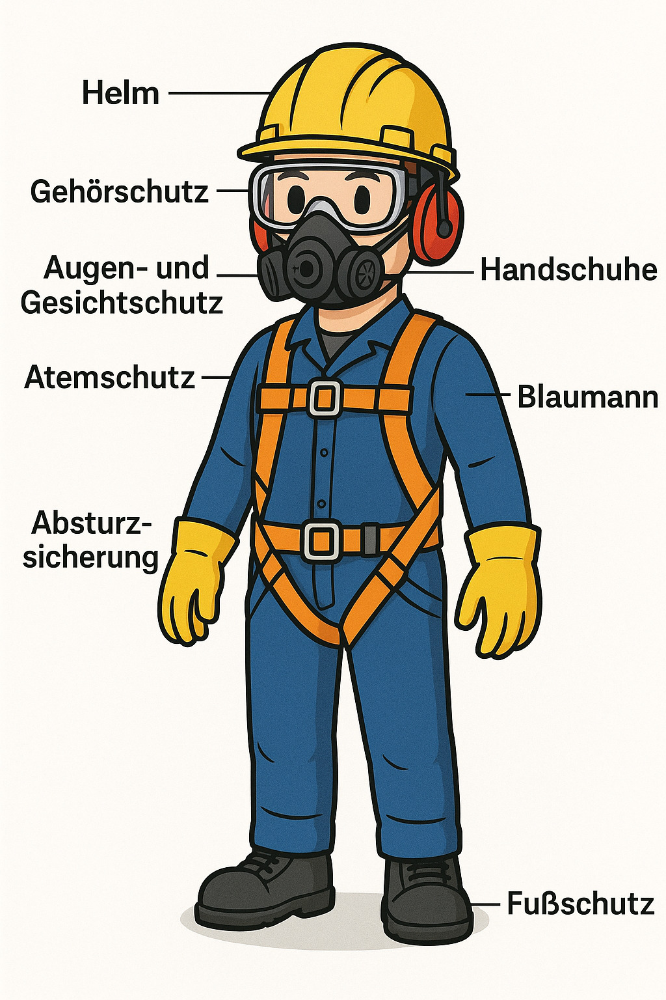<!-- style="width: 500px" -->

<a  href="https://www.seton.de/arbeitsunfaelle-schilder-schutzkleidung-psa" target=_blank>Quelle: Seton.de</a>

</section> 

<!--style="font-size: huge; color:blue; font-weight: bolder;"-->Sicheres Arbeiten ist Teamarbeit – und Sie sind ein wichtiger Teil davon.

## 1. Welche persönliche Schutzausrüstung (PSA) ist beim Schweißen unbedingt erforderlich?

<!--style="color:blue; font-weight: bolder;"-->Ziehe alle richtigen Symbole in das Antwortfeld. 🤔

<!-- data-randomize -->
@dragdropmultipleimages(@uid,@Gebotszeichen.Gesichtsschutz.src|@Gebotszeichen.Augenschutz.src|@Gebotszeichen.Handschuh.src,@Gebotszeichen.Rettungsweste_benutzen.src|@Gebotszeichen.Rueckhaltesystem.src)

_Quelle: BGHM_

## 2. Wichtige Schutzmaßnahmen beim Schweißen und Löten

<!--style="font-size: huge; color: red"-->Hinweis: Es können mehrere Antworten richtig sein. 

<!--style="color:blue; font-weight: bolder;"-->Entscheiden Sie, welche Maßnahmen des Arbeitssicherheit und Gesundheitsschutz für Löt- und Schweißarbeiten zu beachten sind.  🤔

<!-- data-randomize -->
- [[X]] Schutzausrüstung 
- [[X]] Belüftung
- [[ ]] Abstimmung mit den Kollegen 
- [[X]] Löschmittel in unmittelbarer Nähe
- [[X]] gereinigte Arbeitsstücke 
- [[ ]] Beaufsichtigung der Arbeiten durch einen erfahrenen Fachmann 

-----------------------

<!--style="color:blue; font-weight: bolder;"-->Welche Schutzausrüstung und Sicherheitsmaßnahmen sind beim Löten zu beachten? Ziehen Sie die richtigen Bilder ins Antwortfeld. 🤔

<!-- data-randomize -->
@dragdropmultipleimages(@uid,@Gebotszeichen.Augenschutz.src|@Gebotszeichen.Handschuh.src|@Gebotszeichen.Schutzkleidung.src|@Brandschutzzeichen.Feuerloescher.src|@Gebotszeichen.Haende_waschen.src,@Gebotszeichen.Rettungsweste_benutzen.src|@Warnzeichen.Brandfoerdernde_Stoffe.src|@Warnzeichen.Heisse_Oberflaeche.src|@Warnzeichen.Laserstrahl.src|@Gebotszeichen.Kopfschutz.src)

## 3. Gefahren beim Schweißen

<!--style="font-size: huge; color: red"-->Hinweis: Es können mehrere Antworten richtig sein. 

----------------

<!--style="color:blue; font-weight: bolder;"-->Sind besondere Schutzmaßnahmen gegen elektrischen Strom beim Schweißen notwendig? 🤔

<!-- data-randomize -->
- [[X]] Ja. Zum Beispiel durch eine Isoliermatte unter den Füßen
- [[X]] Ja. Zum Beispiel durch elektrisch isolierende Schutzhandschuhe und Sicherheitsschuhe
- [[ ]] Es sind keine besonderen Maßnahmen notwendig.

-----------------

<!--style="color:blue; font-weight: bolder;"-->Welche Risiken bestehen beim Schweißen?  🤔

<section class="flex-container">

<!-- data-randomize -->
- [[X]] Gase und Dämpfe
- [[X]] Lärm
- [[X]] Elektrischer Schlag
- [[X]] UV-Strahlung
- [[X]] Brände und Explosionen

<!-- style="width: 350px" -->

<a  href="https://www.zehnder-cleanairsolutions.com/de/blog/gefahren-beim-schweissen" target=_blank>Quelle: Zehnder-Cleanairsolutions.com</a>

</section> 

----------------

<!--style="color:blue; font-weight: bolder;"-->Was ist beim Elektroschweißen zum Schutz vor elektrischem Strom zu beachten?  🤔

<!-- data-randomize -->
- [[ ]] Ein Schweißeranzug bietet ausreichenden Schutz gegen elektrische Gefährdung.
- [[X]] Bei Schweißarbeiten auf metallenem Untergrund setze ich Isoliermatten ein. 
- [[X]] Nasse und durchschwitzte Kleidung hat eine erhöhte elektrische Leitfähigkeit und sollte gewechselt werden. 
- [[ ]] Beim Tragen von Sicherheitsschuhen mit isollierender Sohle kann es zu keiner elektrischen Körperdurchströmung kommen.

## 4. Weitere Quizfragen zum Schweißen I

<!--style="font-size: huge; color: red"-->Hinweis: Es können mehrere Antworten richtig sein. 

----------------

<!--style="color:blue; font-weight: bolder;"-->Was ist beim Elektroschweißen zum Schutz vor elektrischem Strom zu beachten?  🤔

<section class="flex-container">

<!-- data-randomize -->
- [( )] Mit einem Feuerzeug.
- [(X)] Mit einem Gasanzünder.

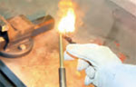<!-- style="width: 150px" -->

<a  href="https://www.vbg.de/zeitarbeit-fb/fragebogen/10/" target=_blank>Alle Bilder: VGB</a>

</section> 

----------------

<!--style="color:blue; font-weight: bolder;"-->Was ist beim Elektro-Handschweißen zu beachten?  🤔

<section class="flex-container">

<!-- data-randomize -->
- [[ ]] Das Massekabel kann ich beliebig verlängern.
- [[X]] Ich nehme die Elektrode aus dem Elektrodenhalter und lege beides isoliert ab. 
- [[X]] Zu meiner eigenen Sicherheit habe ich vor Arbeitsbeginn das Schweißgerät und die Leitung auf äußere Beschädigungen zu prüfen.
- [[ ]] Mit einem beschädigten Elektrodenhalter darf ich weiterarbeiten, wenn ich isolierende Schutzhandschuhe trage.
- [[ ]] Die elektrische Prüfung der Schweißstromquelle ist meine Aufgabe als Schweißer/Schweißerin. 
- [[X]] Auch bei kurzfristigen Schweißarbeiten habe ich ein Schutzschild, einen Schutzschirm oder eine Schweißerschutzhaube zu tragen. 

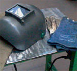<!-- style="width: 150px" -->

</section> 

----------------

<!--style="color:blue; font-weight: bolder;"-->Was ist beim Arbeiten mit dem Schweißbrenner zu beachten?  🤔

<section class="flex-container">

<!-- data-randomize -->
- [[ ]] Das Ausmachen des Brenners erfolgt in der Reihenfolge: 1. Schließen des Sauerstoffventils, 2. Schließen des Brenngasventils
- [[X]] Der Schweißbrenner wird in folgender Reihenfolge gezündet: 1. Öffnen des Sauerstoffventil, 2. Öffnen des Brenngasventils
- [[X]] Heiße Brenner, die direkt an der Brenngasflasche angehängt werden, können zu einer punktförmigen Erhitzung der Flaschenwand führen und die gefährliche Zersetzung des Gases einleiten. 

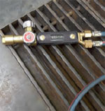<!-- style="width: 150px" -->

</section> 

## 5. Weitere Quizfragen zum Schweißen II

<!--style="font-size: huge; color: red"-->Hinweis: Es können mehrere Antworten richtig sein. 

----------------

<!--style="color:blue; font-weight: bolder;"-->Welche Maßnahmen sind bei Schweißarbeiten an Behältern, die entzündbare oder explosive Stoffe enthalten, zu beachten?  🤔

<section class="flex-container">

<!-- data-randomize -->
- [[ ]] Reste der Stoffe sind ungefährlich, solange diese nicht mit dem Lichtbogen des Schweißapparates in Berührung kommen.
- [[X]] Schweißarbeiten an geschlossenen Behältern darf ich nur unter Aufsicht ausführen. 
- [[X]] Die Behälter müssen gereinigt und mit Wasser oder Schutzgas geflutet werden.
- [[ ]] Eine gründliche Reinigung der Behälter ist ausreichend.

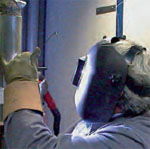<!-- style="width: 150px" -->

<a  href="https://www.vbg.de/zeitarbeit-fb/fragebogen/10/" target=_blank>Alle Bilder: VGB</a>

</section> 

---------------------

<!--style="color:blue; font-weight: bolder;"-->Welche Gefahren ergeben sich beim Autogenschweißen? Wie verhalten Sie sich?  🤔

<section class="flex-container">

<!-- data-randomize -->
- [[X]] Durch die Enden der langen Schweißdrähte können Augen- und Gesichtsverletzungen verursacht werden. Deshalb biege ich die Enden rund.
- [[X]] Von der Schweißflamme und dem Schweißbad geht infrarote Strahlung aus. Deshalb ist das Tragen einer Schutzbrille mit Seitenschutz Pflicht.
- [[ ]] Die Stärke der schädlichen Strahlung ist höher als beim Schutzgasschweißen, ich sollte deshalb einen kompletten Kopfschutz tragen.
- [[ ]] Wegspritzende Schweißperlen kühlen so schnell ab, dass diese keine Verbrennungen verursachen.

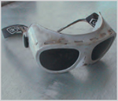<!-- style="width: 150px" -->

</section> 

---------------

<!--style="color:blue; font-weight: bolder;"-->Wie verhalten Sie sich bei Entstehungsbränden in der Nähe von Gasflaschen?  🤔

<section class="flex-container">

<!-- data-randomize -->
- [[X]] Wenn möglich, schließe ich geöffnete Flaschenventile, warne die Kollegen/Kolleginnen, räume die Umgebung und alarmiere die Feuerwehr.
- [[ ]] Hat eine Acetylenzersetzung bereits begonnen, versuche ich das Sauerstoffventil zu schließen.
- [[X]] Ich lösche die Flamme mit Pulver- oder CO2-Löscher, und kühle bei Bränden in der Nähe von Acetylenflaschen die Flasche bis zum Eintreffen der Feuerwehr mit kaltem Wasser.

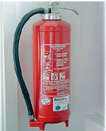<!-- style="width: 150px" -->

</section> 

## 6. Weitere Quizfragen zum Schweißen III

<!--style="font-size: huge; color: red"-->Hinweis: Es können mehrere Antworten richtig sein. 

-------------

<!--style="color:blue; font-weight: bolder;"-->Welche Kennzeichnung steht für Schweißstromquellen, die beim Schweißen mit erhöhter elektrischer Gefährung eingesetzt werden müssen?  🤔

<section class="flex-container">

<!-- data-randomize -->
- [( )] CE
- [(X)] S

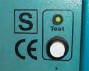<!-- style="width: 150px" -->

<a  href="https://www.vbg.de/zeitarbeit-fb/fragebogen/10/" target=_blank>Alle Bilder: VGB</a>

</section> 

-----------------

<!--style="color:blue; font-weight: bolder;"-->Was tun Sie egen elektrische Gefährdung beim Schweißen?  🤔

<section class="flex-container">

<!-- data-randomize -->
- [[X]] Durch eine ausreichende Isolierung meines Standplatzes kann ich mich gegen eine elektrische Durchströmung meines Körpers schützen.
- [[X]] Kabel mit schadhafter Isolation darf ich nicht verwenden. Sie können beim Schweißen zu schweren Unfällen führen.
- [[ ]] Wenn ich Persönliche Schutzausrüstung benutze, kann keine elektrische Gefährdung entstehen.
- [[ ]] Der Massekontakt hat keinen Einfluss auf die elektrische Gefährdung.

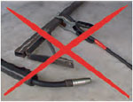<!-- style="width: 150px" -->

</section> 

## 7. Weitere Quizfragen zum Löten

<!--style="font-size: huge; color: red"-->Hinweis: Es können mehrere Antworten richtig sein. 

---------------

<!--style="color:blue; font-weight: bolder;"-->Sie löten. Worauf achten Sie?  🤔

<section class="flex-container">

<!-- data-randomize -->
- [[X]] Ich darf den Kopf nicht direkt über die Lötstelle beugen.
- [[ ]] Bei Weichlötarbeiten Wasser als Feuerlöschmittel bereithalten.
- [[X]] Löt- und Flussmitteldämpfe sind gesundheitsschädlich, deshalb ist die richtige Einstellung der Absauganlage wichtig.

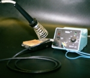<!-- style="width: 150px" -->

</section> 

--------------------

<!--style="color:blue; font-weight: bolder;"-->Auf was achten Sie beim Weichlöten?  🤔

<section class="flex-container">

<!-- data-randomize -->
- [[ ]] Weichlote können nicht überhitzen.
- [[ ]] Das Lötgerät bedarf im Gegensatz zum Schweißgerät keiner besonderen Überprüfung.
- [[X]] Beim Weichlöten besteht erhöhte Brandgefahr.
- [[X]] Beim Flammlöten muss die Schutzbrille zusätzlich Schutz gegen Infrarotstrahlung bieten.

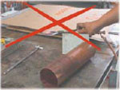<!-- style="width: 150px" -->

</section> 

--------------------

<!--style="color:blue; font-weight: bolder;"-->Welche Gesundheitsgefahren bestehen beim Weichlöten?  🤔

<section class="flex-container">

<!-- data-randomize -->
- [( )] Es gibt keine besonderen Gesundheitsgefahren beim Weichlöten.
- [(X)] Die Lot- und Flussmitteldämpfe sind gesundheitsschädlich.

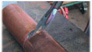<!-- style="width: 150px" -->

</section> 

-------------------

<!--style="color:green; font-weight: bolder;font-size:large"-->Geschafft ! 👏
