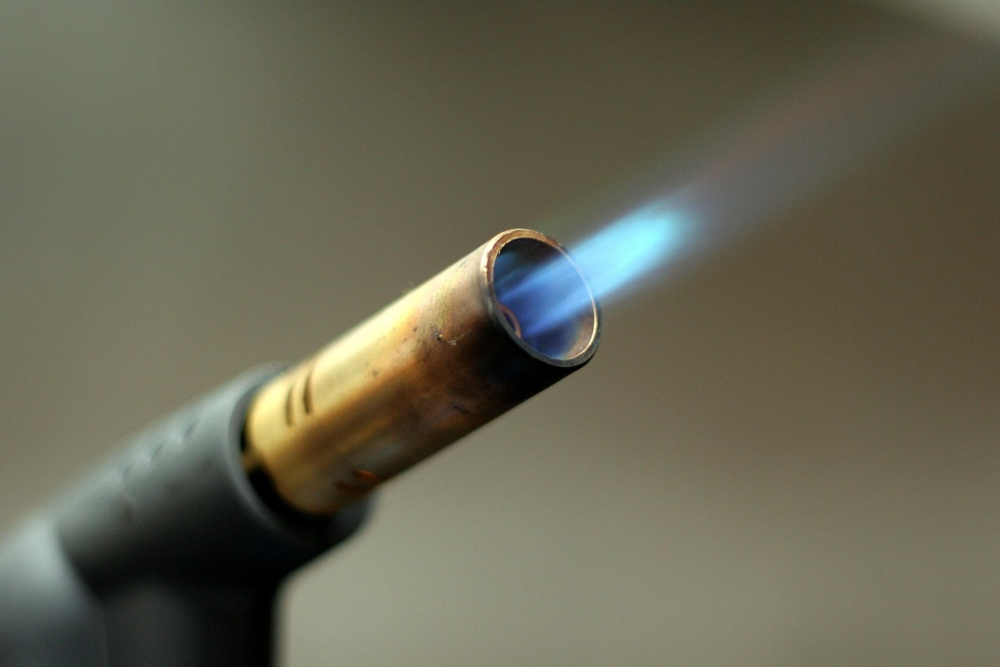
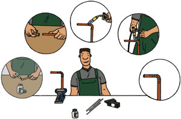
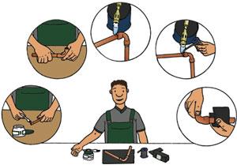
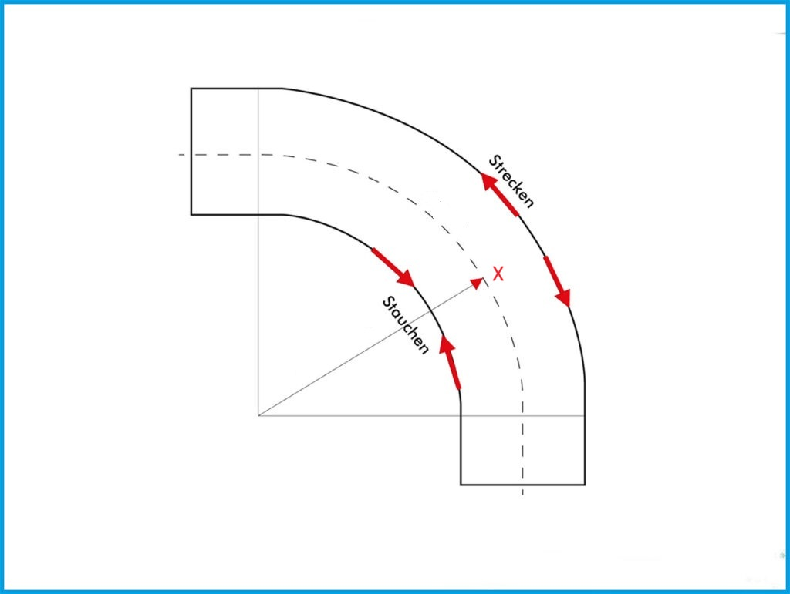

<!--

author:   Hilke Domsch

email:    hilke.domsch@gkz-ev.de

version:  0.0.3

language: de

narrator: Deutsch Male

comment:  Grundkurs SHK-Anlagenmechaniker G-IH 2

edit: true
date: 2025-07-21
logo: https://upload.wikimedia.org/wikipedia/commons/0/05/2006-02-15_Piping.jpg
icon: https://raw.githubusercontent.com/Ifi-DiAgnostiK-Project/LiaScript-Courses/refs/heads/main/img/Logo_234px.png

import: https://raw.githubusercontent.com/Ifi-DiAgnostiK-Project/LiaScript_DragAndDrop_Template/refs/heads/main/README.md
import: https://raw.githubusercontent.com/Ifi-DiAgnostiK-Project/LiaScript_DragAndDrop_Template/refs/heads/main/README.md
import: https://raw.githubusercontent.com/Ifi-DiAgnostiK-Project/LiaScript_ImageQuiz/refs/heads/main/README.md

title: Grundkurs SHK-Anlagenmechaniker G-IH 2
tags:
    - SHK
    - Grundkurs
    - Anlagenmechaniker

@style
.flex-container {
    display: flex;
    flex-wrap: wrap; /* Allows the items to wrap as needed */
    align-items: stretch;
    gap: 20px; /* Adds both horizontal and vertical spacing between items */
}

.flex-child { 
    flex: 1;
    margin-right: 20px; /* Adds space between the columns */
}

@media (max-width: 600px) {
    .flex-child {
        flex: 100%; /* Makes the child divs take up the full width on slim devices */
        margin-right: 0; /* Removes the right margin */
    }
}
@end

attribute: Main Image By Roger McLassus Installateur Notdienst Wien - Own work, CC BY-SA 3.0, https://commons.wikimedia.org/w/index.php?curid=578502
-->

# Grundkurs SHK-Anlagenmechaniker G - IH 2

Fügetechnik - Werkstücke und Bauteile aus gleichen und unterschiedlichen Werkstoffen fügen
===

<section class="flex-container" style="padding: 1rem;">

 <!-- style="height: 300px" -->

 <!-- style="height: 300px" -->

</section>

_Quelle: Pixabay_

## Überprüfungsaufgaben

<!--style="font-size: large"-->Sie haben in den letzten Tagen Werkstücke und Bauteile aus gleichen und unterschiedlichen Werkstoffen zusammengefügt.

<!--style="font-size: large"-->Mit den folgenden Fragen können Sie Ihr erworbenes Wissen überprüfen - viel Erfolg!

>_Hinweis: Es können mehrere Antworten richtig sein!_<!--style="color:blue; font-weight: bolder;"-->

<section class="flex-container" style="padding: 1rem;">

__Bild 1:__
 <!-- style="height: 300px" -->

__Bild 2:__
 <!-- style="height: 300px" -->

</section>

_Arbeitsgänge für Hart- und Weichlöten. Quelle: Strobel-Verlag. Bilder: BrazeTec GmbH, Hanau_,
https://www.ikz.de/ikz-praxis-archiv/p0108/010808.php_ 

----

<!--style="font-size: Large; font-weight: bolder;"-->Ordnen Sie die Bilder dem Arbeitsvorgang "Hartlöten" oder "Weichlöten" zu:

- [[Hartlöten] [Weichlöten]]
- [    [X]          [ ]     ]  Bild 1
- [    [ ]          [X]     ]  Bild 2

### 1. Vorbereitende Arbeitsschritte beim Hart- und Weichlöten

<!--style="font-size: Large; font-weight: bolder;"-->Bringen Sie die vorbereitenden Arbeitsschritte in die richtige Reihenfolge:

@dragdroporder(@uid,Kalibrieren|Entgraten|Ablängen|Reinigen,Ablängen|Entgraten|Kalibrieren|Reinigen)

### 2. Einsatzgebiete des Hart- und Weichlötens

<!--style="font-size: Large; font-weight: bolder;"-->Entscheiden Sie, welche Fügetechnik für welchen Installationsbereich zulässig ist:

<!-- data-randomize -->
- [[Hartlöten] [Weichlöten]]
- [    [ ]          [X]     ]  Trinkwasser Cu-Rohr weich (R220)
- [    [X]          [X]     ]  Trinkwasser Cu-Rohr ziehhart (R290) ab ${d}$ 35 mm 
- [    [X]          [X]     ]  Heizung
- [    [X]          [X]     ]  Dachrinnen und Regenfallrohre
- [    [X]          [ ]     ]  Stadt-, Erd-, Flüssiggas
- [    [X]          [X]     ]  Kälte, Klima
- [    [X]          [ ]     ]  Öl
- [    [X]          [ ]     ]  Druckluft

### 3. Das richtige Biegen

__Worauf ist beim Biegen geschweißter Rohre zu achten?__<!--style="font-size: Large; font-weight: bolder;"-->

3.1. Wie wird die im Bild mit "X"<!--style="color: red; font-weight: bolder;"--> gekennzeichnete Linie bezeichnet?
===

 <!-- style="width: 600px" -->

<!-- data-randomize -->
- [( )] Biegeachse
- [( )] Nulllinie
- [( )] Zugfaser
- [( )] Symmentrielinie
- [(X)] neutrale Faser

-----

3.2. Vervollständigen Sie den Satz, indem Sie die richtige Antwort markieren.
===

<!-- data-randomize -->
<!--style="color:green; font-weight: bolder;"-->_Beim Biegen geschweißter Rohre ist darauf zu achten, dass die Rohrnaht in der [[ ( neutralen Faser ) | Innenseite | Außenseite | kürzeren Seite | längeren Seite ]] liegt._ 

### 4. Flussmittel beim Löten

Löten ist ein Verfahren zum Verbinden von [[ Kunsttoffen   |  Glas  | (metallischen Werkstoffen)]] mit Hilfe einer geschmolzenen [[ ME-Metalllegierung  |  (NE-Metalllegierung)  | FE-Legierung]].

Die Schmelztemperatur des Lotes liegt [[ oberhalb   |  gleich  | (unterhalb)]] der Schmelztemperaturen der zu verbindenden Grundwerkstoffe.

----

<!--style="font-size: Large; font-weight: bolder;"-->Welche Aufgaben hat das Flussmittel?

<!-- data-randomize -->
- [[ ]] das Werkstück zu kühlen
- [[ ]] Flussmittel werden nur beim Hartlöten benötigt
- [[ ]] Entfernen der Oxidschichten
- [[X]] Zerstörung der vorhandenen Oberflächenoxide
- [[X]] Verhindern, dass sich neue Oxidschichten während der Erwärmung bilden
- [[ ]] Entfernen jeder Art von Verschmutzung

<!--style="font-size: Large; font-weight: bolder;"-->Zu welcher Farbe wechselt das Weichlötflussmittel bei Erwärmung? Ziehen Sie die richtige Antwort in das Feld.

<!-- data-randomize -->
@dragdropmultiple(@uid,Silber,Gold |Grün|Weiß|Blau)

### 5.1 Fehler beim Rohrbiegen I

<!--style="font-size: Large; font-weight: bolder;"-->Ein geschweißtes Rohr reißt beim Biegen auf. Was könnte die Ursache sein?

<!-- data-randomize -->
- [( )] Die Schweißnaht war auf der neutralen Faser.
- [(X)] Die Schweißnaht war auf der Innenseite des Bogens.
- [( )] Das Rohr wurde nicht genügend erwärmt.
- [( )] Die Elastizitätsgrenze wurde etwas überschritten.
- [( )] Das Rohr wurde zu schnell verformt. 

-----

<!--style="font-size: Large; font-weight: bolder;"-->Wie kann beim Biegen von Stahlrohren ein Knicken der Rohrwandung verhindert werden?

<!-- data-randomize -->
- [[ ]] durch Zwischenkühlen des Rohres
- [[ ]] durch Einhalten eines sehr kleinen Biegeradius
- [[ ]] durch stückweises und segmentartiges Erwärmen und Biegen
- [[X]] durch Füllen des Rohres mit trockenem Sand
- [[X]] durch Gegendrücken an der neutralen Faser
- [[X]] durch Biegematritzen

### 5.2 Fehler beim Rohrbiegen II

<!--style="font-size: Large; font-weight: bolder;"-->Welche Fehler können beim Rohrbiegen auftreten?

<!-- data-randomize -->
- [[X]] Ovalisierung des Rohrquerschnittes bei der Biegung
- [[X]] Abflachung der Biegung
- [[X]] Platzierung des Dorns hinter der Biegestelle
- [[X]] Rückfederung nach dem Biegen
- [[X]] sehr enger Biegeradius
- [[X]] unzureichender Druck

----

<!--style="font-size: Large; font-weight: bolder;"-->Entscheiden Sie, ob die folgenden Aussagen wahr oder falsch sind.

a) Um einen präzisen Biegeradius zu erzielen, ist das Material einmal grob vorzubiegen.

- [( )] wahr
- [(X)] falsch

b) Schmutz und Fremdkörper im Arbeitsbereich können die Qualität des Biegergebnisses beeinträchtigen.

- [(X)] wahr
- [( )] falsch

c) Das Überbiegen des Rohrs ist nötig, um Rückfederung auszugleichen.

- [(X)] wahr
- [( )] falsch

d) Für Rohre mit sehr geringer Wandstärke sollte besonders auf den Biegeradius geachtet werden.

- [(X)] wahr
- [( )] falsch

### 6. Schweißen mit Acetylen-Sauerstoff

<!--style="font-size: Large; font-weight: bolder;"-->Bringen Sie die Arbeitsschritte in die richtige Reihenfolge. 

Arbeitsvorbereitung<!--style="color:blue; font-weight: bolder;"-->

@dragdroporder(@uid,Acetylen entzünden|Ventile an den Gasflaschen öffnen|Sauerstoffventil öffnen|Anschlüsse prüfen|Flamme einstellen|Acetylenventil am Brenner öffnen| Arbeitsdruck mit dem Druckminderer einstellen,Anschlüsse prüfen|Ventile an den Gasflaschen öffnen|Arbeitsdruck mit dem Druckminderer einstellen|Acetylenventil am Brenner öffnen|Acetylen entzünden|Sauerstoffventil öffnen|Flamme einstellen)

<!--style="color:blue; font-weight: bolder;"-->Nach dem Schweißen

@dragdroporder(@uid,Sauerstoffventil am Brenner schließen|Flaschenventile schließen|Acetylventil am Brenner schließen|Schläuche entlüften,Acetylventil am Brenner schließen|Sauerstoffventil am Brenner schließen|Flaschenventile schließen|Schläuche entlüften)

----

<!--style="font-size: Large; font-weight: bolder;"-->Welcher Druck ist am Druckminderer für Acetylen einzustellen?

- [( )] 25 bar
- [( )] 10 bar
- [( )] 2,5 bar
- [(X)] 0,5 bar
- [( )] 0,01 bar
