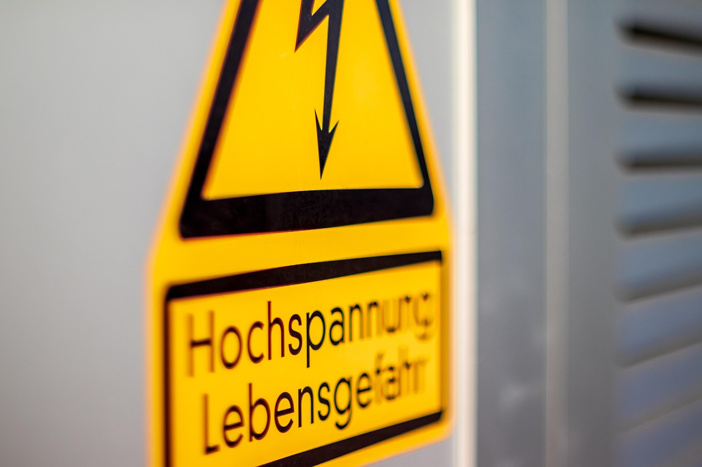
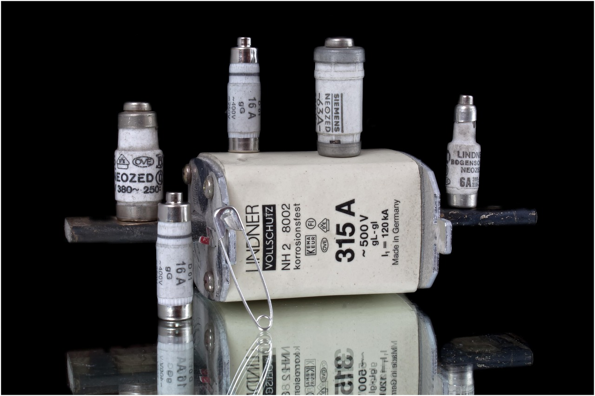
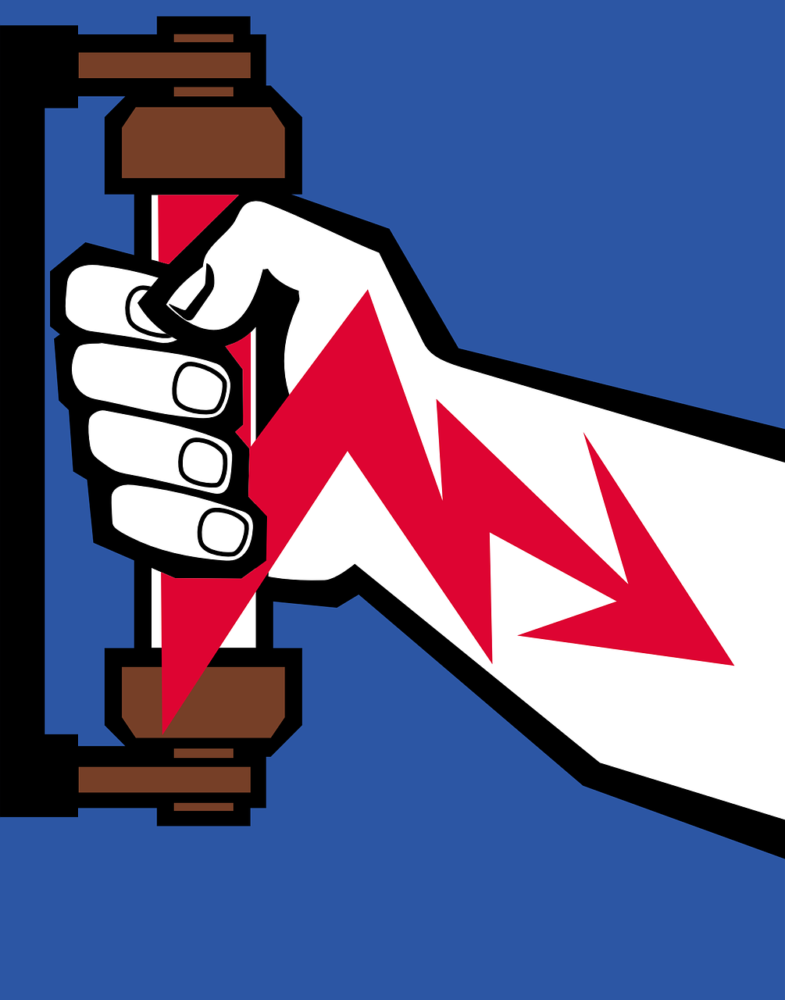
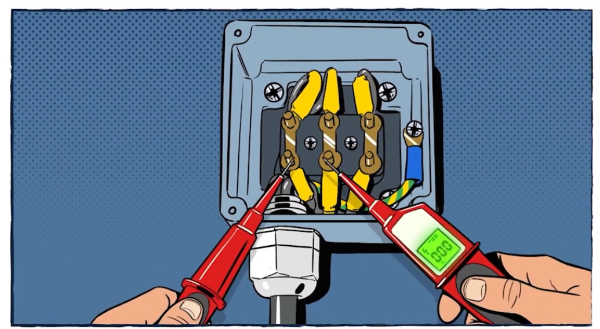
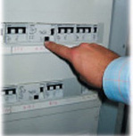
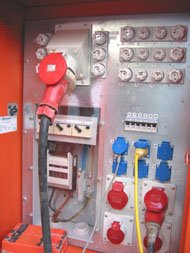
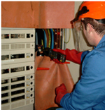
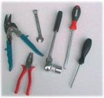

<!--

author:   Hilke Domsch

email:    hilke.domsch@gkz-ev.de

version:  0.0.1

language: de

narrator: Deutsch Male

comment:  Grundkurs Anlangenmechaniker 3

edit: true
date: 2025-07-28
logo: https://upload.wikimedia.org/wikipedia/commons/a/a2/%E3%82%B3%E3%82%B9%E3%83%A2%E3%82%B91%E5%8F%B7%E7%B7%9A.jpg
icon: https://raw.githubusercontent.com/Ifi-DiAgnostiK-Project/LiaScript-Courses/refs/heads/main/img/Logo_234px.png

import: https://raw.githubusercontent.com/Ifi-DiAgnostiK-Project/Piktogramme/refs/heads/main/makros.md
import: https://raw.githubusercontent.com/Ifi-DiAgnostiK-Project/LiaScript_DragAndDrop_Template/refs/heads/main/README.md
import: https://raw.githubusercontent.com/Ifi-DiAgnostiK-Project/LiaScript_ImageQuiz/refs/heads/main/README.md

title: Grundkurs SHK-Anlagenmechaniker G-IH 3
tags:
    - SHK
    - Grundkurs
    - Anlagenmechaniker

@style
.flex-container {
    display: flex;
    flex-wrap: wrap; /* Allows the items to wrap as needed */
    align-items: stretch;
    gap: 20px; /* Adds both horizontal and vertical spacing between items */
}

.flex-child { 
    flex: 1;
    margin-right: 20px; /* Adds space between the columns */
}

@media (max-width: 600px) {
    .flex-child {
        flex: 100%; /* Makes the child divs take up the full width on slim devices */
        margin-right: 0; /* Removes the right margin */
    }
}
@end

-->

-->

# Grundkurs SHK-Anlagenmechaniker G - IH 3

Elektrotechnik und deren Sicherheitsmaßnahmen
===

<section class="flex-container" style="padding: 1rem;">

 <!-- style="width: 550px" -->

 <!-- style="width: 550px" -->

</section>

_Quelle: Pixabay_

## Überprüfungsaufgaben I

<!--style="font-size: huge; color: red"-->Hinweis: Es können mehrere Antworten richtig sein. 

----------------

<!--style="color:blue; font-weight: bolder;"-->
Welche Aufgabe hat eine Sicherung?   🤔
===

<section class="flex-container">

<!-- data-randomize -->
- [[ ]] Einschalten eines Gerätes.
- [[X]] Schutz vor Überspannung.
- [[X]] Schutz der angeschlossenen Geräte.
- [[ ]] Ausschalten eines Gerätes.
- [[X]] Schutz von Menschenleben.

<!-- style="width: 250px" -->

<a  href="https://pixabay.com/de/photos/sicherung-sicher-strom-elektrizit%C3%A4t-631745/" target=_blank>Quelle: Rabe-Foto, Pixabay</a>

</section> 

----------------

<!--style="color:blue; font-weight: bolder;"-->
Was brauchen Sie als zusätzliche PSA beim Ziehen von NH-Sicherungen?   🤔
===

<section class="flex-container">

<!-- data-randomize -->
- [[ ]] zusätzliche Schutzjacke
- [[X]] Aufsteckgriffe mit Stulpe
- [[ ]] feuerfeste Schutzbrille
- [[X]] Helm mit Gesichtsschutz

<!-- style="width: 150px" -->

<a  href="https://pixabay.com/de/vectors/elektrische-sicherung-sicherung-155785/" target=_blank>Quelle: OpenClipart-Vectors, Pixabay</a>

</section> 

------

<!--style="color:blue; font-weight: bolder;"-->
Was bedeutet dieses Symbol?   🤔
===

<section class="flex-container">

<!-- data-randomize -->
- [( )] Achtung! Freischaltung ist aufgehoben.
- [(X)] Achtung! Schalten verboten.
- [( )] Achtung! Spanngurt schließt nicht.
- [( )] Achtung! Türverriegelung nicht öffnen.

@Verbotszeichen.Schalten_verboten(15)

 

<a  href="https://github.com/Ifi-DiAgnostiK-Project/Piktogramme/blob/main/img/Verbotszeichen/Schalten_verboten.jpg" target=_blank>Quelle: BGHM</a>

</section>

## Überprüfungsaufgaben II

<!--style="font-size: huge; color: red"-->Hinweis: Es können mehrere Antworten richtig sein. 

----------------

<section class="flex-container" style="padding: 1rem;">

<!-- style="width: 150px" -->

<!-- style="width: 150px" -->

<!-- style="width: 150px" -->

</section>

<a  href="https://de.m.wikipedia.org/wiki/Datei:Schutzklasse_1_halb_fett.svg; https://de.m.wikipedia.org/wiki/Datei:Schutzklasse_2_fett.svg; https://de.m.wikipedia.org/wiki/Datei:Schutzklasse_3_fett.svg" target=_blank>Quelle: Wikimedia Commons, David W.</a>

 

  

<!--style="color:blue; font-weight: bolder;"-->
Welche Aussagen zu den ~~Schutzklassen~~ elektrischer Betriebsmittel sind korrekt?   🤔
===

<!-- data-randomize -->
- [[ ]] Schutzklasse 0 besitzt keinen Schutzleiter und keine Isolierung.
- [[X]] Schutzklasse I verwendet eine Basisisolierung und ist zusätzlich mit einem Schutzleiter verbunden.
- [[X]] Schutzklasse II kann durch das Symbol eines Quadrates in einem Quadrat gekennzeichnet sein.
- [[ ]] Schutzklasse II verwendet verstärkte oder doppelte Isolierung und benötigt keinen Schutzleiter.
- [[X]] Schutzklasse III darf nur in Netzen mit 400 V betrieben werden.
- [[X]] Schutzklasse III basiert auf Schutz durch Kleinspannung (SELV oder PELV) und benötigt keinen Schutzleiter.

><!--style="color:red"-->SHK-HWK zur Antwort Schutzklasse II "Quadrat in einem Quadrat" fragen.<!--style="color:red"-->

-----

<!--style="color:blue; font-weight: bolder;"-->
Wie viele Prüfvorgänge zum Feststellen der Spannungsfreiheit sind hier nötig?   🤔
===

<section class="flex-container">

- [( )] 3
- [(X)] 6
- [( )] 9
- [( )] 12

<!-- style="width: 350px" -->

<a  href="https://pixabay.com/de/photos/sicherung-sicher-strom-elektrizit%C3%A4t-631745/" target=_blank>Quelle: BG ETEM</a>

</section> 

## Aufputzinstallation

----------------

<!--style="color:blue; font-weight: bolder;"-->
Welche Aussagen zur Verlegung von Leitungen bei der Aufputzinstallation sind korrekt?   🤔
===

<!--style="font-weight: bolder;"-->Der maximale Abstand zwischen zwei Befestigungsschellen bei waagerechter Verlegung von Leitungen beträgt 30 cm.

- [( )] falsch
- [(X)] wahr

---------

<!--style="font-weight: bolder;"-->Der maximale Abstand zwischen zwei Befestigungsschellen bei waagerechter Verlegung von Leitungen beträgt 25 cm.

- [(X)] falsch
- [( )] wahr

---------------

<!--style="font-weight: bolder;"-->Bei senkrechter Verlegung dürfen Schellen weiter auseinanderliegen als bei waagerechter.

- [( )] falsch
- [(X)] wahr

--------------------

<!--style="font-weight: bolder;"-->Der Biegeradius darf bei flexiblen Leitungen kleiner sein als bei festen Leitungen.

- [( )] falsch
- [(X)] wahr

## Reihen- und Parallelschaltung

<!--style="color:blue; font-weight: bolder;"-->
Welche Aussagen zu Reihen- und Parallelschaltungen von Widerständen sind korrekt?   🤔
===

<section class="flex-container">

<!-- data-randomize -->
- [[ ]] In einer Reihenschaltung teilt sich der Strom auf die Widerstände auf.
- [[X]] In einer Reihenschaltung ist der Strom durch alle Widerstände gleich groß.
- [[X]] In einer Parallelschaltung ist die Spannung an allen Widerständen gleich groß.
- [[ ]] Der Gesamtwiderstand einer Parallelschaltung ist stets größer als der größte Einzelwiderstand.
- [[X]] Der Gesamtwiderstand einer Reihenschaltung ist die Summe der Einzelwiderstände.
- [[X]] In einer Parallelschaltung fließt durch den kleineren Widerstand ein größerer Strom. 

<!-- style="width: 400px" -->

<a  href="https://pixabay.com/de/vectors/schaltkreis-symbol-elektronik-146512/" target=_blank>Quelle: Pixabay; OpenClipart-Vectors</a>

</section> 

------

<!--style="color:blue; font-weight: bolder;"-->
Ordnen Sie zu, ob die jeweilige Aussage zur Reihen- oder Parallelschaltung gehört?   🤔
===

<!-- data-randomize -->
- [[Reihenschaltung] (Parallelschaltung) ]
- [       [X]              [ ]           ]  Die Stromstärke ist in jedem Bauteil gleich.
- [       [ ]              [X]           ]  Die Spannung ist in jedem Zweig gleich groß.
- [       [X]              [ ]           ]  Der Gesamtwiderstand ist größer als jeder Einzelwiderstand.
- [       [ ]              [X]           ]  Der Strom teilt sich auf die einzelnen Zweige auf.
- [       [ ]              [X]           ]  Beim Ausfall eines Bauteil funktionieren die anderen weiter.
- [       [X]              [ ]           ]  $U_{Quelle}$ = $U_{1}$ + $U_{2}$ + $U_{3}$ + ... + $U_{n}$ 
- [       [X]              [ ]           ]  $I_{Gesamt}$ = $I_{1}$ = $I_{2}$ = $I_{3}$ = ... = $I_{n}$ 

## Arbeits- und Gesundheitsschutz bei elektrotechnischen Aufgaben 🔌

<section class="flex-container">

Im SHK-Handwerk arbeiten Sie mit Werkzeugen, Maschinen, Strom, Wasser und Gas – da ist Sicherheit besonders wichtig. 

Arbeits- und Gesundheitsschutz bedeutet: 

<!--style="font-weight: bolder;"-->👍 Unfälle vermeiden

<!--style="font-weight: bolder;"-->👍 gesund bleiben 

<!--style="font-weight: bolder;"-->👍 aufeinander achten

Dazu gehören, z. B.: 

✔️ das Tragen von Schutzkleidung

✔️ sicheres Heben

✔️ sauberes Arbeiten 

✔️das Beachten von Regeln auf der Baustelle

<!-- style="width: 500px" -->

<a  href="https://www.seton.de/arbeitsunfaelle-schilder-schutzkleidung-psa" target=_blank>Quelle: Seton.de</a>

</section> 

<!--style="font-size: huge; color:blue; font-weight: bolder;"-->Sicheres Arbeiten ist Teamarbeit – und Sie sind ein wichtiger Teil davon.

### Quizfragen I

<!--style="font-size: huge; color: red"-->Hinweis: Es können mehrere Antworten richtig sein. 

----------------

<!--style="color:blue; font-weight: bolder;"-->Was müssen Sie beim Einsetzen und Herausnehmen von NH-Sicherungen beachten?   🤔

<section class="flex-container">

<!-- data-randomize -->
- [[ ]] Es ist keine Persönliche Schutzausrüstung erforderlich.
- [[X]] Es ist ein Schutzhelm mit Gesichtsschutz zu benutzen.
- [[X]] Es sind Betätigungsgriffe mit Handschutzstulpe zu benutzen.
- [[ ]] Es genügen Schutzhandschuhe und eine isolierte Zange.

<!-- style="width: 250px" -->

<a  href="https://www.vbg.de/zeitarbeit-fb/infos/89_szn/" target=_blank>Alle Bilder: VBG</a>

</section> 

>_Ich habe den Eindruck, dass sich die Fragen nicht mischen._

---------------------

<!--style="color:blue; font-weight: bolder;"-->Welche Aussage ist richtig?   🤔

<section class="flex-container">

<!-- data-randomize -->
- [[ ]] Für die Demontage von Lampen im Innenbereich ist keine Sicherung auszuschalten.
- [[X]] Bauleuchten müssen mindestens sprühwassergeschützt sein.
- [[X]] Auf Baustellen dürfen Elektrogeräte nur am Baustromverteiler angeschlossen werden.
- [[ ]] Ich kann jedes genormte Leuchtmittel als Bauleuchte verwenden. 

<!-- style="width: 150px" -->

</section> 

--------------------------

<!--style="color:blue; font-weight: bolder;"-->Welche Schutzmaßnahmen sind bei Arbeiten an elektrischen Anlagen erforderlich?   🤔

<section class="flex-container">

<!-- data-randomize -->
- [[X]] Ich beachte die 5 Sicherheitsregeln.
- [[ ]] Alle Sicherungen im Gebäude müssen ausgeschaltet sein.
- [[ ]] Bei Netzen mit FI-Schutz (Fehlerstromschutzschalter) sind keine weiteren Maßnahmen erforderlich.
- [[X]] Bei „Unterbrechungsfreier Stromversorgung“ (USV) muss die Spannungsfreiheit der Anlage nach dem Abschalten der Netzversorgung gesondert geprüft und herbeigeführt werden.

<!-- style="width: 150px" -->

</section> 

---------

### Quizfragen II

<!--style="font-size: huge; color: red"-->Hinweis: Es können mehrere Antworten richtig sein. 

----------------

<!--style="color:blue; font-weight: bolder;"-->Kennen Sie die fünf Sicherheitsregeln bei elektrischen Anlagen?   🤔

<section class="flex-container">

<!-- data-randomize -->
- [[X]] Freischalten. Gegen Wiedereinschalten sichern.
- [[ ]] Persönliche Schutzausrüstung ab Arbeitsbeginn benutzen.
- [[ ]] Den Vorgesetzten/die Vorgesetzte über die Arbeit an spannungsführenden Teilen informieren.
- [[ ]] Schutzhandschuhe tragen.
- [[X]] Spannungsfreiheit allpolig feststellen. Erden und Kurzschließen.
- [[X]] Benachbarte, unter Spannung stehende Teile abdecken oder abschranken.

<!-- style="width: 150px" -->

<a  href="https://www.vbg.de/zeitarbeit-fb/infos/89_szn/" target=_blank>Alle Bilder: VBG</a>

</section> 

---------------------

<!--style="color:blue; font-weight: bolder;"-->Ist es erlaubt, Arbeiten auch an unter Spannung stehenden Teilen auszuführen?   🤔

<section class="flex-container">

<!-- data-randomize -->
- [[ ]] Ja, unabhängig von der Höhe der Spannung.
- [[X]] Ja, bei Nennspannung bis 50 V Wechsel- beziehungsweise 120 V Gleichspannung.
- [[X]] In zwingenden Ausnahmefällen bei Nennspannungen über 50 V Wechsel- oder 120 V Gleichspannung bei Berücksichtigung besonderer technischer und organisatorischer Schutzmaßnahmen.
- [[ ]] Ja, wenn es sich um gelegentliche kurzzeitige Arbeiten an Elektroinstallationen handelt.

<!-- style="width: 150px" -->

</section> 

--------------------------

<!--style="color:blue; font-weight: bolder;"-->Was ist beim Einsatz von Werkzeugen im Elektrobereich zu beachten?   🤔

<section class="flex-container">

<!-- data-randomize -->
- [[X]] Ich prüfe die Werkzeuge vor dem Arbeitsbeginn auf sichtbare Mängel. 
- [[ ]] Die Handgriffe der Werkzeuge sind immer grün = isoliert.
- [[X]] Auf Schraubendrehern und Zangen sollte sich ein VDE-Prüfzeichen befinden.
- [[ ]] Bei Verwendung von isoliertem Werkzeug brauche ich keine Spannungsfreiheit herstellen.

<!-- style="width: 150px" -->

</section> 

-------------------

<!--style="color:green; font-weight: bolder;font-size:large"-->Geschafft ! 👏
