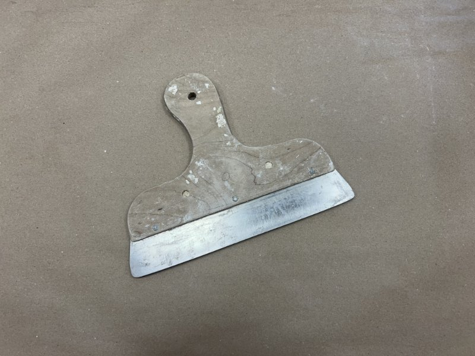
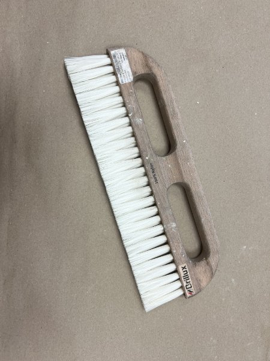
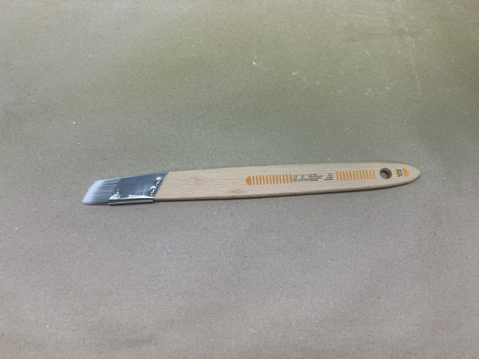
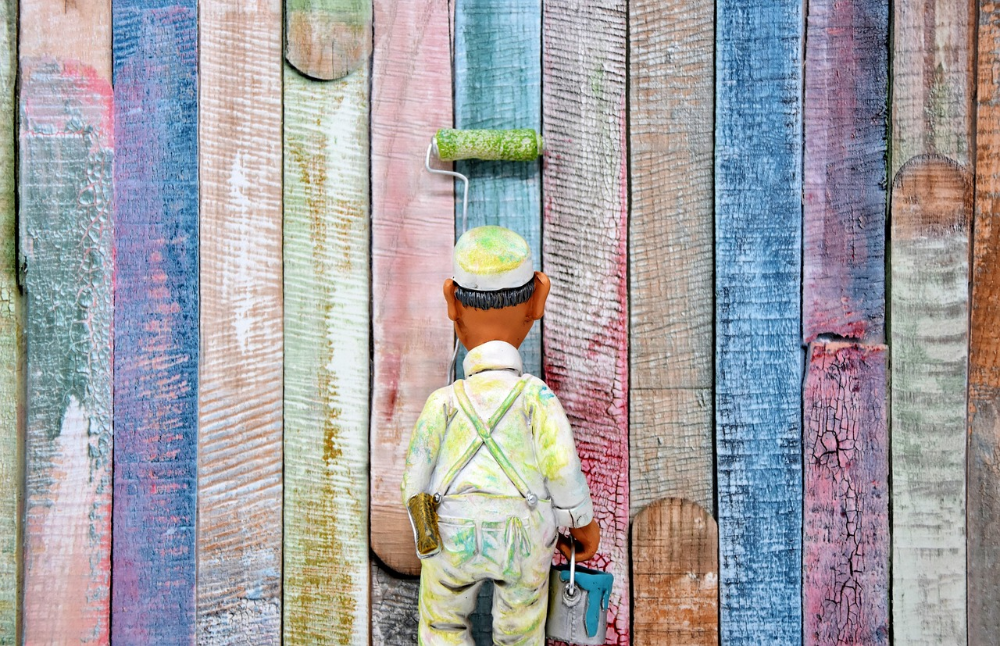
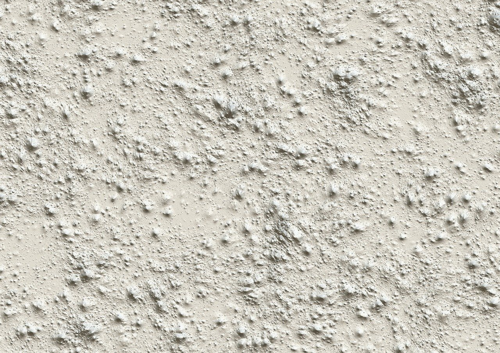
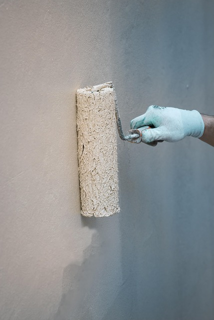

<!--

author:    Hilke Domsch
email:     hilke.domsch@gkz-ev.de
version:   0.0.6

language:  de
narrator:  Deutsch Male

edit:      true
date:      2025-08-01

title:     Grundkurs Maler/Lackierer G-ML-24
comment:   Grundkurs Maler/Lackierer

tags:      Maler, Grundkurs

icon:      https://raw.githubusercontent.com/Ifi-DiAgnostiK-Project/LiaScript-Courses/refs/heads/main/img/Logo_234px.png
logo:      img/farben.jpg

attribute: Title Image by Pixabay, Darkmoon Art

link:      style.css
import:    https://raw.githubusercontent.com/Ifi-DiAgnostiK-Project/LiaScript_DragAndDrop_Template/refs/heads/main/README.md
           https://raw.githubusercontent.com/Ifi-DiAgnostiK-Project/Piktogramme/refs/heads/main/makros.md
           https://raw.githubusercontent.com/Ifi-DiAgnostiK-Project/LiaScript_ImageQuiz/refs/heads/main/README.md
           https://raw.githubusercontent.com/Ifi-DiAgnostiK-Project/Bildersammlung/refs/heads/main/makros.md

-->

# Grundstufe Maler- und Lackiererhandwerk G-ML-24  🧑‍🎨

<!-- style="width: 100%" -->

## Überprüfungsaufgaben

<!--style="font-size: large; font-weight: bolder"-->
Sie haben in den letzten Tagen Werkzeuge und Grundhandgriffe im Maler- und Lackiererhandwerk kennengelernt und eingeübt.\
\
Überprüfen Sie Ihr Wissen - viel Erfolg!

@Maler_Planung.Uebung3_Ergebnis(70)

_Quelle aller Bilder: HWK Dresden, Florian Riefling_

### Typische Werkzeuge im Maler- und Lackiererhandwerk I

> __Hinweis:__ Es können mehrere Antworten richtig sein!

<section class="flex-container">

<!-- class="highlight" -->
Wie nennt man dieses Werkzeug?
------------------------------

<!-- data-randomize -->
- [[ ]] Kamm
- [[X]] Abreißblech
- [[X]] Rakel
- [[X]] Schwedenblech
- [[ ]] Blockschiene
- [[X]] Flächenrakel

</section>

### Typische Werkzeuge im Maler- und Lackiererhandwerk II

<section class="flex-container">

<!-- class="highlight" -->
Wie nennt man dieses Werkzeug?
------------------------------

<!-- data-randomize -->
- [( )] Kehrbesen
- [( )] Wandbürste
- [(X)] Tapezierbürste

</section>

### Typische Werkzeuge im Maler- und Lackiererhandwerk III

<section class="flex-container">

<!-- class="highlight" -->
Wie nennt man dieses Werkzeug?
------------------------------

<!-- data-randomize -->
- [( )] Ringpinsel
- [( )] Heizkörperpinsel
- [(X)] Schrägstrichzieher

</section>

### Wichtige Arbeitsabläufe für allgemeine Decken- und Wandgestaltungen

<!-- class="highlight"-->
__In welcher Reihenfolge führen Sie den Auftrag aus?__\
__Ziehen Sie die einzelnen Arbeitsschritte in die richtige Reihenfolge.__\
__An oberster Stelle steht der erste Arbeitsschritt.__

------------------

<!-- data-randomize -->
@dragdroporder(@uid,Makulatur/Glattvlies kleben.|Decken- und Wandanschlüsse beschneiden und Schlussbeschichtung applizieren.|Wand- und Deckenflächen nachwaschen.|Wand- und Deckenflächen schleifen/entstauben.|Wand- und Deckenflächen mit unpigmentierter sowie wasserverdünnter Grundbeschichtung grundieren.|Nicht tragfähige Beschichtung und Beläge von den Wand- und Deckenflächen entfernen.|Decken- und Wandanschlüsse beschneiden und Zwischenbeschichtung applizieren.|Wand- und Deckenflächen abkleben/abdecken.|Wand- und Deckenflächen spachteln.|Tapezieren von Raufaser an der Deckenfläche.,Nicht tragfähige Beschichtung und Beläge von den Wand- und Deckenflächen entfernen.|Wand- und Deckenflächen nachwaschen.|Wand- und Deckenflächen spachteln.|Wand- und Deckenflächen schleifen/entstauben.|Wand- und Deckenflächen mit unpigmentierter sowie wasserverdünnter Grundbeschichtung grundieren.|Makulatur/Glattvlies kleben.|Tapezieren von Raufaser an der Deckenfläche.|Wand- und Deckenflächen abkleben/abdecken.|Decken- und Wandanschlüsse beschneiden und Zwischenbeschichtung applizieren.|Decken- und Wandanschlüsse beschneiden und Schlussbeschichtung applizieren.)

### Wichtige Arbeitsabläufe für Gestaltungsflächen: Wände und Sockel

<!-- class="highlight"-->
__In welcher Reihenfolge führen Sie den Auftrag aus?__\
__Ziehen Sie die einzelnen Arbeitsschritte in die richtige Reihenfolge.__\
__An oberster Stelle steht der erste Arbeitsschritt.__

------------------

<!-- data-randomize -->
@dragdroporder(@uid,Gestaltungswand: Flächengliederung abmessen und anzeichnen.|Farbflächen mit Pinsel deckend farbig auslegen.|Fläche der Wickeltechnik mit Strichzieher und Lineal einrahmen.|Radius auf der rechten Seite anzeichnen und deckend farbig auslegen.|Abklebung und Abdeckung entfernen. Abfälle sachgerecht entsorgen und Werkzeuge und Arbeitsmittel reinigen.|Farbflächen mit Strichzieher und Lineal beschneiden.|Wickeltechnik über die gesamte Gestaltung mit Latexbindemittel -glänzend- ausführen.|Sockelfläche einmessen und abkleben/abdecken.|Wickeltechnik zweifarbig im Sockelbereich ausführen.|Kontrastlinien mit Lineal und Strichzieher ziehen.,Sockelfläche einmessen und abkleben/abdecken.|Gestaltungswand: Flächengliederung abmessen und anzeichnen.|Farbflächen mit Strichzieher und Lineal beschneiden.|Farbflächen mit Pinsel deckend farbig auslegen.|Kontrastlinien mit Lineal und Strichzieher ziehen.|Radius auf der rechten Seite anzeichnen und deckend farbig auslegen.|Wickeltechnik über die gesamte Gestaltung mit Latexbindemittel -glänzend- ausführen.|Wickeltechnik zweifarbig im Sockelbereich ausführen.|Fläche der Wickeltechnik mit Strichzieher und Lineal einrahmen.|Abklebung und Abdeckung entfernen. Abfälle sachgerecht entsorgen und Werkzeuge und Arbeitsmittel reinigen.)

### Beschaffenheit von Untergründen

> __Hinweis:__ Es können mehrere Antworten richtig sein!

-------------------

<!-- class="highlight" -->
Wie sollte ein Untergrund beschaffen sein, damit dieser beschichtet oder tapeziert werden kann?
-----------------------------------------------------------------------------------------------

<section class="flex-container">

<!-- data-randomize -->
- [[X]] sauber
- [[X]] trocken
- [[X]] fest
- [[X]] tragfähig
- [[X]] frei von trennenden Substanzen
- [[X]] gleichmäßig saugfähig
- [[ ]] Haarrisse sind unerheblich
- [[ ]] leicht angeraute Unterfläche, damit es besser haftet
- [[ ]] leicht angefeuchtet, damit das Auftragen leichter geht

@Maler_Taetigkeiten.Koje_Vorbereitung(25)

</section>

### Haftfestigkeit alter Anstriche

> __Hinweis:__ Es können mehrere Antworten richtig sein!

-------------------

<!-- class="highlight" -->
Mit welchen Methoden kann die Haftfestigkeit alter Anstriche geprüft werden?
----------------------------------------------------------------------------

<section class="flex-container">

<!-- data-randomize -->
- [[X]] Abriebprobe/Wischprobe mit der Hand oder einem Tuch
- [[ ]] Abkärchern
- [[X]] Kratzprobe mit dem Spachtel
- [[X]] Tragfähigkeitsprüfung mit Klebebandtest
- [[ ]] Besprühen der Wand mit Parfüm oder Duftstoffen
- [[ ]] Abklopfen mit dem Finger
- [[ ]] Farbauftragstest

</section>

### Saugfähigkeit eines Untergrundes

<!-- class="highlight" -->
Wie prüft man am besten die Saugfähigkeit eines Untergrunds?
------------------------------------------------------------

<section class="flex-container">

<!-- data-randomize -->
- [(X)] Benetzungsprobe mit Wasser
- [( )] Farbauftragstest
- [( )] Kratzprobe mit Messer
- [( )] Wischprobe mit trockenem Tuch

</section>

### Feuchtigkeitsmessung

> __Hinweis:__ Es können mehrere Antworten richtig sein!

-------------------

<!-- class="highlight" -->
Wann ist eine Feuchtigkeitsprüfung sinnvoll?
--------------------------------------------

<section class="flex-container">

<!-- data-randomize -->
- [[X]] bei sichtbarem oder vermuteten Schimmelbefall
- [[X]] bei sichtbaren oder vermuteten Wasserschäden
- [[X]] wenn dunkle Flecken an den Wänden sichtbar sind
- [[X]] bei einem muffigen Geruch
- [[ ]] immer - auch wenn die Umgebung trocken ist
- [[ ]] Eine Feuchtigkeitsprüfung ist zugleich eine Temperaturmessung und daher immer sinnvoll.
- [[ ]] Eine Feuchtigkeitsprüfung geht jedem Farbanstrich voraus, um die Haftfestigkeit zu prüfen.

</section>

### Prüfgeräte für Untergrundprüfungen I

> __Hinweis:__ Es können mehrere Antworten richtig sein!

-------------------

<!-- class="highlight" -->
Welche Prüfgeräte oder Hilfsmittel werden häufig bei Untergrundprüfungen im Malerhandwerk eingesetzt?
-----------------------------------------------------------------------------------------------------

<!-- data-randomize -->
- [[ ]] Rückprallbolzen
- [[ ]] Haftmessgerät
- [[ ]] CO2-Messgerät
- [[X]] Hydrometer
- [[X]] Gitterschnitt
- [[X]] Profometer (Betonüberdeckung)
- [[X]] Schichtdickenmessgerät (Lack)
- [[X]] Lupe

### Prüfgeräte für Untergrundprüfungen II

> __Hinweis:__ Es können mehrere Antworten richtig sein!

-------------------

<!-- class="highlight" -->
Welche der folgenden Geräte oder Werkzeuge gehören typischerweise zu einem Untergrundprüfkoffer?
------------------------------------------------------------------------------------------------

<!-- data-randomize -->
- [[X]] Meißel
- [[X]] Taschenmesser
- [[X]] Hammer
- [[ ]] Föhn
- [[X]] Spritzflasche
- [[ ]] mobiler Gasbrenner

## Geschafft 🎉

