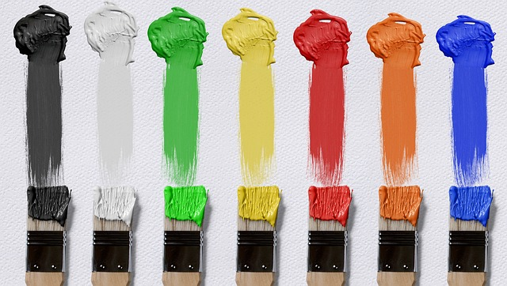

<!--

author:   Hilke Domsch

email:    hilke.domsch@gkz-ev.de

version:  0.0.1

language: de

narrator: Deutsch Male

edit: true
date: 2025-08-01

title:  Grundkurs Maler/Lackierer G-ML-24
comment:  Grundkurs Maler/Lackierer

tags: 
  - Maler
  - Grundkurs

logo: https://raw.githubusercontent.com/Ifi-DiAgnostiK-Project/LiaScript-Courses/refs/heads/main/img/Logo_234px.png
icon: img/farben.jpg

attribute: Title Image by Pixabay, Darkmoon Art

import: https://raw.githubusercontent.com/Ifi-DiAgnostiK-Project/LiaScript_DragAndDrop_Template/refs/heads/main/README.md
import: https://raw.githubusercontent.com/Ifi-DiAgnostiK-Project/Piktogramme/refs/heads/main/makros.md
import: https://raw.githubusercontent.com/Ifi-DiAgnostiK-Project/LiaScript_ImageQuiz/refs/heads/main/README.md
import: https://raw.githubusercontent.com/Ifi-DiAgnostiK-Project/Bildersammlung/refs/heads/main/makros.md

@style
.flex-container {
    display: flex;
    flex-wrap: wrap; /* Allows the items to wrap as needed */
    align-items: stretch;
    gap: 20px; /* Adds both horizontal and vertical spacing between items */
}

.flex-child { 
    flex: 1;
    margin-right: 20px; /* Adds space between the columns */
}

@media (max-width: 600px) {
    .flex-child {
        flex: 100%; /* Makes the child divs take up the full width on slim devices */
        margin-right: 0; /* Removes the right margin */
    }
}

.image-container {
  width: 200px;
  height: 200px;
  border: 1px solid #ccc;
  display: flex;
  justify-content: center;
  align-items: center;
  overflow: hidden;
  background-color: #f8f8f8;
}

.image-container img {
  width: fit-content;
  height: fit-content;
  object-fit: cover;
  display: block;
}

@end

-->

# Grundstufe Maler- und Lackiererhandwerk G-ML-24  🧑‍🎨

<!-- style="width: 800px" -->

_Quelle: Pixabay, Darkmoon Art_

## Überprüfungsaufgaben

<!--style="color:grey; font-size: large; font-weight: bolder"-->Sie haben in den letzten Tagen Werkzeuge und Grundhandgriffe im Maler- und Lackiererhandwerk kennengelernt und eingeübt.     Überprüfen Sie Ihr Wissen - viel Erfolg!

<section class="flex-container" style="padding: 1rem;">

@Maler_Planung.Uebung3_Ergebnis(70) 

_Quelle aller Bilder: HWK Dresden, Florian Riefling_

</section>

### Typische Werkzeuge im Maler- und Lackiererhandwerk

<!--style="color:red; font-size: huge"-->Hinweis: Es können mehrere Antworten richtig sein!

<!--style="color:grey; font-size: large; font-weight: bolder"-->Wie nennt man dieses Werkzeug?
===

<section class="flex-container" style="padding: 1rem;">

<!-- style="width: 300px" -->

<!-- data-randomize -->
- [[X]] Abreisblech
- [[X]] Abreißblech
- [[X]] Rakel
- [[X]] Schwedenblech
- [[X]] Abreissblech
- [[X]] Flächenrakel

</section>

-----------------

<!--style="color:grey; font-size: large; font-weight: bolder"-->Wie nennt man dieses Werkzeug?
===

<section class="flex-container" style="padding: 1rem;">

<!-- style="width: 300px" -->

<!-- data-randomize -->
- [( )] Kehrbesen
- [( )] Wandbürste
- [(X)] Tapezierbürste

</section>

--------------

<!--style="color:grey; font-size: large; font-weight: bolder"-->Wie nennt man dieses Werkzeug?
===

<section class="flex-container" style="padding: 1rem;">

<!-- style="width: 300px" -->

<!-- data-randomize -->
- [( )] Ringpinsel
- [( )] Heizkörperpinsel
- [(X)] Schrägstrichzieher

</section>

### Wichtige Arbeitsabläufe für allgemeine Decken- und Wandgestaltungen

<!--style="color:grey; font-size: large; font-weight: bolder"-->In welcher Reihenfolge führen Sie den Auftrag aus?   Ziehen Sie die einzelnen Arbeitsschritte in die richtige Reihenfolge.
===

<!-- data-randomize -->
@dragdroporder(@uid,Makulatur/Glattvlies kleben.|Decken- und Wandanschlüsse beschneiden und Schlussbeschichtung applizieren.|Wand- und Deckenflächen nachwaschen.|Wand- und Deckenflächen schleifen/entstauben.|Wand- und Deckenflächen mit unpigmentierter sowie wasserverdünnter Grundbeschichtung grundieren.|Nicht tragfähige Beschichtung und Beläge von den Wand- und Deckenflächen entfernen.|Decken- und Wandanschlüsse beschneiden und Zwischenbeschichtung applizieren.|Wand- und Deckenflächen abkleben/abdecken.|Wand- und Deckenflächen spachteln.|Tapezieren von Raufaser an der Deckenfläche.,Nicht tragfähige Beschichtung und Beläge von den Wand- und Deckenflächen entfernen.|Wand- und Deckenflächen nachwaschen.|Wand- und Deckenflächen spachteln.|Wand- und Deckenflächen schleifen/entstauben.|Wand- und Deckenflächen mit unpigmentierter sowie wasserverdünnter Grundbeschichtung grundieren.|Makulatur/Glattvlies kleben.|Tapezieren von Raufaser an der Deckenfläche.|Wand- und Deckenflächen abkleben/abdecken.|Decken- und Wandanschlüsse beschneiden und Zwischenbeschichtung applizieren.|Decken- und Wandanschlüsse beschneiden und Schlussbeschichtung applizieren.)

>_Funktioniert das mit dem Randomize?_

### Wichtige Arbeitsabläufe für Gestaltungsflächen - Wände und Sockel

<!--style="color:grey; font-size: large; font-weight: bolder"-->In welcher Reihenfolge führen Sie den Auftrag aus?   Ziehen Sie die einzelnen Arbeitsschritte in die richtige Reihenfolge.
===

<!-- data-randomize -->
@dragdroporder(@uid,Gestaltungswand: Flächengliederung abmessen und anzeichnen.|Farbflächen mit Pinsel deckend farbig auslegen.|Fläche der Wickeltechnik mit Strichzieher und Lineal einrahmen.|Radius auf der rechten Seite anzeichnen und deckend farbig auslegen.|Abklebung und Abdeckung entfernen. Abfälle sachgerecht entsorgen und Werkzeuge und Arbeitsmittel reinigen.|Farbflächen mit Strichzieher und Lineal beschneiden.|Wickeltechnik über die gesamte Gestaltung mit Latexbindemittel -glänzend- ausführen.|Sockelfläche einmessen und abkleben/abdecken.|Wickeltechnik zweifarbig im Sockelbereich ausführen.|Kontrastlinien mit Lineal und Strichzieher ziehen.,Sockelfläche einmessen und abkleben/abdecken.|Gestaltungswand: Flächengliederung abmessen und anzeichnen.|Farbflächen mit Strichzieher und Lineal beschneiden.|Farbflächen mit Pinsel deckend farbig auslegen.|Kontrastlinien mit Lineal und Strichzieher ziehen.|Radius auf der rechten Seite anzeichnen und deckend farbig auslegen.|Wickeltechnik über die gesamte Gestaltung mit Latexbindemittel -glänzend- ausführen.|Wickeltechnik zweifarbig im Sockelbereich ausführen.|Fläche der Wickeltechnik mit Strichzieher und Lineal einrahmen.|Abklebung und Abdeckung entfernen. Abfälle sachgerecht entsorgen und Werkzeuge und Arbeitsmittel reinigen.)

### Untergründe

<!--style="color:red; font-size: huge"-->Hinweis: Es können mehrere Antworten richtig sein!

<!--style="color:grey; font-size: large; font-weight: bolder"-->Wie muss ein Untergrund beschaffen sein, der beschichtet oder tapeziert werden soll?
===

<section class="flex-container" style="padding: 1rem;">

<!-- data-randomize -->
- [[X]] sauber
- [[X]] trocken
- [[X]] fest
- [[X]] tragfähig
- [[X]] frei von trennenden Substanzen
- [[X]] gleichmäßig saugfähig

@Maler_Taetigkeiten.Koje_Vorbereitung(25)

</section>

----------------

<!--style="color:grey; font-size: large; font-weight: bolder"-->Welche baustellenübliche Untergrundprüfmethoden gibt es?
===

<section class="flex-container" style="padding: 1rem;">

<!-- data-randomize -->
- [[X]] Wischprobe mit der Hand
- [[X]] Klopfprobe mit dem Hammer
- [[X]] Kratzprobe mit dem Spachtel
- [[X]] Tragfähigkeit mit Klebebandtest
- [[X]] Saugfähigkeit mit Benetzungsprobe
- [[X]] Alkalität mit Indikatorpapier
- [[X]] Augenschein

<!-- style="width: 300px" --> 
 
 _Quelle: Pixabay, Ralphs-Fotos_

</section>

----------------------

<!--style="color:grey; font-size: large; font-weight: bolder"-->Welche Prüfgeräte für Untergrundprüfungen kennen Sie?
===

<!-- data-randomize -->
- [[X]] Rückprallhammer
- [[X]] Haftzugmessgerät
- [[X]] CM-Feuchtigkeitsmessgerät
- [[X]] Hydrometer
- [[X]] Gitterschnitt
- [[X]] Profometer (Betonüberdeckung)
- [[X]] Schichtdickenmessgerät (Lack)

><!--style="color:red"-->_TUBAF/HWK: Es ist zu evaluieren, inwiefern durchgängig vollständig richtige Vorgaben in eienm Quiz didaktisch sinnvoll sind?   Florian: Bitte noch ein Prüfgerät-Bild zur Verfügung stellen._

### Geschafft 🎉

<!-- style="width: 500px" --> 

_Quelle: Pixabay, geralt_
