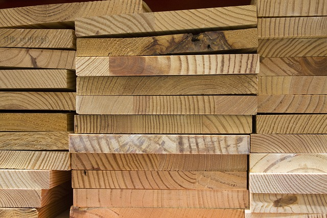

<!--
author:   Jan Franke; Volker Göhler; Hilke Domsch

email:    jan.franke@hwk-dresden.de; volker.goehler@informatik.tu-freiberg.de; hilke.domsch@gkz-ev.de
 
version:  0.0.1
 
language: de
 
narrator: Deutsch Female

edit: true
date: 2025-07-29
icon: https://raw.githubusercontent.com/Ifi-DiAgnostiK-Project/LiaScript-Courses/refs/heads/main/img/Logo_234px.png
logo: https://upload.wikimedia.org/wikipedia/commons/5/59/Dry_wood_texture.jpg
attribute: Title Image by Martin Vorel, CC BY-SA 4.0 <https://creativecommons.org/licenses/by-sa/4.0>, via Wikimedia Commons

comment:  Quiz zu Eigenschaften von Holz -- Teil 1

import: https://raw.githubusercontent.com/Ifi-DiAgnostiK-Project/LiaScript_DragAndDrop_Template/refs/heads/main/README.md
import: https://raw.githubusercontent.com/Ifi-DiAgnostiK-Project/Piktogramme/refs/heads/main/makros.md
import: https://raw.githubusercontent.com/Ifi-DiAgnostiK-Project/LiaScript_ImageQuiz/refs/heads/main/README.md
import: https://raw.githubusercontent.com/Ifi-DiAgnostiK-Project/Holzarten/refs/heads/main/makros.md

title: Holzarten I

tags: 
    - Tischler
    - Holzarten

@style
.flex-container {
    display: flex;
    flex-wrap: wrap; /* Allows the items to wrap as needed */
    align-items: stretch;
    gap: 20px; /* Adds both horizontal and vertical spacing between items */
}

@style
.image-container {
  width: 200px;
  height: 200px;
  border: 1px solid #ccc;
  display: flex;
  justify-content: center;
  align-items: center;
  overflow: hidden;
  background-color: #f8f8f8;
}

.image-container img {
  width: fit-content;
  height: fit-content;
  object-fit: contain;
}

.flex-child { 
    flex: 1;
    margin-right: 20px; /* Adds space between the columns */
}

@media (max-width: 600px) {
    .flex-child {
        flex: 100%; /* Makes the child divs take up the full width on slim devices */
        margin-right: 0; /* Removes the right margin */
    }
}
@end

-->
 
## Überprüfen Sie Ihr Wissen zu den Holzarten I

Teil 1
=======

_Quelle: Pixabay, antmoreton_

# Welche Holzart erkennen Sie?

_Quelle aller Holz-Abbildungen:_ https://holz-werken.com/holz-datenbank/ bzw. HWK Dresden, Florian Riefling

<section class="flex-container" style="padding: 1rem;">

<!-- data-randomize -->
- [(X)] Ahorn
- [( )] Fichte
- [( )] Kiefer
- [( )] Zeder

@Hoelzer1.Ahorn(10)

@Hoelzer2.Ahorn(10)

</section>

><!--style="color:red"-->Florian: Die Ahorn-Bilder sind sehr unterschiedlich. 🤷‍♀️ Welche Abbildung ist korrekt(er)?

-----------------------

<section class="flex-container" style="padding: 1rem;">

<!-- data-randomize -->
- [( )] Ahorn
- [(x)] Birke
- [( )] Rüster
- [( )] Lärche

@Hoelzer1.Birke(10)

</section>

------------------------------

<section class="flex-container" style="padding: 1rem;">

<!-- data-randomize -->
- [[x]] Pappel
- [[x]] Espe
- [[ ]] Ahorn
- [[x]] Aspe

@Hoelzer1.Pappel(10)

</section>

 
>_Ist es möglich, hier noch was an den Bildgrößen zu ändern? Mich stören die unterschiedlichen Abmessungen.   Könnten die Bildernamen bitte nach dem Alphabet sortiert werden auf Github? Da finden sie sich schneller.   Wenn ich hier die Bilder mit .src schreibe, dann kommen keine Bilder._

## Füllen Sie den Lückentext aus

<!--data-randomize -->
Eiche<!--style="font-weight: bolder;color: green"  --> ist ein sehr widerstandsfähiges Holz und lässt sich daher sehr gut für [[ Schneidbretter | (Außenbereiche) | Brandschutzverkleidungen]] verwenden. 

<!--data-randomize -->
Lärche<!--style="font-weight: bolder;color: green"  --> ist aufgrund seiner [[ groben Holzstruktur |   Astfreiheit   | (hohen Harzhaltigkeit) ]] für Außenverkleidungen sehr gut geeignet.

<!--data-randomize -->
Ahorn<!--style="font-weight: bolder;color: green"  -->  ist wegen  [[ seines breiten Wuchses |    seiner hellen Färbung   | (seiner Härte) ]] für beanspruchte Arbeitsflächen nutzbar.

<!--data-randomize -->
Die Buche<!--style="font-weight: bolder;color: green"  --> wird sehr gerne aufgrund ihrer [[ wilden Wuchsform |   (gleichmäßigen Färbung)  | Langlebigkeit ]] für Furniere verwendet.

## Entscheiden Sie, welche Holzarten eher hart oder weich sind

<!--style="font-size: large;"--> Die Verarbeitung und auch das Einsatzgebiet von Holz ist davon abhängig, ob es sich um weiches oder hartes Holz handelt.

 

<!--data-randomize -->
- [  [Hartholz]     [Weichholz]  ]
- [    (x)             ( )       ] __Ahorn__ @Hoelzer1.Ahorn(10)
- [    ( )             (x)       ] __Balsa__ @Hoelzer1.Balsa(10)
- [    ( )             (x)       ] __Fichte__ @Hoelzer1.Fichte(10)
- [    (x)             ( )       ] __Pockholz__ @Hoelzer1.Pockholz(10)
- [    (x)             ( )       ] __Eiche__ @Hoelzer2.Eiche2(10)

>_Ahorn ist größer als die Tabellenzeile. 🤷‍♀️_

_Bild-Quelle "Eiche": Florian Riefling, HWK Dresden_

## Welches Holz eignet sich für welches Einsatzgebiet?

<!--style="color:green"-->Welches Holz eignet sich für den Möbelbau?
===

@selectimages(@uid,10,@Hoelzer2.Buche2.src|@Hoelzer2.Mahagonie.src|@Hoelzer2.Eiche.src, @Hoelzer1.Fichte.src)

>_Ich sehe beim Anklicken der Bilder keine Veränderung, habe aber alles richtig. Was stimmt hier beim Quiz nicht?_

<!--style="color:green"-->Ziehe alle Holzbilder in die Box, welche vorrangig im Außenbereich verwendet werden.
===

@dragdropmultiple(@uid, @Hoelzer1.Robinie.src|@Hoelzer1.Laerche.src, @Hoelzer1.Ahorn.src)
 

## Ordne die Holzarten ihren typischen Eigenschaften zu

<!--data-randomize -->
Dieses Holz ist sehr hart, groß-ringporig, hat einen markanten Spiegel und ist hell-mittelbraun: [[ Linde | (Eiche) | Pappel  | Nussbaum ]] . 

<!--data-randomize -->
Dieses Holz ist besonders feinporig und sehr gut zum Schnitzen geeignet. Seine Farbe ist hell-gelblich: [[ (Linde) |  Eiche  | Pappel  | Nussbaum ]] 

<!--data-randomize -->
Dieses Holz ist weich, besitzt eine wechselhafte Maserung und wird oft für Sperrholz verwendet: [[ Linde | Eiche | (Pappel)  | Nussbaum ]] 

<!--data-randomize -->
Dieses Holz wird für den Möbelbau bevorzug. Es ist mittelhart und dunkelbraun: [[ Linde | Eiche | Pappel  | (Nussbaum) ]] 

---

<!--style="color:green; font-weight: bolder;font-size:large"-->Geschafft ! 👏
