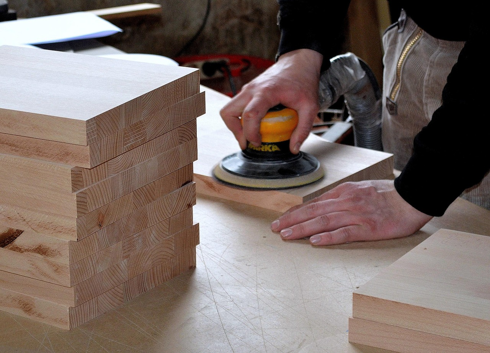
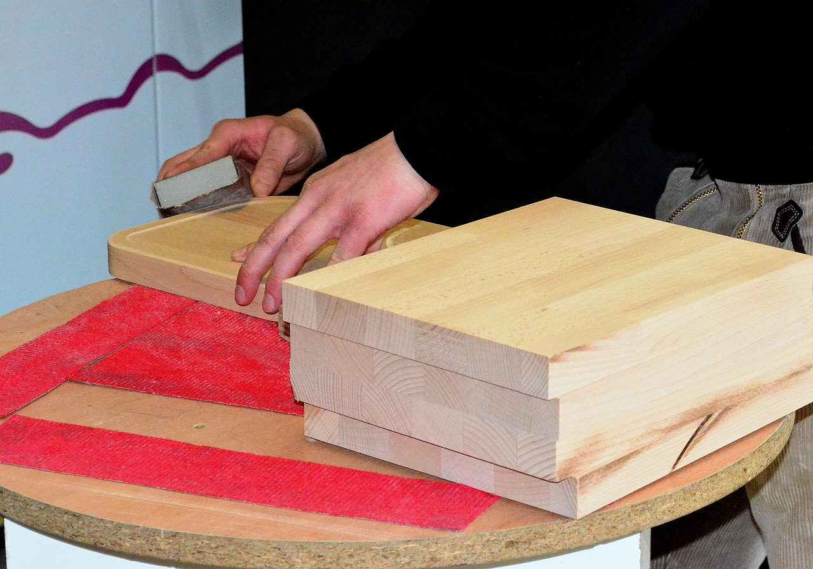
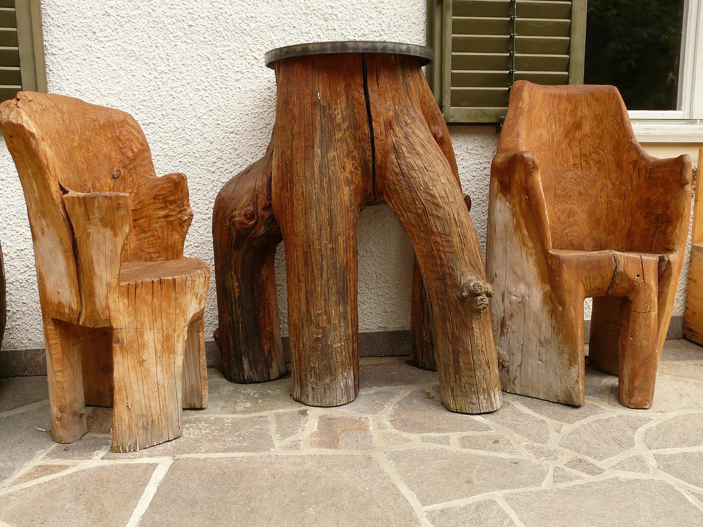

<!--
author:   Volker Göhler; Hilke Domsch

email:    hilke.domsch@gkz-ev.de
 
version:  0.0.1
 
language: de
 
narrator: Deutsch Male

edit: true
date: 2025-07-29
icon: https://raw.githubusercontent.com/Ifi-DiAgnostiK-Project/LiaScript-Courses/refs/heads/main/img/Logo_234px.png
logo: https://upload.wikimedia.org/wikipedia/commons/2/26/Stacked_Timber_Displaying_Growth_Rings.jpg

attribute: Title Image By Kelsey Todd, CC BY-SA 4.0 <https://creativecommons.org/licenses/by-sa/4.0>, via Wikimedia Commons

comment:  Quiz zu Eigenschaften von Holz -- Teil 2

import: https://raw.githubusercontent.com/Ifi-DiAgnostiK-Project/LiaScript_DragAndDrop_Template/refs/heads/main/README.md
import: https://raw.githubusercontent.com/Ifi-DiAgnostiK-Project/Piktogramme/refs/heads/main/makros.md
import: https://raw.githubusercontent.com/Ifi-DiAgnostiK-Project/LiaScript_ImageQuiz/refs/heads/main/README.md
import: https://raw.githubusercontent.com/Ifi-DiAgnostiK-Project/Holzarten/refs/heads/main/makros.md

title: Holzarten II

tags: 
    - Tischler
    - Holzarten

@style
.image-container {
  width: 200px;
  height: 200px;
  border: 1px solid #ccc;
  display: flex;
  justify-content: center;
  align-items: center;
  overflow: hidden;
  background-color: #f8f8f8;
}

.image-container img {
  width: fit-content;
  height: fit-content;
  object-fit: cover;
  display: block;
}

.lia-table__data {
    overflow: hidden;
    padding: 0.5rem;
}

.flex-container {
    display: flex;
    flex-wrap: wrap; /* Allows the items to wrap as needed */
    align-items: stretch;
    gap: 20px; /* Adds both horizontal and vertical spacing between items */
}

.flex-child { 
    flex: 1;
    margin-right: 20px; /* Adds space between the columns */
}

@media (max-width: 600px) {
    .flex-child {
        flex: 100%; /* Makes the child divs take up the full width on slim devices */
        margin-right: 0; /* Removes the right margin */
    }
}
@end

-->
 
# Überprüfen Sie Ihr Wissen zu den Holzarten II

Teil 2
=======

 <!-- style="width: 700px" -->

_Quelle: Pixabay, Detmold_

## Bestimmen Sie die Holzarten als Laub- oder Nadelholz

_Quelle aller Holz-Abbildungen: https://holz-werken.com/holz-datenbank/ bzw. HWK Dresden, Florian Riefling_

 

<!--data-randomize -->
- [  [Laubholz]     [Nadelholz]  ]
- [    (x)             ( )       ] __Ahorn__ @Hoelzer1.Ahorn(10)
- [    ( )             (x)       ] __Weißtanne__ @Hoelzer1.Weisstanne(10)
- [    ( )             (x)       ] __Fichte__ @Hoelzer1.Fichte(10)
- [    (x)             ( )       ] __Buche__ @Hoelzer1.Buche(10)
- [    (x)             ( )       ] __Eiche__ @Hoelzer2.Eiche2(10)
- [    ( )             (x)       ] __Kiefer__ @Hoelzer1.Kiefer(10)

## Zu welcher Holzart gehört folgende Beschreibung?

<!--style="font-size: huge; color: red"-->Hinweis: Es können mehrere Antworten richtig sein. 

-----------------

<!--style="color: green"  -->Dieses Holz besitzt einen hohen Harzgehalt, oft mit sichtbaren Harzkanälen. 
 
Es kann in der Regel für Innen- und Außengestaltungen eingesetzt werden.
 
Es ist ein typisch deutsches Bauholz.

<!--data-randomize -->
- [( )] Hartholz
- [( )] Tropenholz
- [(X)] Weichholz
- [( )] Faserholz

Welche Hölzer sind typischerweise hell in der Farbe?
===

<section class="flex-container">

<!--data-randomize -->
- [[ ]] Buche
- [[X]] Ahorn
- [[X]] Linde
- [[X]] Fichte

<!-- style="width: 250px" -->

<a  href="https://pixabay.com/de/photos/tischler-schreiner-handwerk-3280956/" target=_blank>_Quelle: Pixabay, Detmold_</a>

</section> 

## Welche Holzarten haben keine Harzkanäle?

<!--style="color:green"-->Ziehen Sie alle richtigen Holzarten in die Box.
===

Quelle aller Holz-Abbildungen: https://holz-werken.com/holz-datenbank/

-------

<!--data-randomize -->
@dragdropmultiple(@uid, Robinie|Tanne|Nussbaum|Edelkastanie,Fichte|Douglasie|Lärche)

---------------

<!--data-randomize -->
@dragdropmultiple(@uid, @Hoelzer1.Robinie.src|@Hoelzer1.Weisstanne.src|@Hoelzer1.Nussbaum.src,@Hoelzer1.Laerche.src|@Hoelzer1.Douglasie.src|@Hoelzer1.Fichte.src)

>_Ich wollte noch Edelkastanie reinnehmen, aber das bringt Fehler: Hoelzer1.Edelkastanie.src_

## Holzarten und ihre Verwendungsmöglichkeiten

<!--style="font-size: huge; color: red"-->Hinweis: Es können mehrere Antworten richtig sein. 

-----------------

<!--style="color:green"-->Welche der genannten Holzarten sind typisch für "rustikale", wetterfeste Gartenmöbel?
===

<section class="flex-container">

<!--data-randomize -->
- [[ ]] Birne
- [[ ]] Kirschbaum
- [[X]] Lärche
- [[X]] Eiche
- [[X]] Robinie

<!-- style="width: 250px" -->

<a  href="https://pixabay.com/de/photos/m%C3%B6bel-tisch-stuhl-holz-gartenm%C3%B6bel-617/" target=_blank>_Quelle: Pixabay, Hans_</a>

</section> 

-------------------

<!--style="color:green"-->Auf welche Holzart treffen die Aussagen zu?
===

<!--data-randomize -->
[[ Robinie | (Eiche) | Teak]] ist wegen seiner auffälligen Fladerung (markante schmale Markstrahlen) und Härte beliebt für hochwertige Böden und rustikale Möbel. 

---------------

<!--style="color:green"-->Eschenholz wird aufgrund seiner Härte, Zähigkeit und Elastizität vielseitig eingesetzt:
===

<!--data-randomize -->
- [[X]] Bootsbau
- [[X]] Brennholz
- [[X]] Möbelbau
- [[X]] Treppen
- [[X]] Werkzeugstiele
- [[X]] Skier
- [[X]] Musikinstrumente

## Geschafft ! 👏

<!-- style="width: 500px" -->

<a  href="https://pixabay.com/de/illustrations/freude-springen-luftsprung-spa%C3%9F-3940425/" target=_blank>_Quelle: Pixabay, geralt_</a>
