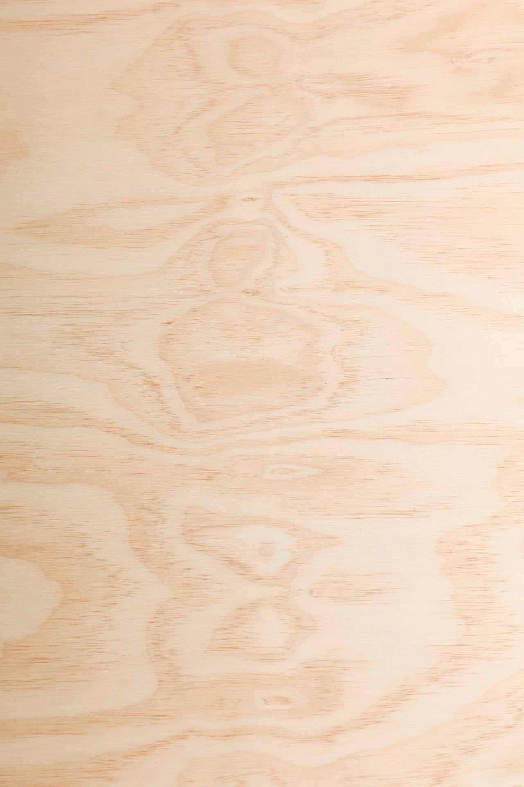
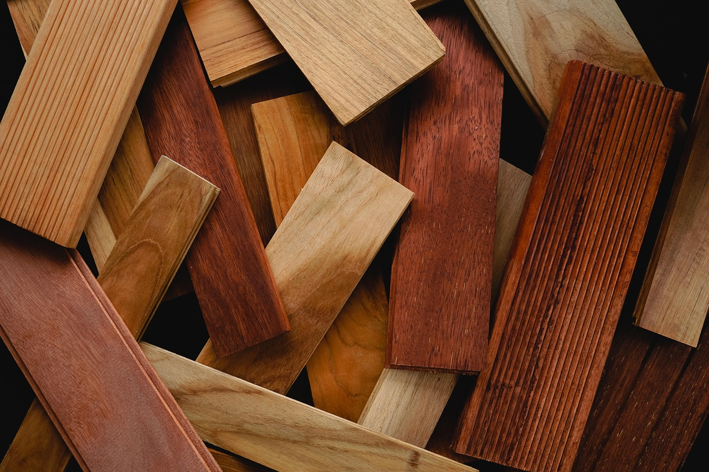

<!--

author:   Hilke Domsch, Volker Göhler

email:    hilke.domsch@gkz-ev.de

version:  0.0.2

language: de

narrator: Deutsch Male

edit: true
date: 2025-07-29

icon: https://raw.githubusercontent.com/Ifi-DiAgnostiK-Project/LiaScript-Courses/refs/heads/main/img/Logo_234px.png
logo: https://upload.wikimedia.org/wikipedia/commons/3/3c/EB1911_Furniture_Fig._1.%E2%80%94Venetian_Folding_Chair%2C_walnut%2C_c._1530.jpg

attribute: Title Image By AnonymousUnknown author, Public domain, via Wikimedia Commons

comment:  Quiz zu Eigenschaften von Holz -- Teil 3

import: https://raw.githubusercontent.com/Ifi-DiAgnostiK-Project/LiaScript_DragAndDrop_Template/refs/heads/main/README.md
import: https://raw.githubusercontent.com/Ifi-DiAgnostiK-Project/Piktogramme/refs/heads/main/makros.md
import: https://raw.githubusercontent.com/Ifi-DiAgnostiK-Project/LiaScript_ImageQuiz/refs/heads/main/README.md
import: https://raw.githubusercontent.com/Ifi-DiAgnostiK-Project/Holzarten/refs/heads/main/makros.md

title: Holzarten III

tags: 
    - Tischler
    - Holzarten

@style
.image-container {
  width: 200px;
  height: 200px;
  border: 1px solid #ccc;
  display: flex;
  justify-content: center;
  align-items: center;
  overflow: hidden;
  background-color: #f8f8f8;
}

.image-container img {
  width: fit-content;
  height: fit-content;
  object-fit: cover;
  display: block;
}

.lia-table__data {
    overflow: hidden;
    padding: 0.5rem;
}

.flex-container {
    display: flex;
    flex-wrap: wrap; /* Allows the items to wrap as needed */
    align-items: stretch;
    gap: 20px; /* Adds both horizontal and vertical spacing between items */
}

.flex-child { 
    flex: 1;
    margin-right: 20px; /* Adds space between the columns */
}

@media (max-width: 600px) {
    .flex-child {
        flex: 100%; /* Makes the child divs take up the full width on slim devices */
        margin-right: 0; /* Removes the right margin */
    }
}
@end

-->
 
# Überprüfen Sie Ihr Wissen zu den Holzarten III

Teil 3
========

<!-- style="width:450px" -->

_Quelle: Pixabay, Ric Evangelista_

## Einteilung in Laub- und Nadelhölzer  anhand des Holzbildes

_Quelle aller Holz-Abbildungen: https://holz-werken.com/holz-datenbank/ bzw. HWK Dresden, Florian Riefling_

 

<!--data-randomize -->
- [  [Laubholz]     [Nadelholz]  ]
- [    (x)             ( )       ] @Hoelzer2.Ahorn(10)
- [    ( )             (x)       ] @Hoelzer1.Weisstanne(10)
- [    ( )             (x)       ] @Hoelzer1.Laerche(10)
- [    (x)             ( )       ] @Hoelzer2.Buche2(10)
- [    (x)             ( )       ] @Hoelzer2.Eiche2(10)
- [    ( )             (x)       ] @Hoelzer1.Kiefer(10)

## Zu welcher Holzart gehört folgende Beschreibung?

<section class="flex-container">

<!--data-randomize -->
[[ (Robinie) | Fichte | Birke | Nussbaum ]]  ist besonders witterungsbeständig mit einem anfangs grünlichen Holz.

<!--data-randomize -->
[[ Robinie | Fichte | Birke | (Nussbaum) ]]  hat ein dunkelbraunes, hartes Holz, welches sich für edle Möbel eignet.

<!--data-randomize -->
[[  Robinie | (Fichte) | Birke | Nussbaum ]]  hat ein sehr weiches Holz, welches harzhaltig ist mit Harzkanälen.

<!--data-randomize -->
[[  Robinie | Fichte | (Birke) | Nussbaum ]]  eignet sich mit dem hellen, mittelharten Holz für Möbel- und Sperrholzverarbeitung.

@Hoelzer1.Birke(20)

<a  href="https://holz-werken.com/holz-datenbank/birke/"  target=_blank>_Quelle: holz-werken.com_</a>

</section> 

--------------

<!--style="color:green"-->Welche Farbe hat das Kernholz der meisten Kirschen?
===

<section class="flex-container">

<!--data-randomize -->
- [( )] weiß
- [( )] gelb
- [( )] grünlich
- [(X)] rötlich-braun

<!-- style="width:250px" -->

<a  href="https://pixabay.com/de/photos/fu%C3%9Fboden-holz-holzbohlen-parkett-6990002/"  target=_blank>_Quelle: Pixabay, Lantaikayu-biz_</a>

</section> 

## Welche Holzbilder zeigen Nadelgehölze?

<!--style="color:green"-->Ziehen Sie alle richtigen Holzarten in die Box.
===

Quelle aller Holz-Abbildungen: https://holz-werken.com/holz-datenbank/

---------------

<!--data-randomize -->
@dragdropmultiple(@uid, @Hoelzer1.Fichte.src|@Hoelzer1.Weisstanne.src|@Hoelzer1.Laerche.src|@Hoelzer1.Kiefer.src,@Hoelzer1.Kirschbaum.src|@Hoelzer1.Schwarzerle.src|@Hoelzer1.Roteiche.src))

## Welches Holzbild zeigt ein Laubgehölz?

<!--data-randomize -->
- [          [Laubholz]  ]
- [              ( )       ] @Hoelzer1.Schwarzerle(10)
- [              ( )       ] @Hoelzer1.Fichte(10)
- [              ( )       ] @Hoelzer1.Laerche(10)
- [              ( )       ] @Hoelzer1.Roteiche(10)
- [              ( )       ] @Hoelzer1.Linde(10)
- [              ( )       ] @Hoelzer1.Kiefer(10)

## Welche Holzarten eignen sich besonders gut für den Möbelbau?

<!--style="color:green"-->Ziehen Sie alle richtigen Holzarten in die Box.
===

Quelle aller Holz-Abbildungen: https://holz-werken.com/holz-datenbank/

-------

<!--data-randomize -->
@dragdropmultiple(@uid, Buche|Birke|Lärche|Eiche|Esche|Nussbaum,Pappel|Erle)

---------------

<!--data-randomize -->
@dragdropmultiple(@uid, @Hoelzer1.Buche.src|@Hoelzer1.Birke.src|@Hoelzer1.Nussbaum.src|@Hoelzer1.Laerche.src|@Hoelzer1.Weisseiche.src|@Hoelzer1.Esche.src,@Hoelzer1.Pappel.src)

## Bilderquiz Holzarten

<!--style="color:green"-->Welches Bild zeigt das Schnitz-Holz Linde?
===

<section class="flex-container" style="padding: 1rem;">

@Hoelzer1.Linde(10)

__Bild 1:__

@Hoelzer1.Birke(10)

__Bild 2:__

@Hoelzer1.Birnbaum(10)

__Bild 3:__

 

</section>

[[ (Bild 1) | Bild 2 | Bild 3 ]]

----------------

<!--style="color:green"-->Welche Bild zeigt die Holzart Pappel?
===

<section class="flex-container" style="padding: 1rem;">

@Hoelzer1.Elsbeere(10)

__Bild 1:__

@Hoelzer1.Edelkastanie(10)

__Bild 2:__

@Hoelzer1.Ulme_Ruester(10)

__Bild 3:__

 

</section>

[[ (Bild 1) | Bild 2 | Bild 3 ]]

-----------

<!--style="color:green"-->Welche Bild zeigt die Holzart Ulme?
===

<section class="flex-container" style="padding: 1rem;">

@Hoelzer1.Laerche(10)

__Bild 1:__

@Hoelzer1.Birke(10)

__Bild 2:__

@Hoelzer1.Ulme_Pappel(10)

__Bild 3:__

 

</section>

[[Bild 1 | Bild 2 | (Bild 3) ]]

## Geschafft ! 👏

<!-- style="width: 500px" -->

<a  href="https://pixabay.com/de/illustrations/freude-springen-luftsprung-spa%C3%9F-3940425/" target=_blank>_Quelle: Pixabay, geralt_</a>
