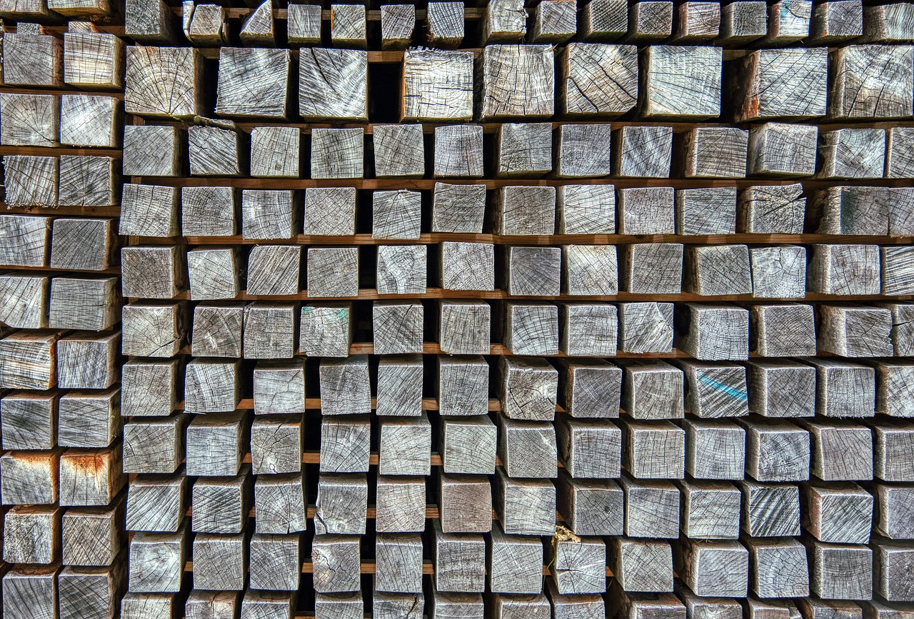

<!--

author:   Hilke Domsch, Volker Göhler

email:    hilke.domsch@gkz-ev.de

version:  0.0.2

language: de

narrator: Deutsch Male

edit: true
date: 2025-07-31

comment:  Holzarten und die üblichen Kürzel
title: Holzarten IV

tags: 
  - Tischler
  - Holzarten

logo: img/front_wood_stack.jpg
icon: https://raw.githubusercontent.com/Ifi-DiAgnostiK-Project/LiaScript-Courses/refs/heads/main/img/Logo_234px.png

import: https://raw.githubusercontent.com/Ifi-DiAgnostiK-Project/LiaScript_DragAndDrop_Template/refs/heads/main/README.md
import: https://raw.githubusercontent.com/Ifi-DiAgnostiK-Project/Piktogramme/refs/heads/main/makros.md
import: https://raw.githubusercontent.com/Ifi-DiAgnostiK-Project/LiaScript_ImageQuiz/refs/heads/main/README.md
import: https://raw.githubusercontent.com/Ifi-DiAgnostiK-Project/Holzarten/refs/heads/main/makros.md

@style
.flex-container {
    display: flex;
    flex-wrap: wrap; /* Allows the items to wrap as needed */
    align-items: stretch;
    gap: 20px; /* Adds both horizontal and vertical spacing between items */
}

.flex-child { 
    flex: 1;
    margin-right: 20px; /* Adds space between the columns */
}

@media (max-width: 600px) {
    .flex-child {
        flex: 100%; /* Makes the child divs take up the full width on slim devices */
        margin-right: 0; /* Removes the right margin */
    }
}

.image-container {
  width: 200px;
  height: 200px;
  border: 1px solid #ccc;
  display: flex;
  justify-content: center;
  align-items: center;
  overflow: hidden;
  background-color: #f8f8f8;
}

.image-container img {
  width: fit-content;
  height: fit-content;
  object-fit: cover;
  display: block;
}

@end

-->

# Holzarten: Eigenschaften, Verwendung und Aussehen I

<!-- style="width: 800px" -->

_Quelle: Pixabay, webentwicklerin_

## Eiche 

_Quelle aller Holz-Abbildungen:_ https://holz-werken.com/holz-datenbank/ bzw. HWK Dresden, Florian Riefling

----------------

<!--style="color:green; font-size: large; font-weight: bolder"-->Eiche (EI / QCXR)

<section class="flex-container" style="padding: 1rem;">

<!--style="color:green; font-size: large; font-weight: bolder"-->Eigenschaften:

* markante, schmale Markstrahlen
* Splint darf nicht verwendet werden
* Kern ist sehr hart und dauerhaft
* groß-ringporig
* hell-mittelbraun

<!--style="color:green; font-size: large; font-weight: bolder"-->Verwendung:

* anspruchsvolle Bautischler-Arbeiten
* Möbelbau, meist Furnier
* Parkett

</section>

>_Könnten bitte die beiden Textblöcke im Container auf einer Höhe stehen?_

-------------------

Klicken Sie auf das richtige Holzarten-Bild.
===

<!--style="color:red; font-weight: bolder"-->Es können mehrere Bilder richtig sein.

-------------------

@selectimages(@uid,10, @Hoelzer2.Eiche.src|@Hoelzer1.Weisseiche.src, @Hoelzer1.Edelkastanie.src|@Hoelzer1.Nussbaum.src|@Hoelzer1.Elsbeere.src)

## Buche

_Quelle aller Holz-Abbildungen:_ https://holz-werken.com/holz-datenbank/ bzw. HWK Dresden, Florian Riefling

----------------

<!--style="color:green; font-size: large; font-weight: bolder"-->Buche (BU / FASY)

<section class="flex-container" style="padding: 1rem;">

<!--style="color:green; font-size: large; font-weight: bolder"-->Eigenschaften:

* kleine Markstrahlen
* Jahresringe nur schwach sichtbar
* rötlich-weiß

<!--style="color:green; font-size: large; font-weight: bolder"-->Verwendung:

* Möbel- und Innenausbau
* Sperrholzplatten
* Fußleisten
* Brennholz

</section>

-------------------

Klicken Sie auf das richtige Holzarten-Bild.
===

<!--style="color:red; font-weight: bolder"-->Es können mehrere Bilder richtig sein.

-------------------

@selectimages(@uid,10, @Hoelzer2.Buche2.src|@Hoelzer1.Buche.src, @Hoelzer1.Balsa.src|@Hoelzer1.Birke.src|@Hoelzer1.Schwarzerle.src)

## Nussbaum

_Quelle aller Holz-Abbildungen:_ https://holz-werken.com/holz-datenbank/ bzw. HWK Dresden, Florian Riefling

----------------

<!--style="color:green; font-size: large; font-weight: bolder"-->Nussbaum (NB / JGRG)

<section class="flex-container" style="padding: 1rem;">

<!--style="color:green; font-size: large; font-weight: bolder"-->Eigenschaften:

* dunkler Kern
* kurze, schwarze Striche = Poren
* hellbrauner Splint

<!--style="color:green; font-size: large; font-weight: bolder"-->Verwendung:

* schönes, edles, teures Möbelholz

</section>

-------------------

Klicken Sie auf das richtige Holzarten-Bild.
===

<!--style="color:red; font-weight: bolder"-->Es ist nur ein Bild richtig.

-------------------

@selectimages(@uid,10, @Hoelzer1.Nussbaum.src, @Hoelzer1.Pappel.src|@Hoelzer1.Birnbaum.src|@Hoelzer1.Schwarzerle.src|@Hoelzer1.Pockholz.src|@Hoelzer2.Mahagonie.src)

## Kirschbaum

_Quelle aller Holz-Abbildungen:_ https://holz-werken.com/holz-datenbank/ bzw. HWK Dresden, Florian Riefling

----------------

<!--style="color:green; font-size: large; font-weight: bolder"-->Kirschbaum (KB / PRAV)

<section class="flex-container" style="padding: 1rem;">

<!--style="color:green; font-size: large; font-weight: bolder"-->Eigenschaften:

* Jahresringzonen oft verschieden gefärbt mit leicht grünlichem Schimmer
* rötliche Farbe

<!--style="color:green; font-size: large; font-weight: bolder"-->Verwendung:

* Möbelholz
* auch für anspruchsvollen Innenausbau

</section>

-------------------

Klicken Sie auf das richtige Holzarten-Bild.
===

<!--style="color:red; font-weight: bolder"-->Es können mehrere Bilder richtig sein.

-------------------

@selectimages(@uid,10, @Hoelzer1.Kirschbaum.src|@Hoelzer2.Kirsche.src, @Hoelzer1.Pockholz.src|@Hoelzer1.Ulme_Ruester.src|@Hoelzer1.Weisseiche.src|@Hoelzer2.Mahagonie.src)

## Ahorn

_Quelle aller Holz-Abbildungen:_ https://holz-werken.com/holz-datenbank/ bzw. HWK Dresden, Florian Riefling

----------------

><!--style="color:red"-->_Florian: Laut einer DIN-Liste lautet für Bergahorn das EU-Kürzel ACPS; für Feldahorn ACCM. Bitte klären._

<!--style="color:green; font-size: large; font-weight: bolder"-->(Berg-)Ahorn (AH / ACCM)

<section class="flex-container" style="padding: 1rem;">

<!--style="color:green; font-size: large; font-weight: bolder"-->Eigenschaften:

* hart
* sehr feinporig
* beinahe weiß

<!--style="color:green; font-size: large; font-weight: bolder"-->Verwendung:

* Innenteile von Möbel
* massive Tischplatten
* Parkett

</section>

-------------------

Klicken Sie auf das richtige Holzarten-Bild.
===

<!--style="color:red; font-weight: bolder"-->Es können mehrere Bilder richtig sein.

-------------------

@selectimages(@uid,10, @Hoelzer1.Ahorn.src|@Hoelzer2.Ahorn.src|@Hoelzer2.Ahorn2.src, @Hoelzer1.Balsa.src|@Hoelzer1.Linde.src|@Hoelzer1.Schwarzerle.src)

## Tanne / Weißtanne

_Quelle aller Holz-Abbildungen:_ https://holz-werken.com/holz-datenbank/ bzw. HWK Dresden, Florian Riefling

----------------

<!--style="color:green; font-size: large; font-weight: bolder"-->Tanne (TA / ABAL)

<section class="flex-container" style="padding: 1rem;">

<!--style="color:green; font-size: large; font-weight: bolder"-->Eigenschaften:

* keine Harzgallen und Harzkanäle
* lässt sich dadurch besser imprägnieren, beizen, lackieren als Fichtenholz
* glanzlos
* weniger warmer Farbton wie Fichte, oft Stich ins Gräuliche

<!--style="color:green; font-size: large; font-weight: bolder"-->Verwendung:

* Bau- und Fensterholz
* Wand- und Deckenverkleidung
* Innenausbau
* Möbel

</section>

-------------------

Klicken Sie auf das richtige Holzarten-Bild.
===

<!--style="color:red; font-weight: bolder"-->Es ist nur ein Bild richtig.

-------------------

@selectimages(@uid,10, @Hoelzer1.Weisstanne.src, @Hoelzer1.Ulme_Ruester.src|@Hoelzer1.Teak.src|@Hoelzer1.Douglasie.src|@Hoelzer1.Fichte.src)

## Haben Sie sich die Kürzel je Holzart gemerkt?

Ziehen Sie die richtigen Kürzel zur jeweiligen Holzart.
===

<!--style="color:green; font-size: large; font-weight: bolder"-->Nussbaum-Kürzel deutsch: [->[  (NB) | NU ]]  ${/}$ Nussbaum-Kürzel EU: [->[  (JGRG) | RGJG ]] 

---------------

<!--style="color:green; font-size: large; font-weight: bolder"-->Tanne-Kürzel deutsch: [->[  (TA) | TN ]]  ${/}$ Tanne-Kürzel EU: [->[  ALAB | (ABAL) ]] 

----------------

<!--style="color:green; font-size: large; font-weight: bolder"-->Buche-Kürzel deutsch: [->[  BC | (BU) ]]  ${/}$ Buche-Kürzel EU: [->[  FAST | (FASY) ]] 

--------------

<!--style="color:green; font-size: large; font-weight: bolder"-->Ahorn-Kürzel deutsch: [->[  (AH) | AN ]]  ${/}$ Ahorn-Kürzel EU: [->[  (ACCM) | ACCE ]] 

><!--style="color:red"-->_Florian: Laut einer DIN-Liste lautet für Bergahorn das EU-Kürzel ACPS; für Feldahorn ACCM. Bitte klären._

-----

<!--style="color:green"-->Gratulation 🎉
===
