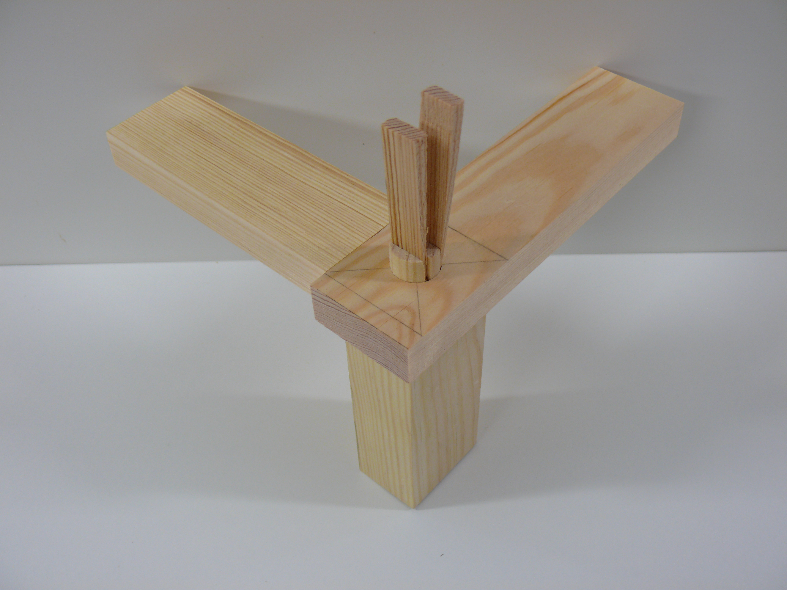
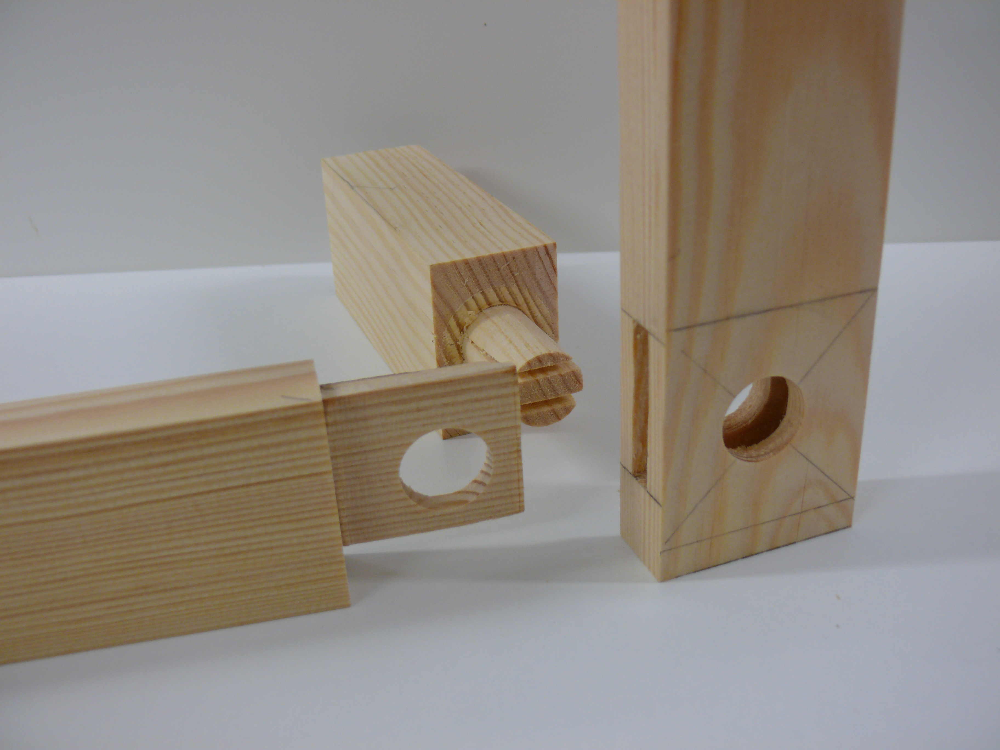
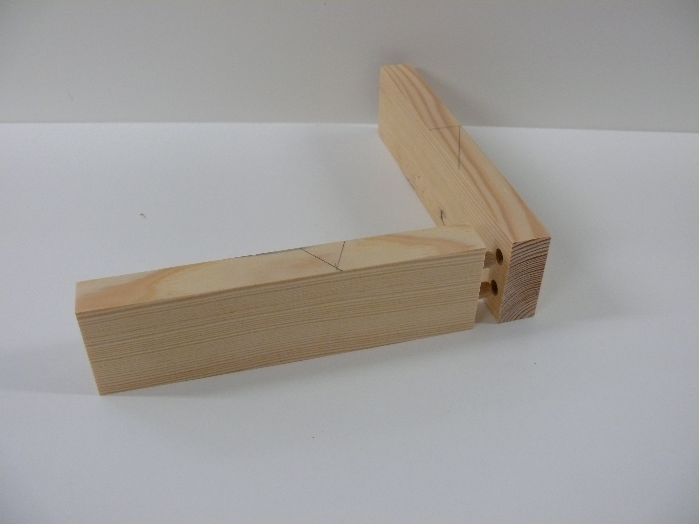
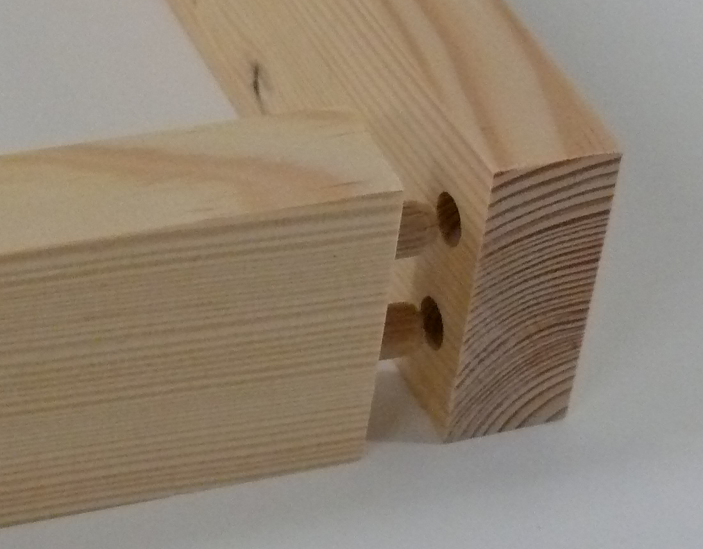
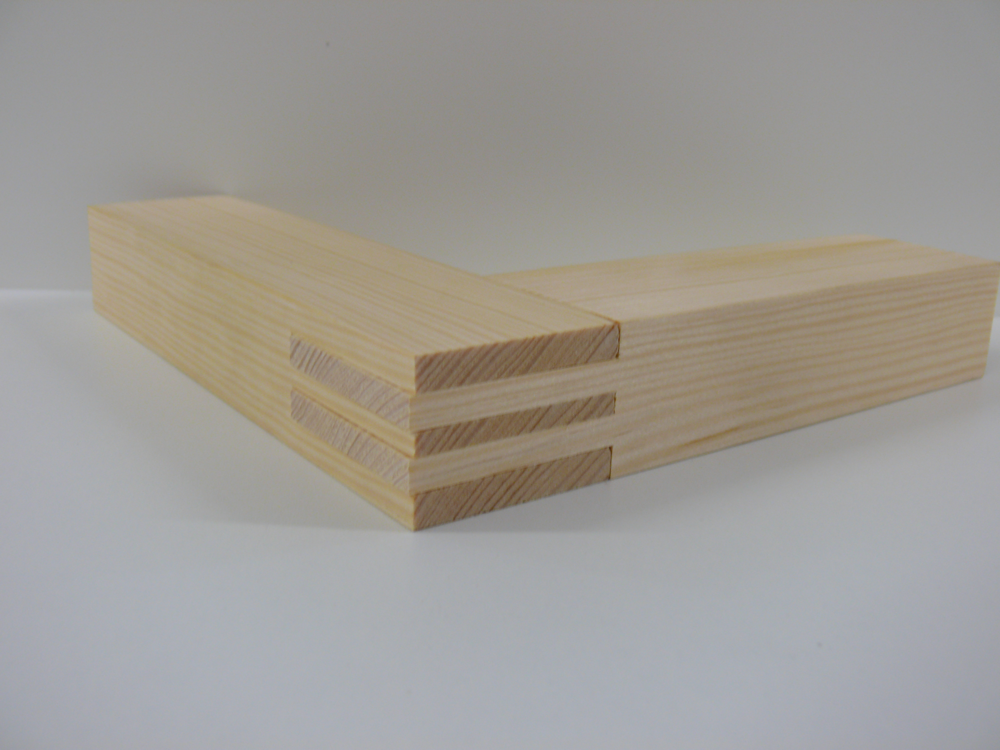
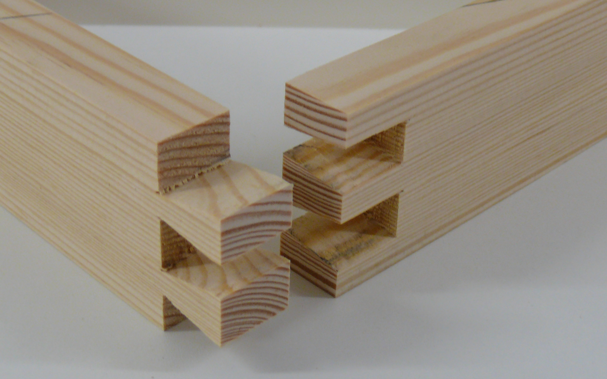
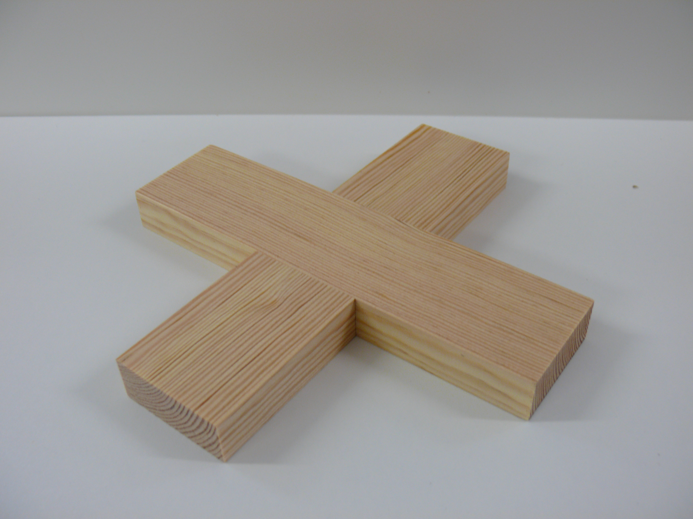
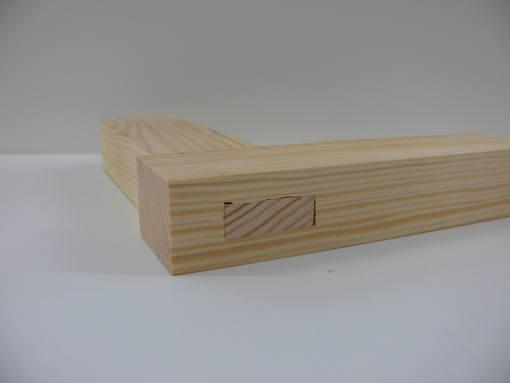
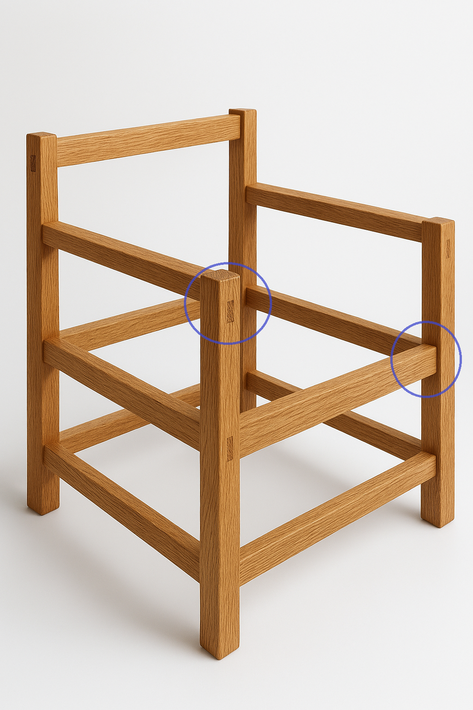

<!--

author:   Hilke Domsch
email:    hilke.domsch@gkz-ev.de
version:  0.1.4
language: de
narrator: Deutsch Male

edit: true
date: 2026-01-22

icon: https://raw.githubusercontent.com/Ifi-DiAgnostiK-Project/LiaScript-Courses/refs/heads/main/img/Logo_234px.png
logo: img/woodwall_corner.png
attribute: "Quelle Titlebild: pixabay"

comment:  Kurs zu den im Gestellbau für Polstermöbel übliche Holzverbindungen

title: "R3/06 Holzverbindungen im Polstermöbelbau - Überblickswissen"

link: ./style.css

import: https://raw.githubusercontent.com/Ifi-DiAgnostiK-Project/LiaScript_DragAndDrop_Template/refs/heads/main/README.md
        https://raw.githubusercontent.com/Ifi-DiAgnostiK-Project/Piktogramme/refs/heads/main/makros.md
        https://raw.githubusercontent.com/Ifi-DiAgnostiK-Project/Textilpflegesymbole/refs/heads/main/makros.md
        https://raw.githubusercontent.com/Ifi-DiAgnostiK-Project/LiaScript_ImageQuiz/refs/heads/main/README.md
        https://raw.githubusercontent.com/Ifi-DiAgnostiK-Project/Bildersammlung/refs/heads/main/makros.md
        https://raw.githubusercontent.com/Ifi-DiAgnostiK-Project/Tapetensymbole/refs/heads/main/makros.md

tags: [Polstern, Polstermöbel, Gestellbau, Polstergestellbau, Holzverbindung, Holz, Raumausstatter]

-->

# Holzverbindungen im Polstermöbelbau - Überblickswissen

Holzverbindungen sind ein wichtiger Bestandteil von Polstermöbeln.\
Sie sorgen dafür, dass Gestelle 

<!-- class="bluefolder"-->
- stabil
- belastbar
- langlebig

 

sind - auch dann, wenn sie später nicht mehr sichtbar sind.\

Als angehende Raumausstatterin bzw. angehender Raumausstatter sollten Sie die wichtigsten Holzverbindungen 

<!-- class="intdes"-->
- erkennen
- benennen
- unterscheiden können.

 

In diesem Quiz testen Sie Ihr Grundwissen zu 

<!-- class="blueball"-->
- typischen Holzverbindungen
- deren Grundprinzip
- Einsatz im Polstermöbelbau 

 
<!--class="highlight"-->
Viel Erfolg!
------------

   

 

")<!-- style="max-width: 450px; width: 100%" -->

 

## Erkennen & Benennen von typischen Holzverbindungen

Auf den folgenden Seiten sehen Sie Abbildungen von 6 typischen Holzverbindungen bei Vollholzgestellen:

<!-- class="hash" -->
- Dübelverbindung
- Zapfenverbindung
- Schlitz-Zapfen-Verbindung
- offene Zinkung
- überblattete Verbindung
- durchbohrte und gezapfte Verbindung

 

<!-- class="highlight" -->
Ordnen Sie jeweils das Bild der richtigen Holzverbindung zu.

-----

   

 

<!-- style="max-width: 450px; width: 100%" -->

 

### Holzverbindung 1

<section class="flex-container border">

<!-- class="highlight" -->
Welche Holzverbindung ist abgebildet?

<!-- data-randomize -->
- [( )] Dübelverbindung
- [(X)] durchbohrte und gezapfte Verbindung
- [( )] offene Zinkung
- [( )] überblattete Verbindung

<!-- style="max-width: 450px; width: 100%; margin-left:-50px; margin-top:10px;" -->

</section>

 

<!-- style="max-width: 450px; width: 100%" -->

 

### Holzverbindung 2

<section class="flex-container border">

<!-- class="highlight" -->
Welche Holzverbindung ist abgebildet?

<!-- data-randomize -->
- [(X)] gedübelte Verbindung
- [( )] durchbohrte und gezapfte Verbindung
- [( )] gezinkte Verbindung
- [( )] Schlitz-Zapfen-Verbindung

<!-- style="max-width: 550px; width: 100%; margin-left:-50px; margin-top:10px;" -->

</section>

 

<!-- style="max-width: 550px; width: 100%" -->

 

### Holzverbindung 3

<section class="flex-container border">

<!-- class="highlight" -->
Welche Holzverbindung ist abgebildet?

<!-- data-randomize -->
- [(X)] Schlitz-Zapfen-Verbindung
- [( )] Dübelverbindung
- [( )] durchbohrte und gezapfte Verbindung
- [( )] überblattete Verbindung

<!-- style="max-width: 550px; width: 100%; margin-left:-50px; margin-top:10px;" -->

</section>

 

<!-- style="max-width: 550px; width: 100%" -->

 

### Holzverbindung 4

<section class="flex-container border">

<!-- class="highlight" -->
Welche Holzverbindung ist abgebildet?

<!-- data-randomize -->
- [( )] Schlitz-Zapfen-Verbindung
- [( )] Zapfen-Verbindung
- [(X)] offene Zinkung
- [( )] Dübelverbindung

<!-- style="max-width: 550px; width: 100%; margin-left:-50px; margin-top:10px;" -->

</section>

 

<!-- style="max-width: 550px; width: 100%" -->

 

### Holzverbindung 5

<section class="flex-container border">

<!-- class="highlight" -->
Welche Holzverbindung ist abgebildet?

<!-- data-randomize -->
- [( )] durchbohrte und gezapfte Verbindung
- [( )] Dübelverbindung
- [( )] Zapfenverbindung
- [(X)] überblattete Verbindung

<!-- style="max-width: 550px; width: 100%; margin-left:-50px; margin-top:10px;" -->

</section>

 

<!-- style="max-width: 550px; width: 100%" -->

 

### Holzverbindung 6

<section class="flex-container border">

<!-- class="highlight" -->
Welche Holzverbindung ist abgebildet?

<!-- data-randomize -->
- [( )] geschlitzte Verbindung
- [(x)] gezapfte Verbindung
- [( )] gedübelte Verbindung
- [( )] überblattete Verbindung

<!-- style="max-width: 550px; width: 100%; margin-left:-50px; margin-top:10px;" -->

</section>

 

<!-- style="max-width: 550px; width: 100%" -->

 

## Anwendung von Holzverbindungen im Polstergestellbau

<!-- class="highlight" -->
Ordnen Sie die folgenden Aussagen in "richtig" und "falsch" ein.

-----------

<!-- data-randomize -->
- [  [richtig]     (falsch) ]
- [    (X)           ( )    ]  Holzverbindungen im Polstergestellbau müssen hohe Belastungen aushalten.
- [    ( )           (X)    ]  Die überplattete Verbindung wird ausschließlich bei Vollholz- bzw. Sichtholzgestellen verwendet.
- [    (X)           ( )    ]  Gedübelte Verbindungen zeichnen sich durch eine hohe Stabilität, einfache Fertigung und Ästhetik aus.
- [    ( )           (X)    ]  Die durchbohrte und gezapfte Verbindung eignet sich für weniger beanspruchte Gestellteile.
- [    (X)           ( )    ]  Die Wahl der Holzverbindung hängt im Polstergestellbau auch davon ab, ob das Gestell sichtbar bleibt oder nicht. 
- [    (X)           ( )    ]  Die (Schlitz-)Zapfen-Verbindung wird aufgrund der hohen Stabilität und schönen Optik oft bei Sichtholzgestellen eingesetzt.
- [    ( )           (X)    ]  Die gezinkte Verbindung ist die am häufigsten eingesetzte Holzverbindung im Polstergestellbau.

-------------------

 

<!-- style="max-width: 350px; width: 100%" -->

 

## Geschafft 🎉

