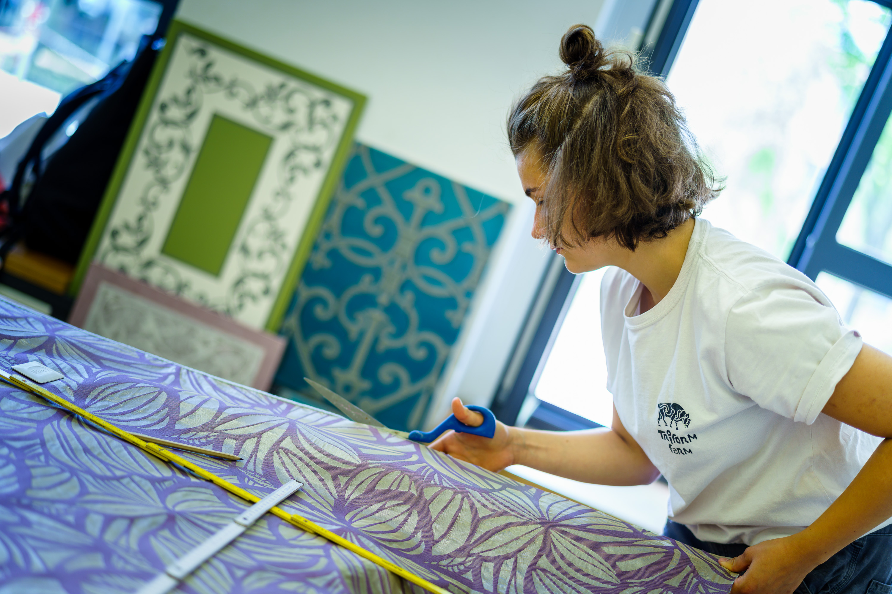

<!--

author:   Hilke Domsch

email:    hilke.domsch@gkz-ev.de

version:  0.0.4

language: de

narrator: Deutsch Male

comment:  Grundkurs Raumausstatter

edit: true
date: 2025-06-24
logo: https://raw.githubusercontent.com/Ifi-DiAgnostiK-Project/LiaScript-Courses/refs/heads/main/img/Logo_234px.png

import: https://raw.githubusercontent.com/Ifi-DiAgnostiK-Project/LiaScript_DragAndDrop_Template/refs/heads/main/README.md
import: https://raw.githubusercontent.com/Ifi-DiAgnostiK-Project/Piktogramme/refs/heads/main/makros.md
import: https://raw.githubusercontent.com/Ifi-DiAgnostiK-Project/LiaScript_ImageQuiz/refs/heads/main/README.md

tags:
    - Raumausstatter

@style
.flex-container {
    display: flex;
    flex-wrap: wrap; /* Allows the items to wrap as needed */
    align-items: stretch;
    gap: 20px; /* Adds both horizontal and vertical spacing between items */
}

.flex-child {
    flex: 1;
    margin-right: 20px; /* Adds space between the columns */
}

@media (max-width: 600px) {
    .flex-child {
        flex: 100%; /* Makes the child divs take up the full width on slim devices */
        margin-right: 0; /* Removes the right margin */
    }
}
@end

-->

# Grundstufe Raumausstatter Kurs GR-06

_Quelle: GKZ_

>_Wenn Kay Lust hat, wäre hier eine kurze Videosequenz möglich, wo kurz zusammmengefasst alle praktischen Arbeiten des Kurses vorgestellt werden._

##  Überprüfungsaufgaben

Sie haben in den letzten Tagen Werkzeuge und Grundhandgriffe im Raumausstatterhandwerk kennengelernt und eingeübt.
===

__Überprüfen Sie Ihr Wissen - viel Erfolg!__

_Ein Hinweis: Es können mehrere Antworten richtig sein!_

>_Schriftfarbenänderungen wären hilfreich - ebenso eine einfache Formatierung der Schriftgrößen_

_Quelle: HWK Dresden, André Wirsing_

## 1. Welche genannten Teile gehören zu einem Schnellnäher?

Ziehe die richtigen Antworten in das Feld.
===

_Kleiner Tipp: 10 Angaben sind richtig_ 😄 - Erst nach den 10 richtigen Auswahl-Antworten, gibt es ein grünes Häckchen!

<!-- data-randomize -->
@dragdropmultiple(@uid,Gestell|Tischplatte|Kopf|Arm|Handrad|Nadelstange|Fadenheber|Spulenkapsel|Transporteur,Hubtisch|Ohr|Finger|Kurbel|Gaspedal|Fadengalgen)

>_Bitte "Pool" und "Your Selection" auf Deutsch schreiben!_

>_Kann man irgendwie eine Rückmeldung geben, dass - wenn viele Einzelantworten zu geben sind und diese im Einzelnen richtig sind - das die Einzelantwort zwar richtig ist, aber die Gesamtantwort noch nicht? - So denkt man, wenn man auswählt, aha, da kommt ein "X", ist also falsch_ 🤷‍♀️

>_Können aus den 10 richtigen Antworten per Zufall nur 5 ausgewählt werden - ebenso sollen aus den momentan 6 falschen Antworten nur 5 falsche zur Verfügung gestellt werden.

## 2. Was ist beim Zuschneiden von Dekorationsstoffen zu beachten?

Klicke alle richtigen Angaben an!
===

<!-- data-randomize -->
- [[X]] Fadenlauf
- [[X]] Webkante
- [[X]] Rapport
- [[X]] Musterung
- [[X]] Materialart
- [[X]] Zuschnittplan
- [[ ]] Fadenfarbe
- [[ ]] Fusselkante

>_HWK: Vielleicht Bilder statt Wörter?._

>_Es wird gewünscht, das bereits bei der ersten Antwortrunde beim Auswerten die richtigen Antworten, die nicht gewählt worden sind, angezeigt werden._

>_Kann die Aufgabe - falls sie falsch gelöst wurde und nochmal probiert werden soll - sofort nochmal neu gelöst werden?_

## 3. Welche Polsteruntergründe kennen Sie?

Ordnen Sie richtig zu!
===

<!-- data-randomize -->
- [[Polsteruntergrund - ja] (Polsteruntergrund - nein)]
- [    ( )           (X)        ]  Leisten
- [    (X)           ( )        ]  Holzplatte
- [    (X)           ( )        ]  Gurtung
- [    ( )           (X)        ]  Polsterpappe
- [    (X)           ( )        ]  Federkorb
- [    (X)           ( )        ]  Wellenfedern
- [    ( )           (X)        ]  Gummikokos

>_Ich habe diese Abfrage mal noch in eine andere Quizform gepackt:_

<!-- data-randomize -->
@dragdropmultiple(@uid,Federkorb|Gurtung|Wellenfedern|Holzplatte,Polsterpappe|Gummikokos|Leisten)

>_Bitte "Pool" und "Your Selection" auf Deutsch schreiben!_

>_Cool wäre auch ein Tool, in dem ich auf die richtigen Begriffe tippe. Auch hier steht immer gleich die Frage von den Ausbildern: Wie wird bei Mehrfachauswahl zurückgemeldet, wenn die gegebene Einzelantwort richtig bzw. falsch war? Bis jetzt tippe ich "blind" an und erfahre erst das Gesamtergebnis - und hier auch nicht, wie viele Einzelfehler für die Gesamt-falsche Antwort gemacht worden sind._

## 4. Welche Nahtarten gehören zu den Handnähten?

Entscheiden Sie sich für die richtige Handnaht: 🤷‍♀️
===

>_Randomize funktioniert hier nicht innerhalb der Antworten! Ich würde gern die Auswahlantworten nebeneinander setzen._

<!-- data-randomize -->
[[ (verzogener Stich) | __vorgezogener Stich__]]

<!-- data-randomize -->
[[ (überwendlicher Stich) | __überwundener Stich__]]

<!-- data-randomize -->
[[ Kettelnaht | (__Rückstich__)  ]]

<!-- data-randomize -->
[[ (Zierstich) | __Verbindungsnaht__]]

<!-- data-randomize -->
[[ Säbelstich | (__Schwertstich__)  ]]

>_Hier wäre auch cool, beide Schreibweisen nebeneinander stehen zu haben und der Azubi klickt seine Wahl an._

## 5. Welche Bodenbeläge verarbeitet der Raumausstatter ~~nicht~~?

Wähle die entsprechenden Antworten aus.
===

<!-- data-randomize -->
- [[ ]] CV Belag
- [[ ]] PVC Belag
- [[X]] Keramikfliesen
- [[ ]] Linoleum
- [[ ]] textile Beläge
- [[ ]] Laminat
- [[X]] Terrazzo
- [[ ]] Fertigparkett
- [[X]] Stabparkett
- [[ ]] Designbelag
- [[X]] Steinboden

>_Die Zuordnung anhand kleiner Materialbilder wäre ansprechender._

>_TUBAF: Wie funktionert eine Bilderpuzzleabfrage ähnlich "Ich bin kein Roboter", wo nach einem bestimmten Begriff alls Bilder angetippt werden sollen, die den entsprechenden Begriff zeigen._

>Hier wäre ein Anklick-Tool besser. Die Auswahlliste ist (zu) lang. Alternativ soll aus den vorgegebenen Begriffen immer 5 Antwortmöglichkeiten in unterschiedlicher Zusammensetzung "falsch-richtig" vom System vorgegeben werden._

## 6. Sie haben verschiedene Tapezierwerkzeuge kennengelernt.

Ordnen Sie richtig zu!
===

<!-- data-randomize -->
- [[Tapezierwerkzeug - ja] (Tapezierwerkzeug - nein)]
- [    ( )           (X)        ]  Zuschneidetisch
- [    ( )           (X)        ]  Stecknadel
- [    (X)           ( )        ]  Kreuzlaser
- [    (X)           ( )        ]  Wasserwaage
- [    (X)           ( )        ]  Cuttermesser
- [    ( )           (X)        ]  Verlegemesser
- [    ( )           (X)        ]  Gurtspanner
- [    (X)           ( )        ]  Lot
- [    (X)           ( )        ]  Spachtel
- [    (X)           ( )        ]  Tapezierbürste
- [    ( )           (X)        ]  Drahtbürste
- [    ( )           (X)        ]  Zahnspachtel
- [    (X)           ( )        ]  Cutterkantschiene
- [    (X)           ( )        ]  Schere
- [    (X)           ( )        ]  Tapeziertisch

>_Vielleicht ließe sich die Kopfzeile durch ein Arbeitsbild Tapezieren aufhübschen?_

>Hier wäre ein Anklick-Tool besser. Die Auswahlliste ist (zu) lang. Alternativ soll aus den vorgegebenen Begriffen immer 5 Antwortmöglichkeiten in unterschiedlicher Zusammensetzung "falsch-richtig" vom System vorgegeben werden._

---

Geschafft! 👌
===
