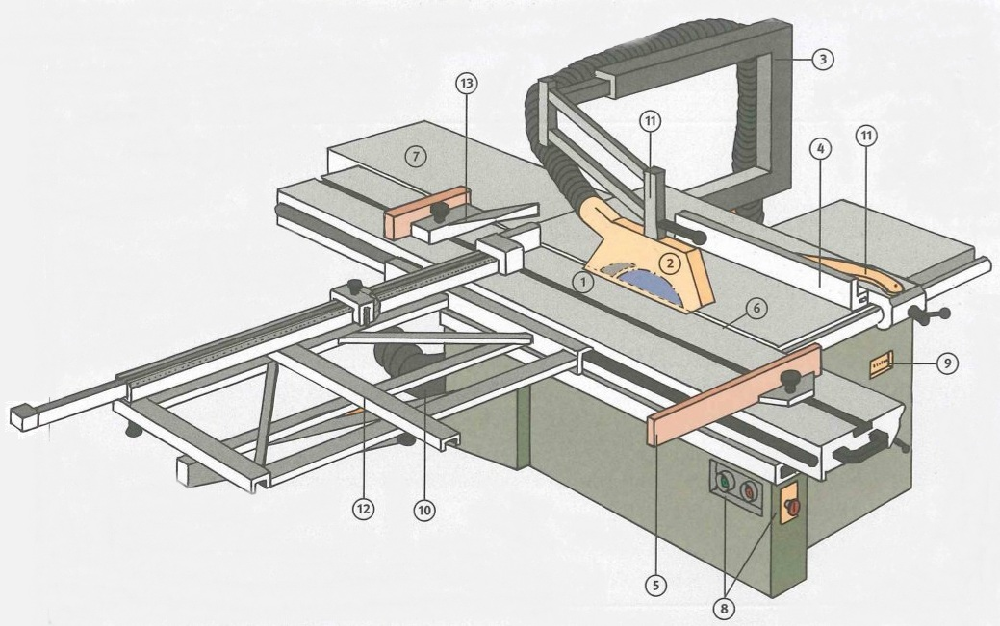
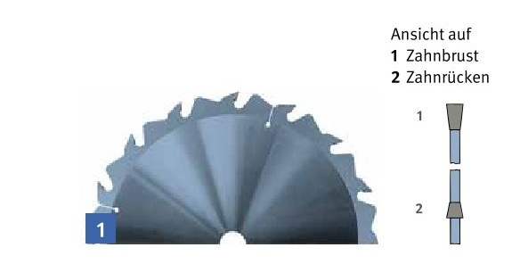
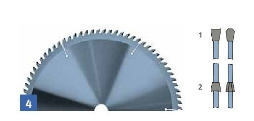
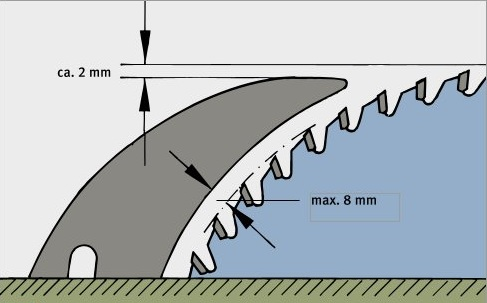

<!--

author:   Hilke Domsch

email:    hilke.domsch@gkz-ev.de

version:  0.0.1

language: de

narrator: Deutsch Male

edit: true
date: 2025-06-27

comment:  TSM 1

logo: https://raw.githubusercontent.com/Ifi-DiAgnostiK-Project/LiaScript-Courses/refs/heads/main/img/Logo_234px.png
icon: https://raw.githubusercontent.com/Ifi-DiAgnostiK-Project/LiaScript-Courses/refs/heads/main/img/Logo_234px.png

import: https://raw.githubusercontent.com/Ifi-DiAgnostiK-Project/LiaScript_DragAndDrop_Template/refs/heads/main/README.md
import: https://raw.githubusercontent.com/Ifi-DiAgnostiK-Project/Piktogramme/refs/heads/main/makros.md
import: https://raw.githubusercontent.com/Ifi-DiAgnostiK-Project/LiaScript_ImageQuiz/refs/heads/main/README.md

@style
.flex-container {
    display: flex;
    flex-wrap: wrap; /* Allows the items to wrap as needed */
    align-items: stretch;
    gap: 20px; /* Adds both horizontal and vertical spacing between items */
}

.flex-child { 
    flex: 1;
    margin-right: 20px; /* Adds space between the columns */
}

@media (max-width: 600px) {
    .flex-child {
        flex: 100%; /* Makes the child divs take up the full width on slim devices */
        margin-right: 0; /* Removes the right margin */
    }
}
@end

-->

# Verständnisfragen TSM 1 Grundlehrgang 

>_Hier wäre ein Bild nett oder eine Animation oder ein Filmchen..._
>
> Volker: so?

<iframe src="https://giphy.com/embed/dWBGYtxY2gBoQr74A3" width="480" height="271" style="" frameBorder="0" class="giphy-embed" allowFullScreen></iframe>
<a href="https://giphy.com/gifs/festool-construction-power-tools-carpentry-dWBGYtxY2gBoQr74A3">via GIPHY</a>

## Aufgaben Teil 1
-------------------------------

--{{1}}-- 

<!-- --{{}}--
Verständnisfragen TSM Grundlehrgang 1
-->

Beantworten Sie die folgenden Fragen. Es können auch mehrere richtig sein. 
===

<!-- --{{1}}--
Beantworten Sie die folgenden Fragen. Es können auch mehrere richtig sein. 
Viel Erfolg!
-->

__Viel Erfolg!__
===

>_Auch hier gilt: Fragen gern mischen! Wie ist das dann aber mit der Nummerierung?_

--{{2}}--  

<!-- --{{Erstens}}--
Für welches Aufgabengebiet ist die Berufsgenossenschaft zuständig?
a. Mutterschutz 
b. Schutz vor Gefahren am Arbeitsplatz 
c. Sportunfälle
-->

1. __Für welches Aufgabengebiet ist die Berufsgenossenschaft zuständig?__
===

- [( )] a) Mutterschutz
- [(X)] b) Schutz vor Gefahren am Arbeitsplatz
- [( )] c) Sportunfälle

>_Warum liest die KI-Stimme hier so schnell - in der folgenden Frage mit Vorlesen der AW-Möglichkeiten sind angenehme Pausen?_

--{{3}}--  

<!-- --{{Zweitens}}--
Was ist beim Lagern von Schnittholz zu beachten?
a. Möglichst hoch stapeln, um Platz zu sparen. b. Für Brettware mit unterschiedlichen Abmessungen eigene Stapel errichten. c. Schmale Brettware nach unten, breitere nach oben, um somit genügend Fußraum zu schaffen.
-->

2. __Was ist beim Lagern von Schnittholz zu beachten?__
===

- [( )] a) Möglichst hoch stapeln, um Platz zu sparen.
- [(X)] b) Für Brettware mit unterschiedlichen Abmessungen eigene Stapel errichten.
- [( )] c) Schmale Brettware nach unten, breitere nach oben, um somit genügend Fußraum zu schaffen.-

--{{4}}--  

<!-- --{{Drittens}}--
Wie ist der Spaltkeil in Handkreissägemaschinen einzustellen?
a. Wie bei Tischkreissägen
b. Bei Handkreissägemaschinen ist der Spaltkeil nicht einstellbar.
c. Nicht mehr als 5 mm von den Zahnspitzen des Sägeblattes entfernt. 
-->

3. __Wie ist der Spaltkeil in Handkreissägemaschinen einzustellen?__
===

- [( )] a) Wie bei Tischkreissägen
- [( )] b) Bei Handkreissägemaschinen ist der Spaltkeil nicht einstellbar.
- [(X)] c) Nicht mehr als 5 mm von den Zahnspitzen des Sägeblattes entfernt.

--{{5}}--  

<!-- --{{Viertens}}--
Was ist grundsätzlich bei Werkzeugwechsel, Störungen und Reparaturarbeiten an Handmaschinen zu beachten?
a. Es sind zusätzlich Schutzhandschuhe zu tragen.
b. Der Netzstecker ist zu ziehen.
c. Reparaturen an Elektrik / Elektronik dürfen nicht von Auszubildenden vorgenommen werden. 
-->

4. __Was ist grundsätzlich bei Werkzeugwechsel, Störungen und Reparaturarbeiten an Handmaschinen zu beachten?__
===

- [[X]] a) Es sind zusätzlich Schutzhandschuhe zu tragen.
- [[X]] b) Der Netzstecker ist zu ziehen.
- [[X]] c) Reparaturen an Elektrik / Elektronik dürfen nicht von Auszubildenden vorgenommen werden. 

--{{6}}--  

<!-- --{{Fünftens}}--
Ergänzen Sie das jeweils fehlende Wort im Text.
Zum Schneiden in Faserrichtung sind Kreissägeblätter mit ... Spanwinkel zu bevorzugen.
Zum Schneiden quer zur Faserrichtung werden Kreissägeblätter mit ... Spanwinkel bevorzugt.
-->

5. __Ergänzen Sie das jeweils fehlende Wort im Text.__
===

Zum Schneiden ~~__in__~~ Faserrichtung sind Kreissägeblätter mit [[ (großem) | __kleinem__  | mittlerem]] Spanwinkel zu bevorzugen. 

Zum Schneiden ~~__quer__~~ zur Faserrichtung werden Kreissägeblätter mit [[ (großem) | (__mittlerem__)  | mittlerem]] Spanwinkel bevorzugt. 

--{{7}}--  

<!-- --{{Sechstens}}--
Die Ziffern an der Tisch- und Formatkreissäge bezeichnen bestimmte Bau- und Maschinenteile. Ordne die Bezeichnungen den Nummern laut Zeichnung richtig zu!
-->

6. __Die Ziffern an der Tisch- und Formatkreissäge bezeichnen bestimmte Bau- und Maschinenteile. Ordne die Bezeichnungen den Nummern laut Zeichnung richtig zu.__
===

_Quelle: BGHM_

<!-- data-randomize -->
[[1]]__Spaltkeil__  
[[2]]__Schutzhaube mit Absauganschluss__ 
[[10]]__Absauganschluss unten__
[[12]]__Queranschlag__
[[3]]__Schutzhaubenträger__
[[8]]__Stellteile__ (EIN-AUS, NOT-AUS)
[[4]]__Parallelanschlag__
[[13]]__Besäumniederhalter__ (Klemmschuh)

--{{8}}--  

<!-- --{{Siebentens}}--
Welches Kreissägeblatt ist abgebildet? 
a. Hohl-Trapez-Zahn für beschichtete Platten
b. Wechselzahn für Massivholz, in und quer zur Faserrichtung
c. Wechselzahn für furnierte Platten und Massivholz quer zur Faserrichtung
d. Flachzahn für Rohzuschnitt in Faserrichtung
-->

7. __Welche Kreissägeblätter sind abgebildet?__
===

<!-- data-randomize -->
-   [[  <!-- style="width: 300px" -->]        (  <!-- style="width: 300px" -->)]
- [    ( )              (X)       ]  Hohl-Trapez-Zahn für beschichtete Platten
- [    ( )              ( )       ]  Wechselzahn für Massivholz, in und quer zur Faserrichtung
- [    ( )              ( )       ]  Wechselzahn für funierte Platten und Massivholz quer zur Faserrichtung
- [    (X)              ( )       ]  Flachzahn für Rohzuschnitt in Faserrichtung

>_Funktioniert das Randomize bei einer Matrix?_ 🤔 => JA

--{{9}}--  

<!-- --{{Achtens}}--
Welche Piktogramme bezeichnen Teile der persönlichen Schutzausrüstung?
-->

8. __Welche Piktogramme bezeichnen Teile der persönlichen Schutzausrüstung (PSA)?__
===

<!-- data-randomize -->
-   [[ <!-- style="width: 100px" -->]        ( <!-- style="width: 100px" -->)                 [ <!-- style="width: 100px" -->]       ( <!-- style="width: 100px" -->)]
- [      [X]                               [ ]                              [ ]                  [X]     ]  Teile der PSA

>_Es wäre schön, einen Abstand zwischen Bildchen und Antwortkästchen hinzubekommen. Noch schöner wäre, direkt hinter dem Bild das Kästchen zu setzen, statt als Block unten drunter._

--{{10}}--  

<!-- --{{Neuntens}}--
Welche persönlichen Schutzausrüstung (PSA) wird an Handkreissägen benötigt?
-->

9. __Welche persönliche Schutzausrüstung (PSA) wird an Handkreissägen benötigt?__
===

<!-- data-randomize -->
-   [[ <!-- style="width: 100px" -->]        ( <!-- style="width: 100px" -->)                 [ <!-- style="width: 100px" -->]       ( <!-- style="width: 100px" -->)]
- [      [X]                               [ ]                              [X]                  [X]     ]  erforderliche PSA 

----

--{{11}}--  

<!-- --{{Zehntens}}--
Für einen Auftrag wird Schnittholz im Holzlager (Schuppen) gelagert. Wähle fünf Regeln aus, die für das Stapeln von Schnittholz mit Stapelleisten wichtig sind.
-->

10. __Für einen Auftrag wird Schnittholz im Holzlager (Schuppen) gelagert. Wähle die Regeln aus, die für das Stapeln von Schnittholz mit Stapelleisten wichtig sind.__
===

@dragdropmultiple(@uid,ebener Unterbau|Stapelleisten mit möglichst quadratischem Querschnitt|Stapelleisten müssen senkrecht übereinanderliegen|Schnittholz soll auf ganzer Breite aufliegen|Abstand der Leisten bei den Bohlen 100 cm bis 150 cm,Abstand der Leisten bei den Bohlen 150 cm bis 200 cm|möglichst dicht und ohne Zwischenräume stapeln|Lagerung auf ebenem Untergrund direkt auf dem Boden)

>_Bitte "Pool" und "Your Selection" auf Deutsch schreiben!_

---

## Aufgaben Teil 2
---------------------------------------

--{{1}}-- 

<!-- --{{}}--
Verständnisfragen TSM Grundlehrgang 1
-->

Beantworten Sie die folgenden Fragen. Es können auch mehrere richtig sein. 
===

<!-- --{{1}}--
Beantworte die folgenden Fragen. Es können auch mehrere richtig sein. 
Viel Erfolg!
-->

__Viel Erfolg!__
===

>_Auch hier gilt: Fragen gern mischen! Wie ist das dann aber mit der Nummerierung?_

--{{2}}--  

<!-- --{{Erstens}}--
Entscheiden Sie: Welche Aussage ist bei der Auswahl des Sägeblattes wichtig?
a. Sägeblätter mit wenig Zähnen und großer Spanlücke sind für Langholzbearbeitung zu verwenden 
b. Auf der Formatkreissägemaschine werden nur Sägeblätter über
350 mm verwendet
c. Auf Kreissägeblättern muss die maximale Drehzahl angegeben sein
-->

1. __Entscheiden Sie: Welche Aussage ist bei der Auswahl des Sägeblattes wichtig?__
===

<!-- data-randomize -->
- [[X]] a) Sägeblätter mit wenig Zähnen und großer Spanlücke sind für Langholzbearbeitung zu verwenden. 
- [[ ]] b) Auf der Formatkreissägemaschine werden nur Sägeblätter über 350 mm verwendet.
- [[X]] c) Auf Kreissägeblättern muss die maximale Drehzahl angegeben sein.

---

--{{3}}--  

<!-- --{{Zweitens}}--
Welche Schutzvorrichtungen / Hilfsmittel müssen beim Auftrennen von 20 Millimeter breiten Leisten verwendet werden?
a. Spaltkeil und Schiebestock
b. Niedere Führungsfläche am Parallelanschlag
c. Schiebeholz in Verbindung mit auf Werkstückhöhe abgesenkter Schutzhaube
-->

2. __Welche Schutzvorrichtungen / Hilfsmittel müssen beim Auftrennen von 20 mm breiten Leisten verwendet werden?__
===

<!-- data-randomize -->
- [[ ]] a) Spaltkeil und Schiebestock
- [[X]] b) Niedere Führungsfläche am Parallelanschlag
- [[X]] c) Schiebeholz in Verbindung mit auf Werkstückhöhe abgesenkter Schutzhaube

---

--{{4}}--  

<!-- --{{Drittens}}--
Schauen Sie sich das Bild an und beantworten Sie dann die Frage.
Wie muss der Spaltkeil an der Tisch- und Formatkreissäge mit getrennter Schutzhaube eingestellt werden?
a. Der Spaltkeil ist auf höchstens 8mm Abstand vom Sägeblatt einzustellen.
b. Der Spaltkeil ist ca. 2 mm tiefer als der Schneidenflugkreis einzustellen.
c. Der Spaltkeilabstand ist von dem jeweiligen Arbeitsgang abhängig.
-->

3. __Wie muss der Spaltkeil an der Tisch- und Formatkreissäge mit getrennter Schutzhaube eingestellt werden?__
===

__Beachten Sie das Bild.__

 <!-- style="width: 400px" -->

_Quelle: BGHM_

<!-- data-randomize -->
- [[X]] a) Der Spaltkeil ist auf höchstens 8 mm Abstand vom Sägeblatt einzustellen.
- [[X]] b) Der Spaltkeil ist ca. 2 mm tiefer als der Schneidenflugkreis einzustellen
- [[ ]] c) Der Spaltkeilabstand ist von dem jeweiligen Arbeitsgang abhängig.

---

--{{5}}--  

<!-- --{{Viertens}}--
Wie groß darf bei Tisch- und Formatkreissägen der Abstand des Spaltkeiles zum Schneidenflugkreis höchstens sein?
a. 3 Millimeter
b. Abhängig vom Sägeblattdurchmesser mindestens 8 Millimeter und maximal 12 Millimeter
c. 8 Millimeter
-->

4. __Wie groß darf bei Tisch- und Formatkreissägen der Abstand des Spaltkeiles zum Schneidenflugkreis höchstens sein?__
===

<!-- data-randomize -->
- [( )] a) 3 mm
- [( )] b) abhängig vom Sägeblattdurchmesser mindestens 8 mm und maximal 12 mm
- [(X)] c) 8 mm

---

--{{6}}--  

<!-- --{{Fünftens}}--
Füllen Sie den Lückentext aus.
-->

5. __Füllen Sie den Lückentext aus:__
===

>_Kann der Lückentext sinnvoll vorgelesen werden, dass die Lücken offensichtlich werden? Funktioniert Randomize?_

<!-- data-randomize -->
Bei Verdecktschnitten an der Tisch- und Formatkreissäge ist der __Spaltkeil__ wie folgt einzustellen: [[ unter die Tischebene | (__höchstens 2 mm unter der höchsten Sägezahnspitze__) | Der Spaltkeil ist auszubauen ]].

<!-- data-randomize -->
Als Hilfsmittel sind beim Abrichten kurzer Werkstücke zu verwenden: [[ (Schiebeholz oder Zuführlade) | __Schiebestock__ | Hilfsanschlag ]].

<!-- data-randomize -->
Der Schneidenüberstand an der Messerwelle der Abrichthobelmaschine darf höchstens: [[ (1,1 mm) | __2-3 mm__ | max. 5 mm ]] sein.

---

>_Wie kann ich eine Auswertung anzeigen, z. B., "Du hast drei von zehn Aufgaben richtig gelöst. Versuch's noch einmal!"_

