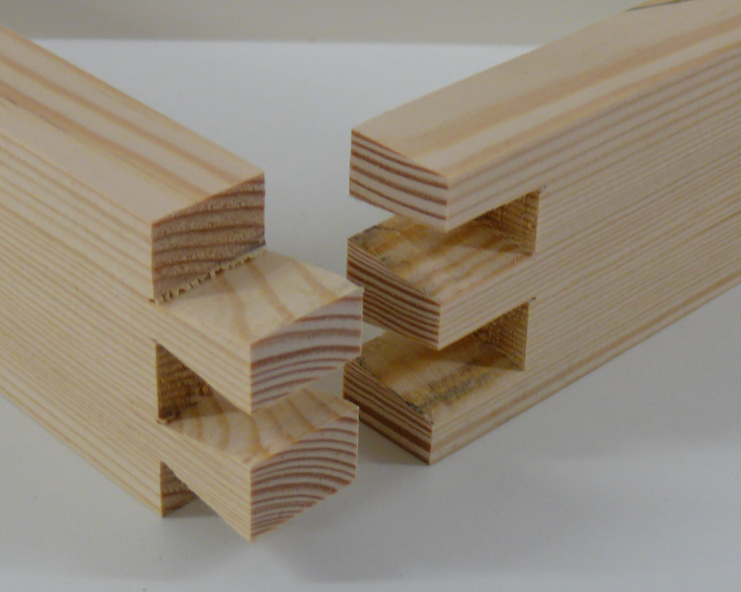
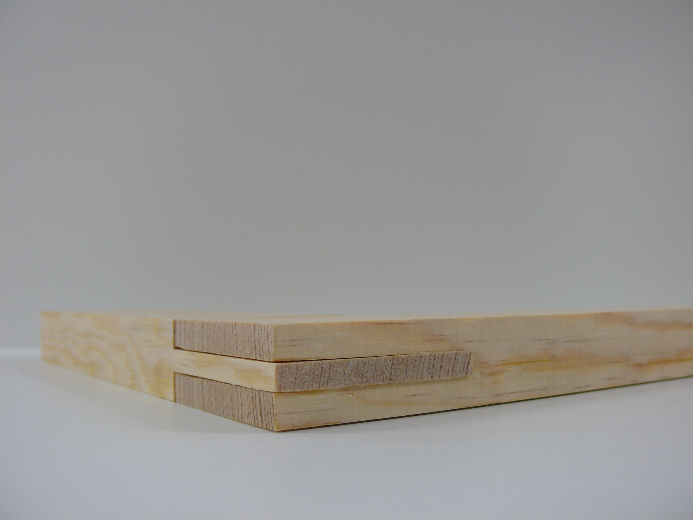
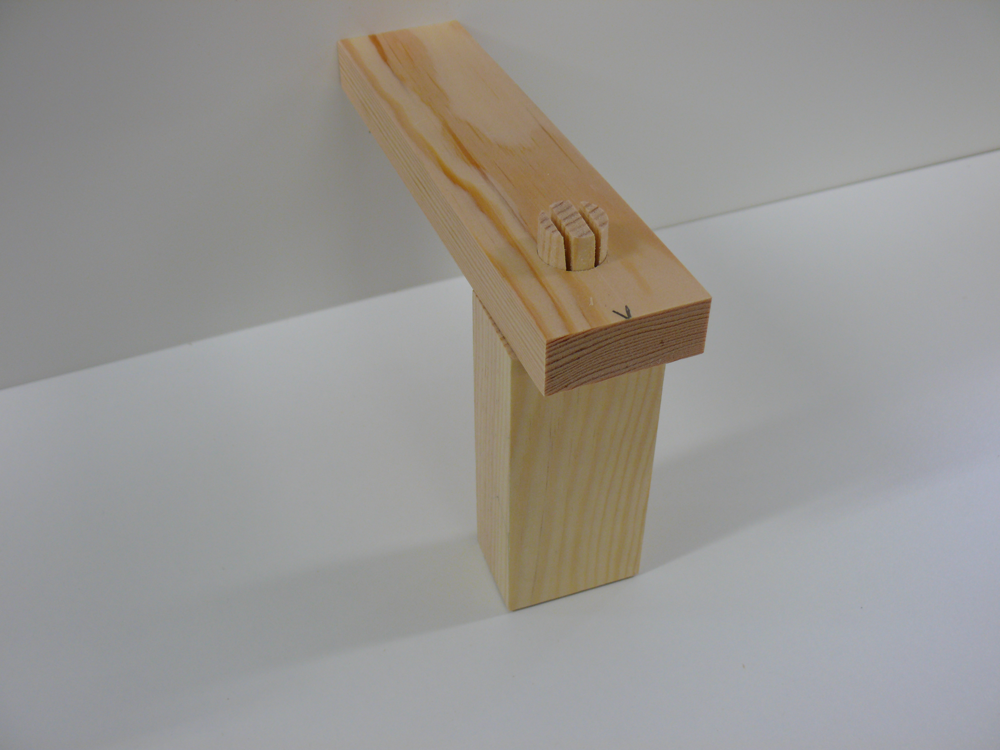

<!--

author:   Hilke Domsch
email:    hilke.domsch@gkz-ev.de
version:  0.0.7
language: de
narrator: Deutsch Male

edit: true
date: 2026-01-24

icon: https://raw.githubusercontent.com/Ifi-DiAgnostiK-Project/LiaScript-Courses/refs/heads/main/img/Logo_234px.png
logo: img/woodwall_corner.png
attribute: "Quelle Titlebild: pixabay"
comment:  Typische Holzverbindungen im Tischlerhandwerk

title: Holzverbindungen im Tischlerhandwerk

link: ./style.css

import: https://raw.githubusercontent.com/Ifi-DiAgnostiK-Project/LiaScript_DragAndDrop_Template/refs/heads/main/README.md
        https://raw.githubusercontent.com/Ifi-DiAgnostiK-Project/Piktogramme/refs/heads/main/makros.md
        https://raw.githubusercontent.com/Ifi-DiAgnostiK-Project/Textilpflegesymbole/refs/heads/main/makros.md
        https://raw.githubusercontent.com/Ifi-DiAgnostiK-Project/LiaScript_ImageQuiz/refs/heads/main/README.md
        https://raw.githubusercontent.com/Ifi-DiAgnostiK-Project/Bildersammlung/refs/heads/main/makros.md
        https://raw.githubusercontent.com/Ifi-DiAgnostiK-Project/Tapetensymbole/refs/heads/main/makros.md

tags: [Gestellbau, Möbelbau, Holzverbindung, Holz, Tischler, Holzverbindungstechniken, Holzfügearten, Holzverbindungskonstruktionen, Holzbau, Rahmenbau, Korpusbau, Verbindungstechnik]

-->

# Typische Holzverbindungen - Überblickswissen

Holzverbindungen<!-- style="font-weight: bolder; font-size: 12pt; color: green;"--> sind das Fundament jeder stabilen und langlebigen Holzkonstruktion. Sie ermöglichen es, einzelne Holzbauteile sicher und präzise miteinander zu verbinden – sei es im Möbelbau, Innenausbau oder bei tragenden Konstruktionen. Dabei geht es nicht nur um Stabilität, sondern auch um Ästhetik, handwerkliche Qualität und die richtige Technik für den jeweiligen Einsatzzweck.

Holzverbindungen werden eingesetzt für:

<!-- class="explained" -->
- **Stabilität und Belastbarkeit**\
Holzverbindungen sorgen dafür, dass Bauteile dauerhaft und sicher miteinander verbunden sind.

- **Formgebung und Funktion**\
Holzverbindungen ermöglichen komplexe Formen und Konstruktionen, z. B. bei Möbeln, Türen oder Fenster.

- **Materialgerechtes Arbeiten**\
Holz "arbeitet" - es dehnt sich aus und zieht sich zusammen. Gute Verbindungen berücksichtigen diese Eigenschaften.

- **Ästhetik und Handwerkskunst**\
Sichtbare Verbindungen wie Zinken oder Schwalbenschwanzverbindungen zeigen handwerkliches Können und sind of gestalterisches Element.

  

<!--class="highlight"-->
Testen Sie Ihr Wissen zu den wichtigsten Holzverbindungen!

------------

   

 

<!-- style="max-width: 550px; width: 100%" -->

 

## Erkennen & Benennen von typischen Holzverbindungen

Auf den folgenden Seiten sehen Sie Abbildungen von typischen Holzverbindungen in ihren Variationen im Tischlerhandwerk:

<!-- class="hash" -->
- Dübelverbindung
- Zapfenverbindung
- Schlitz-Zapfen-Verbindung
- offene Zinkung
- überblattete Verbindung
- durchbohrte und gezapfte Verbindung

 

<!-- class="highlight" -->
Ordnen Sie jeweils das Bild der richtigen Holzverbindung zu.

-----

   

 

")<!-- style="max-width: 550px; width: 100%" -->

 

### Holzverbindung 1

<section class="flex-container border">

<!-- class="highlight" -->
Welche Holzverbindung ist abgebildet?

<!--
data-randomize
data-solution-button="off"
data-max-trials="3"
-->
- [( )] mit durchbohrten Dübel gesicherte Dominoverbindung
- [(X)] abgesetzte und durchbohrte Lochzapfenverbindung, mit Rundzapfen verkeilt
- [( )] offene Dübel-Zapfen-Verbindung
- [( )] verkeilte und durchbohrte Blattverbindung

<!-- style="max-width: 450px; width: 100%; margin-left:-50px; margin-top:10px;" -->

</section>

 

<!-- style="max-width: 450px; width: 100%" -->

 

### Holzverbindung 2

<section class="flex-container border">

<!-- class="highlight" -->
Welche Holzverbindung ist abgebildet?

<!--
data-randomize
data-solution-button="off"
data-max-trials="3"
-->
- [(X)] gedübelte Verbindung
- [( )] durchbohrte und gezapfte Verbindung
- [( )] gezinkte Verbindung
- [( )] Schlitz-Zapfen-Verbindung

<!-- style="max-width: 550px; width: 100%; margin-left:-50px; margin-top:10px;" -->

</section>

 

<!-- style="max-width: 550px; width: 100%" -->

 

### Holzverbindung 3

<section class="flex-container border">

<!-- class="highlight" -->
Welche Holzverbindung ist abgebildet?

<!--
data-randomize
data-solution-button="off"
data-max-trials="3"
-->
- [(X)] doppelte Schlitz-Zapfen-Verbindung
- [( )] einfache Schlitz-Zapfen-Verbindung
- [( )] Schwalbenschwanzverbindung
- [( )] Kreuzüberblattung

<!-- style="max-width: 550px; width: 100%; margin-left:-50px; margin-top:10px;" -->

</section>

 

<!-- style="max-width: 550px; width: 100%" -->

 

### Holzverbindung 4

<section class="flex-container border">

><!--style="color: red; font-weight: bolder"-->Es sind zwei Aussagen richtig!

<!-- class="highlight" -->
Welche Holzverbindung ist abgebildet?

<!--
data-randomize
data-solution-button="off"
data-max-trials="3"
-->
- [[X]] durchgehende Schwalbenschwanzverbindung
- [[ ]] verdeckte Zinkung
- [[X]] offene Zinkung
- [[ ]] Zargen-Schlitz-Verbindung

<!-- style="max-width: 550px; width: 100%; margin-left:-50px; margin-top:10px;" -->

</section>

 

<!-- style="max-width: 450px; width: 100%" -->

 

### Holzverbindung 5

<section class="flex-container border">

<!-- class="highlight" -->
Welche Holzverbindung ist abgebildet?

<!--
data-randomize
data-solution-button="off"
data-max-trials="3"
-->
- [( )] geschlitzte Rahmenverbindung
- [( )] abgesetzte Lochzapfenverbindung
- [( )] verdeckte Zapfenverbindung
- [(X)] Kreuzüberblattung

<!-- style="max-width: 550px; width: 100%; margin-left:-50px; margin-top:10px;" -->

</section>

 

<!-- style="max-width: 550px; width: 100%" -->

 

### Holzverbindung 6

<section class="flex-container border">

><!--style="color: red; font-weight: bolder"-->Es sind zwei Aussagen richtig!

<!-- class="highlight" -->
Welche Holzverbindung ist abgebildet?

<!--
data-randomize
data-solution-button="off"
data-max-trials="3"
-->
- [[ ]] verdeckte Zapfenverbindung
- [[X]] Zapfenverbindung
- [[X]] abgesetzter Lochzapfen
- [[ ]] durchgehende Zapfen-Domino-Verbindung

<!-- style="max-width: 550px; width: 100%; margin-left:-50px; margin-top:80px;" -->

</section>

 

<!-- style="max-width: 550px; width: 100%" -->

 

### Holzverbindung 7

<section class="flex-container border">

><!--style="color: red; font-weight: bolder"-->Es sind zwei Aussagen richtig!

<!-- class="highlight" -->
Welche Holzverbindung ist abgebildet?

<!--
data-randomize
data-solution-button="off"
data-max-trials="3"
-->
- [[X]] Zapfenverbindung
- [[ ]] Nut-Feder-Verbindung
- [[X]] Dominoverbindung
- [[ ]] durchgehende Zapfen-Domino-Verbindung

<!-- style="max-width: 550px; width: 100%; margin-left:-50px; margin-top:80px;" -->

</section>

 

<!-- style="max-width: 550px; width: 100%" -->

 

### Holzverbindung 8

<section class="flex-container border">

><!--style="color: red; font-weight: bolder"-->Es sind zwei Aussagen richtig!

<!-- class="highlight" -->
Welche Holzverbindung ist abgebildet?

<!--
data-randomize
data-solution-button="off"
data-max-trials="3"
-->
- [[X]] Schlitz-Zapfen-Verbindung
- [[X]] einfache Schlitz-Zapfen-Verbindung
- [[ ]] Schwalbenschwanzverbindung
- [[ ]] Spalt-Zapfen-Verbindung

<!-- style="max-width: 550px; width: 100%; margin-left:-50px; margin-top:80px;" -->

</section>

 

<!-- style="max-width: 550px; width: 100%" -->

 

### Holzverbindung 9

<section class="flex-container border">

<!-- class="highlight" -->
Welche Holzverbindung ist abgebildet?

<!--
data-randomize
data-solution-button="off"
data-max-trials="3"
-->
- [( )] durchbohrte Dübelverbindung
- [(X)] verkeilte Rundzapfenverbindung
- [( )] verkeilte Dübelverbindung
- [( )] Spalt-Zapfen-Verbindung

<!-- style="max-width: 550px; width: 100%; margin-left:-50px; margin-top:10px;" -->

</section>

 

<!-- style="max-width: 450px; width: 100%" -->

 

## Typische Einsatzgebiete und passende Verbindungen

Ob Rahmenbau, Möbelkorpus, Schubladenfront oder Bodenbelag – für jede Situation gibt es eine passende Verbindung, die Stabilität, Präzision und handwerkliche Qualität sicherstellt.

Die nachfolgenden Fragen testen, ob Sie den typischen Einsatzgebieten die jeweils passenden Holzverbindungen zuordnen können.

<!-- class="highlight" -->
Viel Erfolg!

 

")<!-- style="max-width: 550px; width: 100%" -->

 

### Einsatzgebiete von Holzverbindungen - Teil 1

<section class="flex-container border">

<!-- class="highlight" -->
Welche Holzverbindung wird typischerweise für stabile Rahmenkonstruktionen wie Türen und Fenster verwendet?

<!--
data-randomize
data-solution-button="off"
data-max-trials="3"
-->
- [( )] Gehrungsverbindung
- [(X)] Schlitz-Zapfen-Verbindung
- [( )] verkeilte Dübelverbindung
- [( )] Nut-Feder-Verbindung
********************
"Die Schlitz-Zapfen-Verbindung ist eine der stabilsten klassischen Holzverbindungen und ideal für Rahmen."
********************

</section>

<section class="flex-container border">

<!-- class="highlight" -->
Welche Holzverbindung eignet sich besonders für den Korpusbau?

<!--
data-randomize
data-solution-button="off"
data-max-trials="3"
-->
- [( )] Überblattung
- [(X)] Fingerzinken (Zinkenverbindung)
- [( )] Schwalbenschwanzverbindung
- [( )] Schraubenverbindung
********************
"Fingerzinken bieten eine große Leimfläche und sind perfekt für stabile Möbelkorpusse."
********************

")<!-- style="max-width: 350px; width: 100%; margin-left: 20px; margin-top:60px;" -->

</section>

### Einsatzgebiete von Holzverbindungen - Teil 2

<section class="flex-container border">

<!-- class="highlight" -->
Welche Holzverbindung wird typischerweise bei Bodenbelägen und Paneelen eingesetzt?

<!--
data-randomize
data-solution-button="off"
data-max-trials="3"
-->
- [( )] Dübelverbindung
- [(X)] Nut-Feder-Verbindung
- [( )] Fingerzinken-Verbindung
- [( )] Überblattung
********************
"Eine Nut-Feder-Verbindung sorgt für flächige, bündige Holzoberflächen."
********************

")<!-- style="max-width: 250px; width: 100%; margin-left: 40px; margin-top:20px;" -->

</section>

<section class="flex-container border">

<!-- class="highlight" -->
Welche Holzverbindung wird häufig bei Schubladen eingesetzt, weil sie hohe Zugkräfte aufnehmen kann?

<!--
data-randomize
data-solution-button="off"
data-max-trials="3"
-->
- [( )] Überblattung
- [( )] Nut-Feder-Verbindung
- [(X)] Schwalbenschwanzverbindung
- [( )] Schraubenverbindung
********************
"Eine Schwalbenschwanzverbindung verhindert ein Auseinanderziehen - ideal für Schubladenfronten."
********************

</section>

### Einsatzgebiete von Holzverbindungen - Teil 3

<section class="flex-container border">

<!-- class="highlight" -->
Welche Holzverbindung wird in der Regel genutzt, wenn eine unsichtbare, aber stabile Verbindung im Möbelbau gewünscht ist?

<!--
data-randomize
data-solution-button="off"
data-max-trials="3"
-->
- [( )] Lochzapfenverbindung
- [(X)] Dübelverbindung
- [( )] Überblattung
- [( )] versenkte Schlitz-Zapfen-Verbindung
********************
"Dübel sind außen nicht sichtbar und bieten gute Stabilität."
********************

</section>

<section class="flex-container border">

<!-- class="highlight" -->
Welche Holzverbindung eignet sich besonders für lange, durchgehende Holzbauteile wie Konstruktions- oder Rahmenholz?

<!--
data-randomize
data-solution-button="off"
data-max-trials="3"
-->
- [( )] Nut-Feder-Verbindung
- [(X)] Keilzinkenverbindung
- [( )] Schwalbenschwanzverbindung
- [( )] Dominoverbindung
********************
"Keilzinken sind eine industrielle Methode zur Längsverbindung (Verlängerung) von Holzstäben o. ä., bei der eine Vielzahl sehr kleiner Keile ineinander verleimt wird.\
Eine Schwalbenschwanzverbindung ist eine handwerklich anspruchsvolle, formschlüssige Eckverbindung, welche im Fall von Leimholzplatten viel zu aufwändig für den Zweck wäre."
********************

")<!-- style="max-width: 350px; width: 100%; margin-left: 20px; margin-top:20px;" -->

</section>

## Geschafft 🎉

