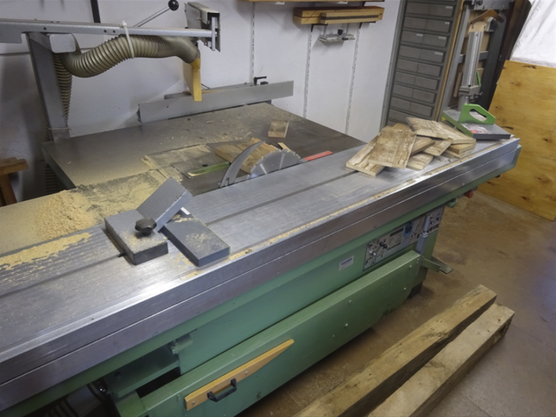
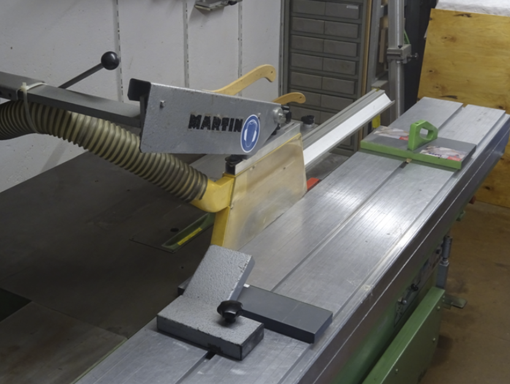
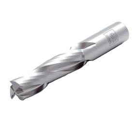
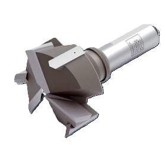
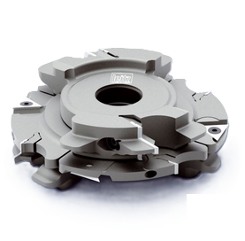
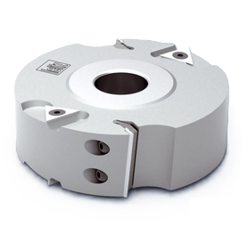
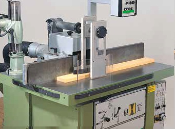
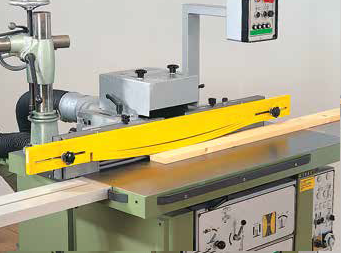
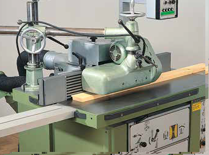

<!--
author:   Hilke Domsch
email:    hilke.domsch@gkz-ev.de
version:  0.0.4
language: de
narrator: Deutsch Male

edit: true
date: 2026-02-06

icon: https://raw.githubusercontent.com/Ifi-DiAgnostiK-Project/LiaScript-Courses/refs/heads/main/img/Logo_234px.png
logo: https://img.freepik.com/free-photo/carpenter-works-with-tree_1157-18913.jpg
comment:  TSM Handhabung und sicheres Arbeiten - Wiederholung Modul 1 in Vorbereitung auf Modul 2
title: Holzbearbeitungsmaschinen - TSM Modul 1 - Überprüfungsfragen

link: https://raw.githubusercontent.com/Ifi-DiAgnostiK-Project/LiaScript-Courses/refs/heads/main/courses/style.css

import: https://raw.githubusercontent.com/Ifi-DiAgnostiK-Project/LiaScript_DragAndDrop_Template/refs/heads/main/README.md
        https://raw.githubusercontent.com/Ifi-DiAgnostiK-Project/Piktogramme/refs/heads/main/makros.md
        https://raw.githubusercontent.com/Ifi-DiAgnostiK-Project/Textilpflegesymbole/refs/heads/main/makros.md
        https://raw.githubusercontent.com/Ifi-DiAgnostiK-Project/LiaScript_ImageQuiz/refs/heads/main/README.md
        https://raw.githubusercontent.com/Ifi-DiAgnostiK-Project/Bildersammlung/refs/heads/main/makros.md
        https://raw.githubusercontent.com/Ifi-DiAgnostiK-Project/Tapetensymbole/refs/heads/main/makros.md

tags: [Tischler, Schreiner, Arbeitssicherheit, Holzbearbeitungsmaschinen, BGHM]
-->

# Modul 1 TSM - Überprüfungsfragen in Vorbereitung auf Modul 2

Die praktischen überbetrieblichen TSM<!-- style="font-weight: bolder; font-size: 12pt; color: green;"--> -<!-- style="font-weight: bolder; font-size: 12pt; color: green;"--> Lehrgänge<!-- style="font-weight: bolder; font-size: 12pt; color: green;"--> sind ein wichtiger Bestandteil Ihrer Ausbildung.\
In diesen Lehrgängen festigen und erweitern Sie Ihre Kenntnisse über das 

<!-- class="hash"-->
- sichere Arbeiten an Sägemaschinen (Tisch- und Formatkreissäge, Bandsäge)
- sichere Arbeiten an stationären Hobelmaschinen (Abricht- und Dickenhobelmaschine)
- sichere Arbeiten mit Handmaschinen (Oberfräse, Formfedernutfräse, Handhobel und Handkreissäge)

Das vorliegende Quiz wiederholt Wissen aus dem Einführungskurs zum Bedienen der genannten Maschinen.\
Damit haben Sie eine optimale Vorbereitung auf das Modul 2 bzw. Ihren Abschlusstest.
 
Die Fragen sind gemäß den Vorgaben der Berufsgenossenschaft Holz und Metall (BGHM) und den geltenden Unfallverhütungsvorschriften formuliert.

Gleichzeitig werden "Nebeneffekte" erreicht:

<!-- class="blueball"-->
- Erhöhung der Arbeitssicherheit, 
- Reduzierung von Materialverschwendung
- Steigerung/Sicherung der Qualität 

  

<!-- style="font-weight: bolder; font-size: 12pt; color: red;"-->
Die Module ersetzen nicht die praktischen überbetrieblichen TSM-Lehrgänge.

 

<!--class="highlight"-->
Testen Sie Ihr Wissen zum sicheren Umgang mit Holzbearbeitungsmaschinen!

------------

 

 

")<!-- style="max-width: 450px; width: 100%" -->

 

## Sägemaschinen

Dieses Wiederholungsmodul dient der Auffrischung der sicherheitsrelevanten Kenntnisse von Sägemaschinen<!-- style="font-weight: bolder; font-size: 12pt; color: blue;"-->  mit besonderem Augenmerk auf das motorisch sichere und vorausschauende Arbeiten.\
 
Das Ziel dieses Kurses ist: 

<!-- class="blueball" -->
- fundiertes Wissen über die Handhabung von Holzbearbeitungsmaschinen erreichen
- Aufmerksamkeit für bewährte Schutzmaßnahmen festigen
- die konsequente Einhaltung aller Schutzmaßnahmen zu trainieren
- typische Gefährdungssituationen zu erkennen
 
Nur wer seinen Arbeitsablauf<!-- style="font-size: 12pt; color: #A00000;"--> kontrolliert, Schutzvorrichtungen<!-- style="font-size: 12pt; color: #A00000;"--> richtig einsetzt und potenzielle Gefahren<!-- style="font-size: 12pt; color: #A00000;"--> frühzeitig erkennt, kann sicher und effizient arbeiten.\
 
Sicherheit im Umgang mit Sägemaschinen beruht auf Übung, Aufmerksamkeit – und der persönlichen Verantwortung jedes Einzelnen.
 

----------------------

 

")<!-- style="max-width: 450px; width: 100%" -->

 

### Bauteile einer Tisch- und Formatkreissäge - Teil 1

<section class="flex-container border">

<!-- class="highlight"-->
Ordnen Sie die Maschinenbauteile 1 - 6 im Bild richtig zu.  

 

<!--
data-randomize
data-solution-button="off"
data-max-trials="3"
-->
1<!--style="color: blue; font-weight: bolder"-->  =  [[  Parallelanschlag | (Spaltkeil)   | Tischeinlage, auswechselbar  |   kurzer Quer- und Gehrungsschlag    | Schutzhaube mit Absauganschluss  |   Schutzhaubenträger   ]]
********************
1. Spalteil
********************

<!--
data-randomize
data-solution-button="off"
data-max-trials="3"
-->
2<!--style="color: blue; font-weight: bolder"-->  =  [[  Parallelanschlag |  Spaltkeil   | Tischeinlage, auswechselbar  |   kurzer Quer- und Gehrungsschlag    | (Schutzhaube mit Absauganschluss)  |   Schutzhaubenträger   ]]
********************
2. Schutzhaube mit Absauganschluss
********************

<!--
data-randomize
data-solution-button="off"
data-max-trials="3"
-->
3<!--style="color: blue; font-weight: bolder"-->  =  [[  Parallelanschlag |  Spaltkeil    | Tischeinlage, auswechselbar  |   kurzer Quer- und Gehrungsschlag    | Schutzhaube mit Absauganschluss  |   (Schutzhaubenträger)   ]]
********************
3. Schutzhaubenträger
********************

<!--
data-randomize
data-solution-button="off"
data-max-trials="3"
-->
4<!--style="color: blue; font-weight: bolder"-->  =  [[ (Parallelanschlag) |  Spaltkeil    | Tischeinlage, auswechselbar  |   kurzer Quer- und Gehrungsschlag    | Schutzhaube mit Absauganschluss  |    Schutzhaubenträger   ]]
********************
4. Parallelanschlag
********************

<!--
data-randomize
data-solution-button="off"
data-max-trials="3"
-->
5<!--style="color: blue; font-weight: bolder"-->  =  [[  Parallelanschlag |  Spaltkeil    | Tischeinlage, auswechselbar  |   (kurzer Quer- und Gehrungsschlag)    | Schutzhaube mit Absauganschluss  |   Schutzhaubenträger   ]]
********************
5. kurzer Quer- und Gehrungsanschlag
********************

<!--
data-randomize
data-solution-button="off"
data-max-trials="3"
-->
6<!--style="color: blue; font-weight: bolder"-->  =  [[  Parallelanschlag |  Spaltkeil   | (Tischeinlage, auswechselbar)  |   kurz Quer- und Gehrungsschlag    | Schutzhaube mit Absauganschluss  |   Schutzhaubenträger   ]]
********************
6. Tischeinlage, auswechselbar
********************

<!-- style="max-width: 550px; width: 190%; margin-left: -240px; margin-top:0px;" -->

</section>

<!--style="background-color:#FFA500;color: white"-->
> Hinweise zur Lösung finden Sie im TSM-Lehrgangsbegleitheft, S. 11-35.

### Bauteile einer Tisch- und Formatkreissäge - Teil 2

<section class="flex-container border">

<!-- class="highlight"-->
Ordnen Sie die Maschinenbauteile 7 - 13 im Bild richtig zu.  

 

<!--
data-randomize
data-solution-button="off"
data-max-trials="3"
-->
7<!--style="color: blue; font-weight: bolder"-->  =  [[  Stellteile EIN - AUS, NOT - AUS | (Tischverlängerung)   | Drehzahlanzeige  |   Absauganschluss unten    | Schiebestock mit Halterung  |   Queranschlag   |   Besäumniederhalter -Klemmschuh-   ]]
********************
7. Tischverlängerung
********************

<!--
data-randomize
data-solution-button="off"
data-max-trials="3"
-->
8<!--style="color: blue; font-weight: bolder"-->  =  [[  (Stellteile EIN - AUS, NOT - AUS) |  Tischverlängerung   | Drehzahlanzeige  |   Absauganschluss unten    | Schiebestock mit Halterung  |   Queranschlag   |   Besäumniederhalter -Klemmschuh-  ]]
********************
8. Stellteile (EIN - AUS, NOT - AUS)
********************

<!--
data-randomize
data-solution-button="off"
data-max-trials="3"
-->
9<!--style="color: blue; font-weight: bolder"-->  =  [[   Stellteile EIN - AUS, NOT - AUS  |  Tischverlängerung   | (Drehzahlanzeige)  |   Absauganschluss unten    | Schiebestock mit Halterung  |   Queranschlag   |   Besäumniederhalter -Klemmschuh-  ]]
********************
9. Drehzahlanzeige
********************

<!--
data-randomize
data-solution-button="off"
data-max-trials="3"
-->
10<!--style="color: blue; font-weight: bolder"-->  =  [[ (Absauganschluss unten) |  Spaltkeil    | Tischeinlage, auswechselbar  |   kurzer Quer- und Gehrungsschlag    | Schutzhaube mit Absauganschluss  |    Schutzhaubenträger   |   Besäumniederhalter -Klemmschuh-   ]]
********************
10. Absauganschluss unten
********************

<!--
data-randomize
data-solution-button="off"
data-max-trials="3"
-->
11<!--style="color: blue; font-weight: bolder"-->  =  [[  Parallelanschlag |  Spaltkeil    | Tischeinlage, auswechselbar  |   (Schiebestock mit Halterung)   |   Queranschlag   |   Besäumniederhalter -Klemmschuh-  | Drehzahlanzeige ]]
********************
11. Schiebestock mit Halterung 
********************

<!--
data-randomize
data-solution-button="off"
data-max-trials="3"
-->
12<!--style="color: blue; font-weight: bolder"-->  =  [[  Parallelanschlag |  Spaltkeil   | (Queranschlag)  |   kurz Quer- und Gehrungsschlag    | Schutzhaube mit Absauganschluss  |   Schutzhaubenträger  |     Stellteile EIN - AUS, NOT - AUS   ]]
********************
12. Queranschlag
********************

<!--
data-randomize
data-solution-button="off"
data-max-trials="3"
-->
13<!--style="color: blue; font-weight: bolder"-->  =  [[  Parallelanschlag |  Spaltkeil   | (Besäumniederhalter -Klemmschuh-)  |   kurz Quer- und Gehrungsschlag    | Schutzhaube mit Absauganschluss  |   Schutzhaubenträger  |    Schiebestock mit Halterung   ]]
********************
13. Besäumniederhalter (Klemmschuh)
********************

<!-- style="max-width: 550px; width: 190%; margin-left: -240px; margin-top:0px;" -->

</section>

<!--style="background-color:#FFA500;color: white"-->
> Hinweise zur Lösung finden Sie im TSM-Lehrgangsbegleitheft, S. 11-35.

### Einstellen der Drehzahl

<section class="flex-container border">

<!-- style="font-size: 11pt; color: black;"-->
An einer Tisch- und Formatkreissägemaschine ist die Drehzahl einzustellen.\
Das Sägeblatt hat einen Durchmesser von 350 mm.\
Die Schnittgeschwindigkeit beträgt ~ 79 m/s.
 

<!-- class="highlight" -->
Welche Drehzahl ist einzustellen?

--------------------------------

<!--
data-randomize
data-solution-button="off"
data-max-trials="3"
-->
Es ist eine Drehzahl von\
 
[[4500]]  U/min\
 
einzustellen.
********************
Die Lösung lautet: 4.500 U/min. - Siehe dazu das TSM-Lehrbuch, S. 15.

🔧 Lösung mit Rechenweg (einfach erklärt)
==========

**Gegeben:**

- Durchmesser des Sägeblatts:  
  $ d = 350 \,\text{mm} = 0{,}35 \,\text{m} $

- Schnittgeschwindigkeit:  
  $ v = 79 \,\text{m/s} $

- Gesucht:  
  Drehzahl $ n $ in **U/min**

---

1️⃣ Umfang des Sägeblatts berechnen
==========

Bei einer Umdrehung legt das Blatt den **Umfang** zurück.

Formel:

$ U = \pi \cdot d $

Einsetzen:

$ U = 3{,}14 \cdot 0{,}35 $

$ U \approx 1{,}10 \,\text{m} $

👉 Das Blatt legt pro Umdrehung ca. **1,10 m** zurück.

---

2️⃣ Umdrehungen pro Sekunde berechnen
==========

Die Schnittgeschwindigkeit gibt an,  
wie viele Meter das Blatt pro Sekunde zurücklegt.

Formel:

$ n = \frac{v}{U} $

Einsetzen:

$ n = \frac{79}{1{,}10} $

$ n \approx 71{,}8 \,\text{U/s} $

👉 Das Blatt dreht sich also ca. **72 Mal pro Sekunde**.

---

3️⃣ Umrechnung in Umdrehungen pro Minute
==========

1 Minute = 60 Sekunden

$ n = 71{,}8 \cdot 60 $

$ n \approx 4308 \,\text{U/min} $

---

4️⃣ Maschinenwert wählen
==========

Maschinen haben feste Einstellwerte.  
4300 U/min liegt nahe bei:

> ✅ 4500 U/min

---

📌 Ergebnis
==========

> $n \approx 4500 \,\text{U/min}$

********************

")<!-- style="max-width: 450px; width: 130%; margin-left: -80px; margin-top:20px;" -->

</section>

### Ordnung am Arbeitsplatz

<section class="flex-container border">

<!-- style="font-size: 11pt; color: black;"-->
Als Sie am Morgen eine Sägearbeit an der Tisch- und Formatkreissäge ausführen sollen, finden Sie Ihren Arbeitsplatz wie unten abgebildet vor.
 

<!-- class="highlight" -->
Was ist von Ihnen alles zu tun, damit Sie sicher arbeiten können?

<!-- style="font-weight: bolder; font-size: 10pt; color: #A00000;"-->
Es sind mehrere Antworten richtig!

<!--
data-randomize
data-solution-button="off"
data-max-trials="3"
-->
- [[ ]] Da die Maschine erneut verschmutzt wird, reicht die Säuberung erst nach dem eigenen Arbeitsende.
- [[ ]] Die Schutzhaube kann so belassen werden.
- [[X]] Stolperstellen vor der Säge sind zu entfernen.
- [[ ]] Der Spaltkeil ist auszubauen.
- [[ ]] Die Abfallstücke brauchen erst nach der eigenen Arbeit insgesamt entfernt zu werden. 
- [[X]] Die Maschine ist sauber zu machen - Abfallstücke und Sägespäne sind zu entfernen.
- [[X]] Die Schutzhaube ist über das Sägeblatt zu schieben.
- [[X]] Der Spaltkeil ist einzustellen.
- [[X]] Der Schiebestock gehört griffbereit an die Maschine.
- [[ ]] Derjenige, der die Maschine zuletzt so hinterlassen hat, ist in Arbeitssicherheit zu unterweisen. 
********************
Folgende Antworten sind richtig:\
- Stolperstellen vor der Säge beseitigen
- Maschine sauber machen - Abfallstücke und Sägespäne entfernen
- Spaltkeil einstellen
- Schiebestock griffbereit an die Maschine
********************

</section>

 

<!-- style="max-width: 700px; width: 100%; margin-left: -80px; margin-top:0px;" -->

 

### Einstellung des Spaltkeils - Frage 1

<section class="flex-container border">

<!-- class="highlight" -->
Sie sollen auf der Tisch- und Formatkreissäge (s. Abbildung unten) Anleimer von 10 mm mit der Sägehilfe sägen.\
Wie ist der Spaltkeilabstand zum Kreissägeblatt einzustellen?

<!--
data-randomize
data-solution-button="off"
data-max-trials="3"
-->
Der Spaltkeil ist auf höchstens\
 
[[8]]  mm\
 
Abstand vom Sägeblatt einzustellen.
********************
Die Lösung lautet: 8 mm. - Siehe dazu das TSM-Lehrbuch, S. 17.
********************

</section>

 

<!-- style="max-width: 700px; width: 100%; margin-left: -80px; margin-top:0px;" -->

 

### Einstellung des Spaltkeils - Frage 2

<section class="flex-container border">

<!-- class="highlight" -->
Wie groß darf bei Tisch- und Formatkreissägen der Abstand des Spaltkeiles unter der höchsten Sägezahnspitze sein?

<!--
data-randomize
data-solution-button="off"
data-max-trials="3"
-->
Der Spaltkeilabstand unter der höchsten Sägezahnspitze darf höchstens\
 
[[2]]  mm\
 
betragen.
********************
Die Lösung lautet: 2 mm. - Siehe dazu das TSM-Lehrbuch, S. 17.
********************

<!-- style="max-width: 450px; width: 120%; margin-left: -40px; margin-top: 40px;" -->

</section>

### Einstellung des Parallelanschlags

<section class="flex-container border">

<!-- class="highlight" -->
Wie wird der Parallelanschlag eingestellt?

<!--
data-randomize
data-solution-button="off"
data-max-trials="3"
-->
- [(X)] Anschlag flach und vor das Sägeblatt zurückziehen, damit ein Klemmen des Werkstücks vermieden wird. 
- [( )] Anschlag flach und nach "Faustregel" - Sägeblattvorderkante 45° nach hinten.
- [( )] Anschlag hoch und nach "Faustregel" - Sägeblattvorderkante 45° nach hinten.
********************
Der Anschlag erfolgt flach und vor das Sägeblatt zurückzuziehen, damit ein Klemmen des Werkstücks verhindert wird. 
********************

<!-- style="max-width: 300px; width: 120%;margin-left: -50px; margin-top:20px;" -->

</section>

### Einstellung der oberen Werkzeugverdeckung

<section class="flex-container border">

<!-- class="highlight" -->
Wie ist die obere Werkzeugverdeckung (Schutzhaube) einzustellen?

<!--
data-randomize
data-solution-button="off"
data-max-trials="3"
-->
- [(X)] Schutzhaube auf Werkstückdicke einstellen
- [( )] Schutzhaube auf 3 mm Abstand zum Werkstück einstellen
- [( )] Zwischen Schutzhaube und Werkstückdicke sind mindestens 5 mm Abstand zu lassen.
********************
Die Schutzhaube ist auf Werkstückdicke einzustellen.
********************

<!-- style="max-width: 300px; width: 120%;margin-left: -50px; margin-top:20px;" -->

</section>

## Persönlicher Arbeitsschutz

Bei der Arbeit an Maschinen ist geeignete Arbeitskleidung ein wichtiger Teil der persönlichen Sicherheit und gehört zur Grundausstattung im Tischlerhandwerk.

<!-- class="blueball" -->
- Sie schützt vor Verletzungen durch scharfe Kanten, Späne und Werkzeuge.
- Sie verhindert, dass lockere Teile der Kleidung in rotierende Maschinenteile geraten.
- Sie trägt dazu bei, sich gut bewegen zu können und auch längere Arbeitsphasen an der Maschine konzentriert zu bleiben.

----------------------

 

")<!-- style="max-width: 450px; width: 100%" -->

 

### Arbeitskleidung

<section class="flex-container border">

<!-- class="highlight" -->
Welche Art von Arbeitskleidung ist an Maschinen zu tragen?

<!-- style="font-weight: bolder; font-size: 10pt; color: #A00000;"-->
Es sind mehrere Antworten richtig!

<!--
data-randomize
data-solution-button="off"
data-max-trials="3"
-->
- [[ ]] Tischlerschürze
- [[ ]] Handschuhe
- [[X]] eng anliegende Arbeitskleidung
- [[ ]] Arbeitskittel
- [[X]] Sicherheitsschuhe
- [[ ]] nicht brennbare Kleidung
********************
Folgende Antworten sind richtig:\
- eng anliegende Arbeitskleidung
- Sicherheitsschuhe
********************

")<!-- style="max-width: 400px; width: 130%;margin-left: -80px; margin-top:20px;" -->

</section>

### Persönliche Schutzausrüstung

<!-- class="highlight"-->
Ziehen Sie das jeweilige Symbol der Persönlichen Schutzausrichtung in das Feld links neben der passenden Beschreibung.

<!-- data-randomize -->
@dragdropsort(@uid,Augenschutz: insbesondere beim Arbeiten mit Handmaschinen über Kopf und mit Gehrungskappsägen;@Gebotszeichen.Augenschutz.src|Gehörschutz: beim Arbeiten im Lärmbereich;@Gebotszeichen.Gehoerschutz.src|Atemschutz: beim Wechseln von Filterelementen und Sammeleinrichtungen;@Gebotszeichen.Atemschutz.src|Fußschutz: in der Werkstatt und auf Baustellen;@Gebotszeichen.Fussschutz.src)

## Dickenhobelmaschine - Hobeln breiter Werkstücke

<!-- class="highlight" -->
Schauen Sie sich das Video der Berufsgenossenschaft Holz und Metall (BGHM) an. 

 

!?[Dickenhobelmaschine_breit](https://vimeo.com/519896500?fl=pl&fe=cm "[_Quelle: BGHM_](https://vimeo.com/519896500?fl=pl&fe=cm)")

### Hobeldicke

<!-- class="highlight"-->
Aus was ergibt sich die Hobeldicke?\
Ziehen Sie die richtige Lösung in das leere Feld.

<!-- 
data-randomize
data-max-trials="3"
data-solution-button="off" 
-->
@dragdropmultiple(@uid,Ausgangsdicke abzüglich Spanabnahme,Fertigdicke|Ausgangsdicke zuzüglich Spanabnahme)

<!--style="background-color:#FFA500;color: white"-->
> Hinweise zur Lösung finden Sie im TSM-Lehrgangsbegleitheft, S. 73-78.

### Bauteile einer Dickenhobelmaschine 

<section class="flex-container border">

<!-- class="highlight"-->
Ordnen Sie die Maschinenbauteile 1 - 8 im Bild richtig zu.  

 

<!--
data-randomize
data-solution-button="off"
data-max-trials="3"
-->
1<!--style="color: blue; font-weight: bolder"-->  =  [[  (Stellteile EIN - AUS, NOT - AUS) |  Messerwelle   | Greiferrückschlagsicherung  |   Druckbalken    | Absaugung  |   Einzugswalze    |   Auszugswalze glatt/gummiert    |   Tischwalzen   ]]
********************
1. Stellteile (EIN - AUS, NOT - AUS)
********************

<!--
data-randomize
data-solution-button="off"
data-max-trials="3"
-->
2<!--style="color: blue; font-weight: bolder"-->  =  [[  Stellteile EIN - AUS, NOT - AUS   |  (Messerwelle)   | Greiferrückschlagsicherung  |   Druckbalken    | Absaugung  |   Einzugswalze    |   Auszugswalze glatt/gummiert    |   Tischwalzen   ]]
********************
2. Messerwelle
********************

<!--
data-randomize
data-solution-button="off"
data-max-trials="3"
-->
3<!--style="color: blue; font-weight: bolder"-->  =  [[  Stellteile EIN - AUS, NOT - AUS |  Messerwelle   |  (Greiferrückschlagsicherung)  |   Druckbalken    | Absaugung  |   Einzugswalze    |   Auszugswalze glatt/gummiert    |   Tischwalzen   ]]
********************
3. Greiferrückschlagsicherung, gegen Durchpendeln gesichert
********************

<!--
data-randomize
data-solution-button="off"
data-max-trials="3"
-->
4<!--style="color: blue; font-weight: bolder"-->  =  [[  Stellteile EIN - AUS, NOT - AUS |  Messerwelle   | Greiferrückschlagsicherung  |   Druckbalken    | (Absaugung)  |   Einzugswalze    |   Auszugswalze glatt/gummiert    |   Tischwalzen   ]]
********************
4. Absaugung
********************

<!--
data-randomize
data-solution-button="off"
data-max-trials="3"
-->
5<!--style="color: blue; font-weight: bolder"-->  =  [[  Stellteile EIN - AUS, NOT - AUS |  Messerwelle   | Greiferrückschlagsicherung  |   (Druckbalken)    | Absaugung  |   Einzugswalze    |   Auszugswalze glatt/gummiert    |   Tischwalzen   ]]
********************
5. Druckbalken, federnd gelagert
********************

<!--
data-randomize
data-solution-button="off"
data-max-trials="3"
-->
6<!--style="color: blue; font-weight: bolder"-->  =  [[  Stellteile EIN - AUS, NOT - AUS |  Messerwelle   | Greiferrückschlagsicherung  |   Druckbalken    | Absaugung  |   (Einzugswalze)    |   Auszugswalze glatt/gummiert    |   Tischwalzen   ]]
********************
6. Einzugswalze geriffelt, federnd gelagert
********************

<!--
data-randomize
data-solution-button="off"
data-max-trials="3"
-->
7<!--style="color: blue; font-weight: bolder"-->  =  [[  Stellteile EIN - AUS, NOT - AUS |  Messerwelle   | Greiferrückschlagsicherung  |   Druckbalken    | Absaugung  |   Einzugswalze    |   (Auszugswalze glatt/gummiert)    |   Tischwalzen   ]]
********************
7. Auszugswalze glatt/gummiert, evtl. auch federnd gelagert
********************

<!--
data-randomize
data-solution-button="off"
data-max-trials="3"
-->
8<!--style="color: blue; font-weight: bolder"-->  =  [[  Stellteile EIN - AUS, NOT - AUS |  Messerwelle   | Greiferrückschlagsicherung  |   Druckbalken    | Absaugung  |   Einzugswalze    |   Auszugswalze glatt/gummiert    |   (Tischwalzen)   ]]
********************
8. Tischwalzen
********************

<!-- style="max-width: 550px; width: 190%; margin-left: -240px; margin-top:0px;" -->

</section>

<!--style="background-color:#FFA500;color: white"-->
> Hinweise zur Lösung finden Sie im TSM-Lehrgangsbegleitheft, S. 73-78.

## Dickenhobelmaschine - Hobeln schmaler Werkstücke

<!-- class="highlight" -->
Schauen Sie sich das Video der Berufsgenossenschaft Holz und Metall (BGHM) an. 

 

!?[Dickenhobelmaschine_schmal](https://vimeo.com/519896587?fl=pl&fe=cm "[_Quelle: BGHM_](https://vimeo.com/519896500?fl=pl&fe=cm)")

### Bearbeitung schmaler Werkstücke

<!-- class="highlight"-->
Wann dürfen mehrere schmale Werkstücke gleichzeitig bearbeitet werden?\
Ziehen Sie die richtige Lösung in das leere Feld.

<!-- 
data-randomize
data-max-trials="3"
data-solution-button="off" 
-->
@dragdropmultiple(@uid,wenn die Maschine Gliedereinzugswalzen und Gliederdruckbalken hat,wenn die Maschine Einzugswalze und Druckbalken hat|wenn die Maschine starre Einzugswalze und starren Druckbalken hat)

<!--style="background-color:#FFA500;color: white"-->
> Hinweise zur Lösung finden Sie im TSM-Lehrgangsbegleitheft, S. 73-78.

## Abrichthobelmaschine - Abrichten kurzer Werkstücke

<!-- class="highlight" -->
Schauen Sie sich das Video der Berufsgenossenschaft Holz und Metall (BGHM) an. 

 

!?[Abrichthobelmaschine](https://vimeo.com/519893092?fl=pl&fe=cm "[_Quelle: BGHM_](https://vimeo.com/519896500?fl=pl&fe=cm)")

### Hilfsmittel

<!-- class="highlight"-->
Welches Hilfsmittel wird im Video benutzt?\
Ziehen Sie die richtige Lösung in das leere Feld.

<!-- 
data-randomize
data-max-trials="3"
data-solution-button="off" 
-->
@dragdropmultiple(@uid,Schiebeholz,Zuführlade|Schiebestock)

<!--style="background-color:#FFA500;color: white"-->
> Hinweise zur Lösung finden Sie im TSM-Lehrgangsbegleitheft, S. 57-68.

## Arbeiten mit der Tischfräsmaschine

Die Tischfräsmaschine<!-- style="font-weight: bolder; font-size: 12pt; color: blue;"--> ist eine stationäre Holzbearbeitungsmaschine für:

<!-- class="blueball" -->
- das Bearbeiten von Kanten
- das Fräsen von Profilen

-----------------------

Die Tischfräsmaschine gehört zu den wichtigsten, aber auch gefährlichsten<!-- style="font-weight: bolder; font-size: 12pt; color: #A00000;"--> Maschinen in der Tischlerwerkstatt: 

🚑 Es wirken hohe Drehzahlen und große Schnittkräfte.\
🚑 Die Hände müssen Abstand zur Frässpindel behalten.\
🚑 Rückschläge sind zu vermeiden.\

 

Es ist wichtig, Aufbau, Einstellmöglichkeiten und Schutzeinrichtungen zu kennen.

-------
 

 

<!-- style="max-width: 350px; width: 100%" -->

 

### Fräswerkzeuge

<!-- class="highlight" -->
Ordnen Sie die Abbildungen den korrekten Werkzeugbezeichnungen zu!

_Abb.: BGHM_<!-- style="margin-left: 750px;" -->

<!--data-randomize -->
- [  [Einteiliges Werkzeug]     [Verbundwerkzeug]        [Werkzeugsatz]     [zusammengesetztes Werkzeug]  ]
- [           (x)                         ( )                  ( )                       ( )              ] <!-- style="max-width: 150px;" -->
- [           ( )                         (X)                  ( )                       ( )              ] <!-- style="max-width: 150px;" -->
- [           ( )                         ( )                  (x)                       ( )              ] <!-- style="max-width: 150px;" -->
- [           ( )                         ( )                  ( )                       (X)              ] <!-- style="max-width: 150px;" -->

<!--style="background-color:#FFA500;color: white"-->
> Hinweise zur Lösung finden Sie im TSM-Lehrgangsbegleitheft, S. 83-115.

### Werkzeugverdeckungen

<!-- class="highlight" -->
Ordnen Sie die Abbildungen den korrekten Bauteilbezeichnungen zu!

_Abb.: BGHM_<!-- style="margin-left: 750px;" -->

<!--data-randomize -->
- [  [Druck- und Schutzvorrichtung]     [Bogenfeder]        [Vorschubapparat]     ]
- [           (x)                         ( )                  ( )                ] <!-- style="max-width: 200px;" -->
- [           ( )                         (X)                  ( )                ] <!-- style="max-width: 200px;" -->
- [           ( )                         ( )                  (x)                ] <!-- style="max-width: 200px;" -->

<!--style="background-color:#FFA500;color: white"-->
> Hinweise zur Lösung finden Sie im TSM-Lehrgangsbegleitheft, S. 94.

## Geschafft 🎉

