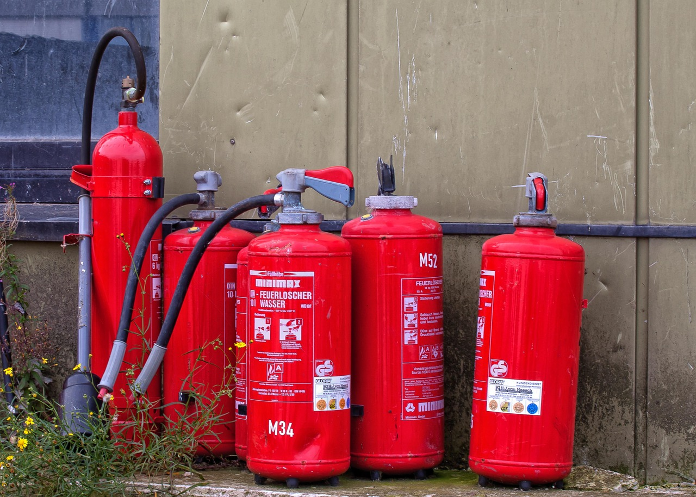

<!--

author:    Hilke Domsch; Volker Göhler
email:     hilke.domsch@gkz-ev.de
version:   0.0.7
language:  de
narrator:  Deutsch Female

edit:      true

date:      2025-07-21
logo:      https://upload.wikimedia.org/wikipedia/commons/thumb/3/3e/ISO_7010_F001.svg/1920px-ISO_7010_F001.svg.png
icon:      https://raw.githubusercontent.com/Ifi-DiAgnostiK-Project/LiaScript-Courses/refs/heads/main/img/Logo_234px.png

comment:   Brandschutzzeichen

attribute: Sicherheitszeichen von [Berufsgenossenschaft Holz und Metall](https://www.bghm.de/arbeitsschuetzer/praxishilfen/sicherheitszeichen)

link:      style.css
import:    https://raw.githubusercontent.com/Ifi-DiAgnostiK-Project/LiaScript_DragAndDrop_Template/refs/heads/main/README.md
           https://raw.githubusercontent.com/Ifi-DiAgnostiK-Project/Piktogramme/refs/heads/main/makros.md
           https://raw.githubusercontent.com/Ifi-DiAgnostiK-Project/LiaScript_ImageQuiz/refs/heads/main/README.md

tags:      [ Arbeitssicherheit, Brandschutzzeichen, Arbeits-_und_Gesundheitsschutz ]

-->

# Arbeitssicherheit und Gesundheitsschutz

Arbeitsbedingte Gesundheitsgefahren, Unfälle und Erkrankungen sollen gar nicht erst entstehen.
Dazu ist es wichtig, Gefahrenhinweise und Symbole richtig zu verstehen.
Vor allem junge Menschen sind am Arbeitsplatz besonders gefährdet, weil sie (noch) nicht über alle nötigen Kenntnisse verfügen.

Dieses Quiz zeigt Ihnen, wie gut Sie sich bereits auskennen!

> __Hinweis:__ Es können mehrere Antworten richtig sein.

<!-- style="max-width: 700px; width: 100%" -->

<!-- class="highlight"-->
Viel Erfolg!
------------

## Brandschutzzeichen

> __Brandschutz geht uns alle an!__
>
> Im Betrieb ist es besonders wichtig, Gefahren durch Brände zu kennen und richtig auf sie zu reagieren.
>
> Damit Sie sich und andere schützen können, sollten Sie die wichtigsten Brandschutzzeichen kennen und wissen, wie Sie sich im Ernstfall richtig verhalten.
>
> Mit ein wenig Aufmerksamkeit können Sie helfen, Gefahren zu vermeiden und im Notfall schnell zu handeln.

<!-- style="max-width: 700px; width: 100%" -->

### 1. Signalfarbe von Brandschutzzeichen

Wie sehen Brandschutzzeichen typischerweise aus?

<!-- data-randomize -->
- [( )] Blaues Quadrat mit weißem Symbol
- [( )] Grünes Rechteck mit weißem Symbol
- [(X)] Rotes Quadrat oder Rechteck mit weißem Symbol
- [( )] Gelbes Dreieck mit schwarzem Symbol
*****************************************************

> __Auflösung:__
>
> Die richtige Antwort ist: __Rotes Quadrat oder Rechteck mit weißem Symbol__.
>
> Brandschutzzeichen sind immer rot mit weißen Symbolen. Diese Farbkombination ist international standardisiert und dient dem schnellen Erkennen in Notfallsituationen. Die Signalfarbe Rot signalisiert "Halt" oder "Verbot" und weist außerdem auf Brandschutzeinrichtungen hin.
>
> Die anderen Farbkombinationen kennzeichnen andere Arten von Sicherheitszeichen:
>
> - Blaues Quadrat mit weißem Symbol: Gebotszeichen
> - Grünes Rechteck mit weißem Symbol: Rettungszeichen
> - Gelbes Dreieck mit schwarzem Symbol: Warnzeichen

******************************************************

### 2. Die Bedeutung einzelner Brandschutz-Piktogramme

<section class="flex-container border">

<!-- data-randomize -->
- [( )] Bei Feuer sofort Helm aufsetzen.
- [(X)] Brandbekämpfung.
- [( )] Bei Brand sofort fliehen - alle beschwerenden Kleidungsstücke zurücklassen.
*****************************************

> __Auflösung:__
>
> Die richtige Antwort ist: __Brandbekämpfung__.
>
> Dieses Symbol kennzeichnet Stellen, an denen sich Ausrüstung zur Brandbekämpfung befindet, wie z.B. Feuerlöscher, Löschschläuche oder andere Löschmittel. Es ist wichtig, diese Standorte zu kennen, um im Notfall schnell handeln zu können. Das Symbol zeigt eine stilisierte Flamme, was direkt auf seinen Zweck im Brandschutz hinweist.

*****************************************

@Brandschutzzeichen.Brandbekaempfung(15)

</section>

<section class="flex-container border">

<!-- data-randomize -->
- [( )] Achtung - Haus steht in Flammen!
- [(X)] Hier befindet sich eine Feuerleiter.
- [( )] Fluchtweg erfolgt über Leitern.
********************************************

> __Auflösung:__
>
> Die richtige Antwort ist: __Hier befindet sich eine Feuerleiter__.
>
> Dieses Brandschutzzeichen weist auf den Standort einer Feuerleiter hin. Feuerleitern sind spezielle Leitern, die für die Brandbekämpfung oder als zusätzlicher Fluchtweg bei Bränden genutzt werden. Sie sind besonders wichtig in höheren Gebäuden, wo normale Fluchtwege durch Rauch oder Feuer versperrt sein könnten. Im Notfall können sowohl Bewohner als auch Feuerwehrleute diese Leitern nutzen.

********************************************

@Brandschutzzeichen.Feuerleiter(15)

</section>

<section class="flex-container border">

<!-- data-randomize -->
- [( )] Bei Feuer sofort Fahrstuhl rufen.
- [(X)] Bei Feuer über Signalknopf Brand melden.
- [( )] Bei Feuer Licht ausschalten.
************************************************

> __Auflösung:__
>
> Die richtige Antwort ist: __Bei Feuer über Signalknopf Brand melden__.
>
> Dieses Brandschutzzeichen kennzeichnet den Standort eines Brandmelders. Brandmelder sind Geräte, mit denen im Brandfall schnell und einfach Alarm ausgelöst werden kann. Sie aktivieren oft automatisch eine Alarmsirene und informieren in vielen Gebäuden direkt die Feuerwehr. Bei Entdeckung eines Brandes ist die schnelle Alarmierung entscheidend, um alle Personen zu warnen und professionelle Hilfe zu rufen.
>
> Die falsche Antwort "Bei Feuer sofort Fahrstuhl rufen" ist besonders gefährlich - im Brandfall dürfen Aufzüge niemals benutzt werden, da die Gefahr besteht, in ihnen eingeschlossen zu werden.

*************************************************

@Brandschutzzeichen.Brandmelder(15)

</section>

### 3. Zuordnungsaufgabe Brandschutzzeichen

Ordnen Sie das jeweilige Symbol der richtigen Bedeutung zu.

<!-- data-randomize -->
- [[@Brandschutzzeichen.Richtungspfeil_Rechts(10)] [@Brandschutzzeichen.Brandmeldetelefon(10)] [@Brandschutzzeichen.Brandmelder(10)]]
- [ ( ) ( ) ( ) ]  Fluchtweg
- [ (X) ( ) ( ) ]  Richtungspfeils rechts
- [ ( ) ( ) (X) ]  Brandmelder
- [ ( ) ( ) ( ) ]  Notruftelefon
- [ ( ) (X) ( ) ]  Brandmeldetelefon
******************************************

> __Auflösung:__
>
> Die richtige Zuordnung ist:
>
> 1. __Richtungspfeil rechts:__ Zeigt die Richtung an, in der Brandschutzeinrichtungen zu finden sind. Diese Richtungsangaben sind im Notfall besonders wichtig, um schnell die nächsten Löschmittel oder andere Brandschutzeinrichtungen zu finden.
>
> 2. __Brandmeldetelefon:__ Kennzeichnet den Standort eines speziellen Telefons für Brandmeldungen. Es ermöglicht die direkte Kommunikation mit der zuständigen Feuerwehrleitstelle oder dem Brandschutzbeauftragten und ist besonders in größeren Gebäuden wichtig.
>
> 3. __Brandmelder:__ Weist auf den Standort eines Brandmeldeknopfes hin, mit dem manuell Alarm ausgelöst werden kann. Diese Melder sind Teil eines Brandmelde- und Alarmsystems und sollten im Brandfall sofort betätigt werden.
>
> Die Kenntnis dieser Symbole kann im Notfall Leben retten, da sie ein schnelles Handeln ermöglichen.

*******************************************

### 4. Verhalten im Brandfall

<section class="flex-container border">

<!-- class="highlight" style="font-size: large"-->
Was ist im Brandfall am wichtigsten?

<!-- data-randomize -->
- [[X]] Ruhe bewahren.
- [[X]] Andere warnen.
- [[X]] Feuerwehr rufen.
- [[ ]] Fenster öffnen, damit der Rauch entweichen kann.
- [[X]] Ausgeschilderte Fluchtwege benutzen.
- [[ ]] Sofort mit Löschen beginnen, um das Feuer im Keim zu ersticken.
- [[X]] Keine Aufzüge verwenden.
***********************************************************************

> __Auflösung:__
>
> Die richtigen Antworten für das Verhalten im Brandfall sind:
>
> - __Ruhe bewahren:__ Panik führt zu falschen Entscheidungen und kann die Situation verschlimmern.
> - __Andere warnen:__ Alle im Gebäude befindlichen Personen müssen über die Gefahr informiert werden.
> - __Feuerwehr rufen:__ Professionelle Hilfe unter der Notrufnummer 112 alarmieren.
> - __Ausgeschilderte Fluchtwege benutzen:__ Diese Wege sind speziell für Notfälle konzipiert und führen sicher ins Freie.
> - __Keine Aufzüge verwenden:__ Aufzüge können steckenbleiben oder zu Rauchschleusen werden.
>
> Die falschen Antworten wären gefährlich:
>
> - Fenster öffnen kann die Brandausbreitung durch zusätzliche Sauerstoffzufuhr beschleunigen.
> - Mit dem Löschen zu beginnen ist nur bei sehr kleinen Entstehungsbränden und mit entsprechender Ausbildung sinnvoll. Die eigene Sicherheit geht immer vor.

************************************************************************

</section>

<section class="flex-container border">

@Rettungszeichen.Rettungsweg_Notausgang_rechts(15)

<!-- class="highlight" style="font-size: large"-->
Welche Bedeutung hat dieses Piktogramm?

<!-- data-randomize -->
- [( )] Brandschutzzeichen sind immer rot. Daher ist es hier bedeutungslos.
- [(X)] Fluchtweg / Notausgang.
- [( )] Brandschutztür benutzen.
*********************************************

> __Auflösung:__
>
> Die richtige Antwort ist: __Fluchtweg / Notausgang__.
>
> Dieses Zeichen ist ein Rettungszeichen, erkennbar an seiner grünen Farbe mit weißem Symbol. Es weist auf einen Fluchtweg nach rechts hin. Rettungszeichen sind grün, nicht rot wie Brandschutzzeichen. Sie kennzeichnen Fluchtwege, Notausgänge und Rettungseinrichtungen und sind im Notfall lebenswichtig, da sie den schnellsten Weg ins Freie weisen.
>
> Die Aussage "Brandschutzzeichen sind immer rot. Daher ist es hier bedeutungslos" ist falsch, da es sich hier um ein Rettungszeichen handelt, nicht um ein Brandschutzzeichen. Rettungszeichen haben eine eigenständige, wichtige Funktion im Notfall.

*********************************************

</section>

## Geschafft! 🙌

<!-- class="highlight" style="font-size: large"-->
> Tipp:
>
> Weitere Informationen und alle Sicherheitszeichen finden Sie auf der BGHM-Webseite:
>
> https://www.bghm.de/arbeitsschuetzer/praxishilfen/sicherheitszeichen

---------------------------

