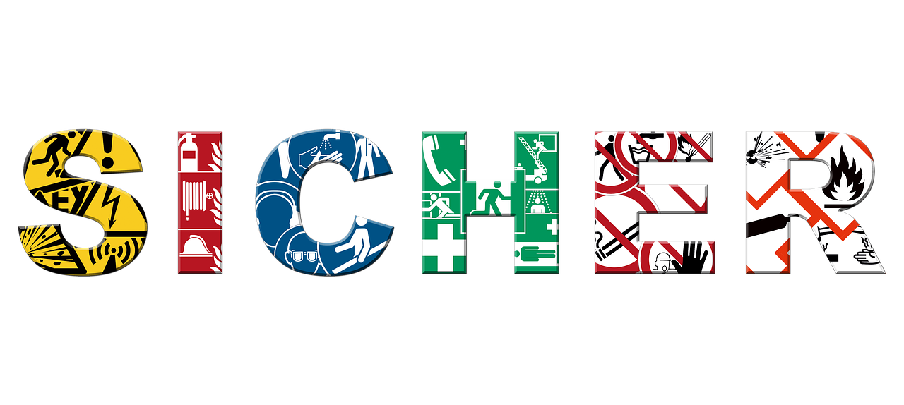

<!--

author:    Hilke Domsch; Volker Göhler
email:     hilke.domsch@gkz-ev.de
version:   0.0.4
language:  de
narrator:  Deutsch Female

edit:      true

date:      2025-07-21
logo:      https://upload.wikimedia.org/wikipedia/commons/thumb/3/3e/ISO_7010_F001.svg/1920px-ISO_7010_F001.svg.png
icon:      https://raw.githubusercontent.com/Ifi-DiAgnostiK-Project/LiaScript-Courses/refs/heads/main/img/Logo_234px.png

comment:   Brandschutzzeichen

attribute: Sicherheitszeichen von [Berufsgenossenschaft Holz und Metall](https://www.bghm.de/arbeitsschuetzer/praxishilfen/sicherheitszeichen)

link:      style.css
import:    https://raw.githubusercontent.com/Ifi-DiAgnostiK-Project/LiaScript_DragAndDrop_Template/refs/heads/main/README.md
           https://raw.githubusercontent.com/Ifi-DiAgnostiK-Project/Piktogramme/refs/heads/main/makros.md
           https://raw.githubusercontent.com/Ifi-DiAgnostiK-Project/LiaScript_ImageQuiz/refs/heads/main/README.md

tags:      Arbeitssicherheit, Brandschutzzeichen, Arbeits-_und_Gesundheitsschutz

-->

# Arbeitssicherheit und Gesundheitsschutz

Arbeitsbedingte Gesundheitsgefahren, Unfälle und Erkrankungen sollen gar nicht erst entstehen.
Dazu ist es wichtig, Gefahrenhinweise und Symbole richtig zu verstehen.
Vor allem junge Menschen sind am Arbeitsplatz besonders gefährdet, weil sie (noch) nicht über alle nötigen Kenntnisse verfügen.

Dieses Quiz zeigt Ihnen, wie gut Sie sich bereits auskennen!

> __Hinweis:__ Es können mehrere Antworten richtig sein.

<!-- style="max-width: 700px; width: 100%" -->

<!-- class="highlight"-->
Viel Erfolg!
------------

## Brandschutzzeichen

> __Brandschutz geht uns alle an!__
>
> Im Betrieb ist es besonders wichtig, Gefahren durch Brände zu kennen und richtig auf sie zu reagieren.
>
> Damit Sie sich und andere schützen können, sollten Sie die wichtigsten Brandschutzzeichen kennen und wissen, wie Sie sich im Ernstfall richtig verhalten.
>
> Mit ein wenig Aufmerksamkeit können Sie helfen, Gefahren zu vermeiden und im Notfall schnell zu handeln.

<!-- style="max-width: 700px; width: 100%" -->

### 1. Signalfarbe von Brandschutzzeichen

Wie sehen Brandschutzzeichen typischerweise aus?

<!-- data-randomize -->
- [( )] Blaues Quadrat mit weißem Symbol
- [( )] Grünes Rechteck mit weißem Symbol
- [(X)] Rotes Quadrat oder Rechteck mit weißem Symbol
- [( )] Gelbes Dreieck mit schwarzem Symbol

### 2. Die Bedeutung einzelner Brandschutz-Piktogramme

<section class="flex-container border">

<!-- data-randomize -->
- [( )] Bei Feuer sofort Helm aufsetzen.
- [(X)] Brandbekämpfung.
- [( )] Bei Brand sofort fliehen - alle beschwerenden Kleidungsstücke zurücklassen.

@Brandschutzzeichen.Brandbekaempfung(15)

</section>

<section class="flex-container border">

<!-- data-randomize -->
- [( )] Achtung - Haus steht in Flammen!
- [(X)] Hier befindet sich eine Feuerleiter.
- [( )] Fluchtweg erfolgt über Leitern.

@Brandschutzzeichen.Feuerleiter(15)

</section>

<section class="flex-container border">

<!-- data-randomize -->
- [( )] Bei Feuer sofort Fahrstuhl rufen.
- [(X)] Bei Feuer über Signalknopf Brand melden.
- [( )] Bei Feuer Licht ausschalten.

@Brandschutzzeichen.Brandmelder(15)

</section>

### 3. Zuordnungsaufgabe Brandschutzzeichen

Ordnen Sie das jeweilige Symbol der richtigen Bedeutung zu.

<!-- data-randomize -->
- [[@Brandschutzzeichen.Richtungspfeil_Rechts(10)] [@Brandschutzzeichen.Brandmeldetelefon(10)] [@Brandschutzzeichen.Brandmelder(10)]]
- [ ( ) ( ) ( ) ]  Fluchtweg
- [ (X) ( ) ( ) ]  Richtungspfeils rechts
- [ ( ) ( ) (X) ]  Brandmelder
- [ ( ) ( ) ( ) ]  Notruftelefon
- [ ( ) (X) ( ) ]  Brandmeldetelefon

### 4. Verhalten im Brandfall

<section class="flex-container border">

<!-- class="highlight" style="font-size: large"-->
Was ist im Brandfall am wichtigsten?

<!-- data-randomize -->
- [[X]] Ruhe bewahren.
- [[X]] Andere warnen.
- [[X]] Feuerwehr rufen.
- [[ ]] Fenster öffnen, damit der Rauch entweichen kann.
- [[X]] Ausgeschilderte Fluchtwege benutzen.
- [[ ]] Sofort mit Löschen beginnen, um das Feuer im Keim zu ersticken.
- [[X]] Keine Aufzüge verwenden.

</section>

<section class="flex-container border">

@Rettungszeichen.Rettungsweg_Notausgang_rechts(15)

<!-- class="highlight" style="font-size: large"-->
Welche Bedeutung hat dieses Piktogramm?

<!-- data-randomize -->
- [( )] Brandschutzzeichen sind immer rot. Daher ist es hier bedeutungslos.
- [(X)] Fluchtweg / Notausgang.
- [( )] Brandschutztür benutzen.

</section>

## Geschafft! 🙌

<!-- class="highlight" style="font-size: large"-->
> Tipp:
>
> Weitere Informationen und alle Sicherheitszeichen finden Sie auf der BGHM-Webseite:
>
> https://www.bghm.de/arbeitsschuetzer/praxishilfen/sicherheitszeichen 

---------------------------

