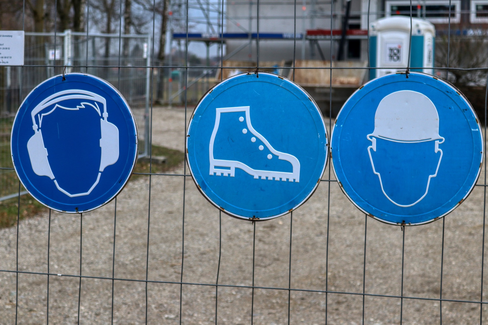

<!--

author:   Hilke Domsch; Volker Göhler
email:    hilke.domsch@gkz-ev.de
version:  0.0.10

language: de
narrator: Deutsch Female

edit:     true
date:     2025-07-21

icon:     https://raw.githubusercontent.com/Ifi-DiAgnostiK-Project/LiaScript-Courses/refs/heads/main/img/Logo_234px.png
logo:     https://upload.wikimedia.org/wikipedia/commons/5/5c/Bockleiter.png

comment:  Arbeitssicherheit & Gesundheitsschutz - Leitern I

attribute:
  - Sicherheitszeichen von [Berufsgenossenschaft Holz und Metall](https://www.bghm.de/arbeitsschuetzer/praxishilfen/sicherheitszeichen)
  - title image Von User:Jenkyll - Eigenes Werk, CC BY-SA 3.0, https://commons.wikimedia.org/w/index.php?curid=15880414

link:     style.css

import:   https://raw.githubusercontent.com/Ifi-DiAgnostiK-Project/LiaScript_DragAndDrop_Template/refs/heads/main/README.md
          https://raw.githubusercontent.com/Ifi-DiAgnostiK-Project/Piktogramme/refs/heads/main/makros.md
          https://raw.githubusercontent.com/Ifi-DiAgnostiK-Project/LiaScript_ImageQuiz/refs/heads/main/README.md

tags: [ Arbeitssicherheit, Leitern, Arbeits- und Gesundheitsschutz ]

-->

# Arbeitssicherheit & Gesundheitsschutz - Leitern I

Arbeitsbedingte Gesundheitsgefahren, Unfälle und Erkrankungen sollen gar nicht erst entstehen.
Dazu ist es wichtig, Gefahrenhinweise und Symbole richtig zu verstehen.\
Vor allem junge Menschen sind am Arbeitsplatz besonders gefährdet, weil sie (noch) nicht über alle nötigen Kenntnisse verfügen.
Dieses Quiz zeigt Ihnen, wie gut Sie sich bereits auskennen!

> __Hinweis:__ Es können mehrere Antworten richtig sein.

--------------------

<!-- style="max-width: 700px; width: 100%" -->

<!-- class="highlight"-->
Viel Erfolg!
------------

## Schwerpunkt: Leitern

> Leitern werden im Arbeitsalltag häufig genutzt.
>
> Sie sind oft Auslöser für Unfälle.
>
> Es ist wichtig, die grundlegenden Sicherheitsregeln zu kennen und zu beachten.

<!-- class="highlight"-->
Schauen Sie sich als Erstes das Video an.

!?[Leitern Lehre to Go](https://www.youtube.com/watch?v=zyfX3ZtkrMI "_Quelle: Lehre fördern_")

<!-- class="highlight" -->
Testen Sie nun Ihr Wissen!

### 1. Vorgaben bei Benutzung von Leitern

<section class="flex-container">

__Welche Maßnahme ist vor jeder Benutzung einer Leiter zwingend erforderlich?__

<!-- data-randomize -->
- [( )] Die Leiter darf nur in sauberem Zustand genutzt werden.
- [(X)] Die Leiter ist auf Beschädigungen und Standsicherheit zu kontrollieren.
- [( )] Es braucht immer eine zweite Person, um die Leiter zu sichern.
*************************************

> __Auflösung:__
>
> Die richtige Antwort ist: __Die Leiter ist auf Beschädigungen und Standsicherheit zu kontrollieren.__
>
> Vor jeder Benutzung muss die Leiter einer Sichtprüfung unterzogen werden. Dabei wird nach offensichtlichen Mängeln wie gebrochenen Sprossen, lockeren Teilen oder Rissen gesucht. Außerdem muss die Standsicherheit überprüft werden, damit die Leiter nicht umkippen oder wegrutschen kann.
>
> Die anderen Antworten sind aus folgenden Gründen falsch:
>
> - Sauberkeit ist zwar wichtig, aber keine zwingende Sicherheitsanforderung vor jedem Gebrauch
> - Eine zweite Person zur Sicherung ist nicht in allen Fällen erforderlich (abhängig von Arbeitshöhe und Risikobewertung)

*************************************

")

</section>

--------------------

__Wann darf eine Leiter als Arbeitsplatz genutzt werden?__

<!-- data-randomize -->
- [[X]] Wenn die Arbeit weniger als 2 Stunden pro Schicht dauert.
- [[ ]] Wenn die Leiter gut gesichert ist, gibt es keine Einschränkungen.
- [[X]] Nur in dem Fall, dass laut Gefährdungsbeurteilung kein anderes sicheres Arbeitsmittel verhältnismäßig ist.
*************************************
> __Auflösung:__
>
> Die richtigen Antworten sind:
> 
> - __Wenn die Arbeit weniger als 2 Stunden pro Schicht dauert.__
> - __Nur in dem Fall, dass laut Gefährdungsbeurteilung kein anderes sicheres Arbeitsmittel verhältnismäßig ist.__
>
> Laut TRBS 2121 Teil 2 (Technische Regeln für Betriebssicherheit) dürfen Leitern nur für zeitlich begrenzte Arbeiten (unter 2 Stunden) als Arbeitsplatz genutzt werden. Zudem muss vorher eine Gefährdungsbeurteilung durchgeführt werden, die bestätigt, dass kein sichereres Arbeitsmittel (wie ein Gerüst oder eine Hubarbeitsbühne) verhältnismäßig ist.
>
> Die Aussage "Wenn die Leiter gut gesichert ist, gibt es keine Einschränkungen" ist falsch. Selbst eine gut gesicherte Leiter ist nur für zeitlich begrenzte Arbeiten als Arbeitsplatz zugelassen.

*************************************

### 2. Anlegeleitern

__Wie sollte eine Anlegeleiter aufgestellt werden?__

<!-- data-randomize -->
- [( )] Mit einem relativ steilem Anstellwinkel, damit sie wenig Platz braucht.
- [( )] Mit einem beliebigen Anstellwinkel - Hauptsache sie steht!
- [(x)] Mit einem Anstellwinkel von ca. 70 Grad.
*************************************

> __Auflösung:__
>
> Die richtige Antwort ist: __Mit einem Anstellwinkel von ca. 70 Grad.__
>
> Der optimale Anstellwinkel für eine Anlegeleiter beträgt etwa 65-75 Grad, wobei 70 Grad als ideal gilt. Dies entspricht einem Verhältnis von 1:4 (ein Meter Abstand vom Fuß der Leiter zur Wand bei 4 Metern Leiterlänge). Dieser Winkel sorgt für maximale Stabilität:
>
> - Bei einem zu steilen Winkel (> 75°) kann die Leiter nach hinten kippen oder umschlagen
> - Bei einem zu flachen Winkel (< 65°) kann die Leiter wegrutschen
>
> Eine einfache Faustregel ist die "Ellbogenprobe": Wenn man vor der Leiter steht und die Arme waagerecht ausstreckt, sollten die Sprossen etwa in Höhe des Ellbogens sein.

*************************************

--------------------

__Wie oft sind Leitern durch eine befähigte Person zu prüfen?__

<!-- data-randomize -->
- [[X]] Mindestens einmal pro Jahr
- [[ ]] Wenn augenscheinlich eine Beschädigung vorliegt
- [[X]] Immer vor jeder Benutzung zu prüfen.
*************************************

> __Auflösung:__
>
> Die richtigen Antworten sind:
>
> - __Mindestens einmal pro Jahr__: Laut BetrSichV (Betriebssicherheitsverordnung) müssen Leitern mindestens jährlich durch eine befähigte Person (mit entsprechender Ausbildung/Qualifikation) geprüft werden.
> - __Immer vor jeder Benutzung zu prüfen__: Vor jeder Nutzung ist eine Sichtprüfung durch den Benutzer selbst durchzuführen.
>
> Die Aussage "Wenn augenscheinlich eine Beschädigung vorliegt" ist nicht korrekt formuliert - bei erkennbaren Schäden darf die Leiter gar nicht mehr benutzt werden und muss sofort der Verwendung entzogen werden.

*************************************

--------------------

<section class="flex-container">

__Was ist beim Transport von Werkzeugen auf der Leiter zu beachten?__

- [( )] Werkzeug darf in den Hosentaschen und am Gürtel getragen werden.
- [(X)] Leichtes Werkzeug darf mitgenommen werden, wenn beide Hände zum Festhalten frei bleiben.
- [( )] Es dürfen alle für die Arbeit benötigten Werkzeuge auf die Leiter mitgenommen werden.
**********************************

> __Auflösung:__
>
> Die richtige Antwort ist: __Leichtes Werkzeug darf mitgenommen werden, wenn beide Hände zum Festhalten frei bleiben.__
>
> Beim Besteigen von Leitern ist es entscheidend, dass beide Hände zum sicheren Festhalten frei bleiben. Daher:
>
> - Leichtes Werkzeug darf nur transportiert werden, wenn es so verstaut ist, dass beide Hände frei bleiben, z.B. in einem geeigneten Werkzeuggürtel mit gesicherten Taschen oder einer am Körper getragenen Werkzeugtasche.
> - Schweres oder sperriges Werkzeug sollte niemals auf einer Leiter transportiert werden.
> - Für umfangreichere Arbeiten mit vielen Werkzeugen sollte ein Gerüst statt einer Leiter verwendet werden.
>
> Die erste Antwort ist falsch, da das Tragen von Werkzeug in Hosentaschen unsicher ist - es könnte herausfallen oder die Bewegungsfreiheit einschränken. Die dritte Antwort ist falsch, da nicht alle Werkzeuge für die Mitnahme auf einer Leiter geeignet sind.

**********************************

")

</section>

### 3. Arbeitsregeln

<section class="flex-container">

__Auf welchem Untergrund kann eine Leiter eingesetzt werden?__

<!-- data-randomize -->
- [( )] Wenn ein schräger Untergrund durch ein Unterlegholz ausgeglichen und gesichert ist, kann eine Leiter auch darauf aufgestellt werden.
- [(X)] Der Untergrund muss rutschfest, tragfähig und fest sein.
- [( )] Liegt ein feuchter Untergrund vor (z.B. durch Regen), ist eine rutschhemmende Matte unterzulegen.
****************************************

> __Auflösung:__
>
> Die richtige Antwort ist: __Der Untergrund muss rutschfest, tragfähig und fest sein.__
>
> Die Sicherheit bei der Verwendung von Leitern hängt maßgeblich vom Untergrund ab:
>
> - Der Untergrund muss eben, fest und ausreichend tragfähig sein, um das Gewicht des Benutzers und der Leiter zu tragen
> - Die Fläche sollte rutschfest sein, damit die Leiter nicht wegrutschen kann
> - Bei unebenem oder rutschigem Untergrund darf die Leiter nicht verwendet werden
>
> Die Aussage zum Ausgleichen eines schrägen Untergrunds mit Unterlegholz ist falsch und gefährlich. Leitern dürfen niemals auf schrägen Untergründen eingesetzt werden, auch nicht mit improvisierten Ausgleichsmaterialien. Die Aussage zur rutschhemmenden Matte bei feuchtem Untergrund ist ebenfalls falsch - bei feuchtem Untergrund sollte die Leiter grundsätzlich nicht eingesetzt werden.

****************************************

</section>

--------------------

__Was ist bei Stehleitern zu beachten?__

<!-- data-randomize -->
- [[X]] Nicht als Anlegeleiter benutzen.
- [[ ]] Das Arbeiten auf den zwei oberen Stufen ist erlaubt.
- [[X]] Stehleiter dürfen nicht zum Übersteigen von Maschinen verwendet werden.
****************************************

> __Auflösung:__
>
> Die richtigen Antworten sind:
>
> - __Nicht als Anlegeleiter benutzen:__ Stehleitern sind für die Verwendung als Anlegeleiter nicht konstruiert und können bei solcher Verwendung leicht brechen oder umkippen. Die beiden Leiterteile müssen immer vollständig ausgeklappt und die Spreizsicherung muss eingerastet sein.
>
> - __Stehleiter dürfen nicht zum Übersteigen von Maschinen verwendet werden:__ Stehleitern sind nicht für das Übersteigen auf andere Flächen oder Gegenstände konzipiert. Dies kann zu gefährlichem Kippen führen.
>
> Die Aussage "Das Arbeiten auf den zwei oberen Stufen ist erlaubt" ist falsch. Die obersten Stufen/Sprossen einer Stehleiter dürfen nicht betreten werden, da die Leiter dort nicht ausreichend Stabilität bietet und die Kippgefahr zu groß ist. Bei einer Stehleiter ohne Plattform und Bügel dürfen die obersten drei Stufen nicht bestiegen werden, bei einer Stehleiter mit Plattform ist die Plattform selbst die höchste zu betretende Stufe.

****************************************

--------------------

__Wann darf eine Leiter als Arbeitsplatz genutzt werden?__

- [( )] Immer, wenn sie verfügbar ist. Damit ist flexibles Arbeiten möglich.
- [( )] Im Ausnahmefall auch für längere Arbeiten, wenn kein Gerüst da ist und flexibel gearbeitet werden soll.
- [(X)] Nur für kurzzeitige Arbeiten, wenn keine andere Alternative möglich ist.
****************************************

> __Auflösung:__
>
> Die richtige Antwort ist: __Nur für kurzzeitige Arbeiten, wenn keine andere Alternative möglich ist.__
>
> Leitern sind in erster Linie Zugangsmittel und keine dauerhaften Arbeitsplätze. Laut TRBS 2121 Teil 2 dürfen sie als Arbeitsplatz nur unter folgenden Bedingungen genutzt werden:
>
> - Die Arbeit dauert weniger als 2 Stunden pro Arbeitsschicht
> - Die Gefährdungsbeurteilung hat ergeben, dass kein sichereres Arbeitsmittel (wie Gerüst oder Hubarbeitsbühne) verhältnismäßig ist
> - Die Standhöhe ist begrenzt (abhängig vom Leitertyp)
>
> Die anderen Antworten sind falsch und gefährlich, da sie zu unsicheren Arbeitssituationen führen können. Die Verfügbarkeit einer Leiter oder der Wunsch nach "flexiblem Arbeiten" sind keine zulässigen Gründe, eine Leiter anstelle eines sichereren Arbeitsmittels zu verwenden.

****************************************

--------------------

__Wie sollte eine Leiter gekennzeichnet sein, um sie für die Arbeit zu nutzen?__

<!--- --{{5}}--
Fünftens. Wie sollte eine Leiter gekennzeichnet sein, um sie für die Arbeit zu nutzen? a) Die Leiter muss das GS-Zeichen (geprüfte Sicherheit) und zusätzlich die EN 131-Kennzeichnung tragen. b) Die Leiter muss das GS-Zeichen (geprüfte Sicherheit) haben. c) Die Leiter braucht ein Prüfkennzeichen des Firmeninhabers oder Vorarbeiters, dass die Leiter sicher ist.
--->

- [(X)] Die Leiter muss das GS-Zeichen (geprüfte Sicherheit) und zusätzlich die EN 131-Kennzeichnung tragen.
- [( )] Die Leiter muss das GS-Zeichen (geprüfte Sicherheit) haben.
- [( )] Die Leiter braucht ein Prüfkennzeichen des Firmeninhabers oder Vorarbeiters, dass die Leiter sicher ist.
****************************************

> __Auflösung:__
>
> Die richtige Antwort ist: __Die Leiter muss das GS-Zeichen (geprüfte Sicherheit) und zusätzlich die EN 131-Kennzeichnung tragen.__
>
> Die ordnungsgemäße Kennzeichnung einer Leiter für den gewerblichen Einsatz umfasst:
>
> - Das GS-Zeichen (geprüfte Sicherheit): Es bestätigt, dass die Leiter nach dem Produktsicherheitsgesetz geprüft wurde und den grundlegenden Sicherheitsanforderungen entspricht.
> - Die EN 131-Kennzeichnung: Diese europäische Norm legt die Anforderungen, Prüfung und Kennzeichnung für tragbare Leitern fest.
>
> Leitern ohne diese Kennzeichnungen dürfen im gewerblichen Bereich nicht eingesetzt werden. Ein internes Prüfkennzeichen des Unternehmens (wie in Antwort 3 beschrieben) ist zwar für die wiederkehrenden Prüfungen wichtig, ersetzt aber nicht die notwendigen Herstellerkennzeichnungen. Die zweite Antwort ist unvollständig, da nur das GS-Zeichen ohne EN 131-Kennzeichnung nicht ausreicht.

****************************************

--------------------

<!--- --{{6}}--
Sechstens. Was ist bei Arbeiten über drei Meter zusätzlich zu beachten? a) Es braucht eine zweite Person, die die andere sichert.  b) Es muss eine Absturzsicherung vorhanden sein. c) Die Leiter darf nicht verwendet werden.
--->

<section class="flex-container">

__Was ist bei Arbeiten über drei Meter zusätzlich zu beachten?__

- [( )] Es braucht eine zweite Person, die die andere sichert.
- [(X)] Es muss eine Absturzsicherung vorhanden sein.
- [( )] Die Leiter darf nicht verwendet werden.
*************************************

> __Auflösung:__
>
> Die richtige Antwort ist: __Es muss eine Absturzsicherung vorhanden sein.__
>
> Bei Arbeiten in Höhen über drei Metern ist das Absturzrisiko besonders hoch. Deshalb schreibt die DGUV Vorschrift 38 (ehemals BGV C22) vor, dass ab dieser Höhe zwingend Absturzsicherungen verwendet werden müssen. Diese können sein:
>
> - Persönliche Schutzausrüstung gegen Absturz (PSAgA)
> - Seitenschutz bei Plattformen oder Gerüsten
> - Auffangnetze in bestimmten Arbeitsbereichen
>
> Die erste Antwort ist nicht ausreichend: Eine zweite Person kann zwar die Leiter stabilisieren, bietet aber keinen wirksamen Schutz gegen Absturz. Die dritte Antwort ist falsch, da Leitern auch über drei Metern eingesetzt werden dürfen, wenn die entsprechenden Sicherheitsmaßnahmen getroffen werden.

*************************************

")

</section>

## Geschafft! 🙌

<!-- class="highlight" style="font-size: large"-->
> Tipp:
>
> Weitere Informationen und alle Sicherheitszeichen finden Sie auf der BGHM-Webseite:
>
> https://www.bghm.de/arbeitsschuetzer/praxishilfen/sicherheitszeichen

--------------------

