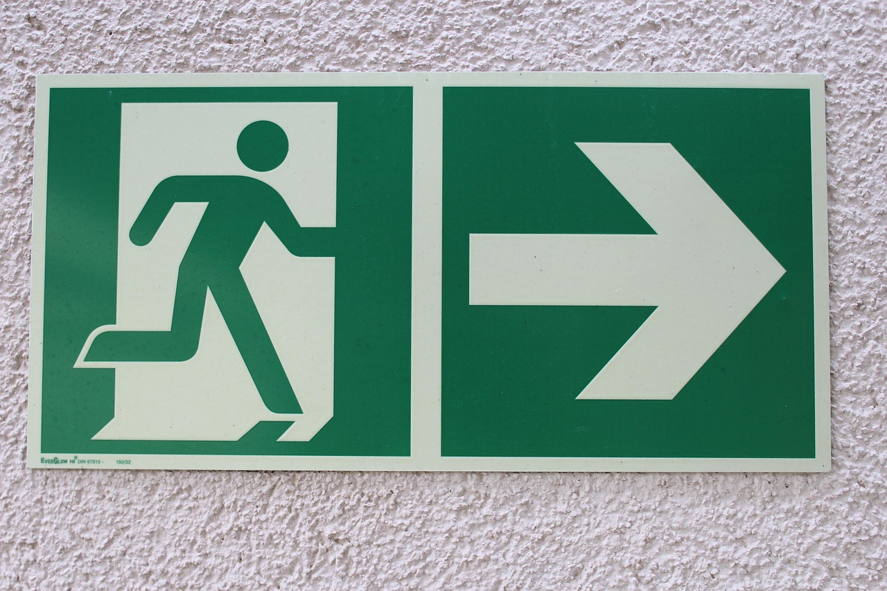

<!--

author:    Hilke Domsch; Volker Göhler
email:     hilke.domsch@gkz-ev.de
version:   0.0.7

language:  de
narrator:  Deutsch Female

edit:      true
date:      2025-07-21

icon:      https://raw.githubusercontent.com/Ifi-DiAgnostiK-Project/LiaScript-Courses/refs/heads/main/img/Logo_234px.png
logo:      https://upload.wikimedia.org/wikipedia/commons/thumb/2/2f/ISO_Exit_-_Right.svg/2880px-ISO_Exit_-_Right.svg.png

comment:   Rettungszeichen

attribute: Sicherheitszeichen von [Berufsgenossenschaft Holz und Metall](https://www.bghm.de/arbeitsschuetzer/praxishilfen/sicherheitszeichen)

link:      style.css
import:    https://raw.githubusercontent.com/Ifi-DiAgnostiK-Project/LiaScript_DragAndDrop_Template/refs/heads/main/README.md
           https://raw.githubusercontent.com/Ifi-DiAgnostiK-Project/Piktogramme/refs/heads/main/makros.md
           https://raw.githubusercontent.com/Ifi-DiAgnostiK-Project/LiaScript_ImageQuiz/refs/heads/main/README.md

tags:  [ Arbeitssicherheit, Gesundheitsschutz, Arbeits- und Gesundheitsschutz ]

-->

# Arbeitssicherheit & Gesundheitsschutz - Rettungszeichen

Arbeitsbedingte Gesundheitsgefahren, Unfälle und Erkrankungen sollen gar nicht erst entstehen.
Dazu ist es wichtig, Gefahrenhinweise und Symbole richtig zu verstehen.\
Vor allem junge Menschen sind am Arbeitsplatz besonders gefährdet, weil sie (noch) nicht über alle nötigen Kenntnisse verfügen.

Dieses Quiz zeigt Ihnen, wie gut Sie sich bereits auskennen!

> __Hinweis:__ Es können mehrere Antworten richtig sein.

-------------------

<!-- style="max-width: 700px; width: 100%" -->

<!-- class="highlight"-->
Viel Erfolg!
------------

## Rettungszeichen

> Rettungszeichen zeigen Ihnen im Betrieb den schnellsten Weg in Sicherheit, zum Beispiel:
>
> - im Brandfall,
> - bei Unfällen
> - bei anderen Notfällen
>
> Im Betrieb ist es besonders wichtig, die Rettungswege und Rettungseinrichtungen zu kennen.
> So können Sie sich und andere umsichtig und unverzüglich in Sicherheit bringen.

<!-- style="max-width: 700px; width: 100%" -->

### 1. Welches dieser Zeichen ist ein Rettungszeichen?

<!-- data-randomize -->
- [[X]] @Rettungszeichen.Erste_Hilfe(7)
- [[ ]] @Warnzeichen.Automatischer_Anlauf(7)
- [[ ]] @Brandschutzzeichen.Brandmelder(7)

### 2. Füllen Sie den Lückentext aus.

<!-- style="width: 100%; max-width: 300px" -->

---

<!-- data-randomize -->
Das Rettungszeichen für den [[ Sammelpunkt | (Notausgang) | Sani-Kasten]] ist grün und zeigt eine laufende Person mit einem Pfeil.\
Rettungszeichen sind immer in der Farbe [[ rot |   blau   | (grün) ]] gehalten.

---

Die Bedeutung der Rettungszeichen ist europaweit [[ unterschiedlich |   in den meisten Symbolen gleich   | (standardisiert) ]].\
Die Rettungszeichen befinden sich in der Regel [[ in öffentlichen Gebäuden |   (in Fluren und Ausgängen)  | in Lagerräumen ]].

### 3. Rettungszeichen und ihre Bedeutung

<!-- class="highlight" -->
__Ordnen Sie die Piktogramme ihrer jeweiligen Bedeutung zu.__

--------------

<!-- data-randomize -->
- [[ @Rettungszeichen.Richtungspfeil_rechts(10) ] [@Rettungszeichen.Oeffentliche_Rettungsausruestung(10) ] [ @Rettungszeichen.Arzt(10) ]]
- [ ( ) ( ) ( ) ]  Fluchtweg links
- [ (X) ( ) ( ) ]  Fluchtweg rechts
- [ ( ) ( ) ( ) ]  Rettungsring
- [ ( ) (X) ( ) ]  öffentliche Schutzausrüstung
- [ ( ) ( ) (X) ]  Arzt

## Geschafft! 🙌

<!-- class="highlight" style="font-size: large"-->
> Tipp:
>
> Weitere Informationen und alle Sicherheitszeichen finden Sie auf der BGHM-Webseite:
>
> https://www.bghm.de/arbeitsschuetzer/praxishilfen/sicherheitszeichen

--------------------

