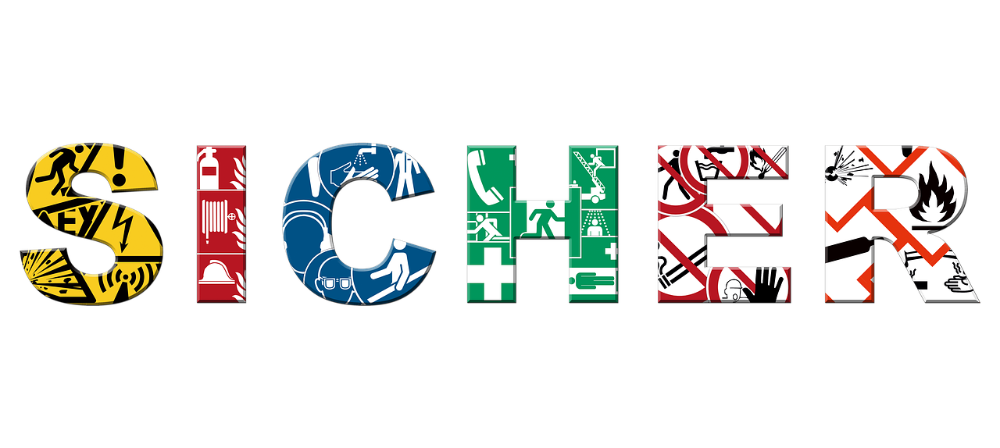

<!--

author:    Hilke Domsch; Volker Göhler
email:     hilke.domsch@gkz-ev.de

version:   0.0.7
language:  de
narrator:  Deutsch Female

edit:      true
date:      2025-07-21

icon:      https://raw.githubusercontent.com/Ifi-DiAgnostiK-Project/LiaScript-Courses/refs/heads/main/img/Logo_234px.png
logo:      https://upload.wikimedia.org/wikipedia/commons/thumb/0/00/ISO_7010_W002.svg/2560px-ISO_7010_W002.svg.png

comment:   Arbeitssicherheit & Gesundheitsschutz

attribute: Sicherheitszeichen von [Berufsgenossenschaft Holz und Metall](https://www.bghm.de/arbeitsschuetzer/praxishilfen/sicherheitszeichen)

link:      style.css
import:    https://raw.githubusercontent.com/Ifi-DiAgnostiK-Project/LiaScript_DragAndDrop_Template/refs/heads/main/README.md
           https://raw.githubusercontent.com/Ifi-DiAgnostiK-Project/Piktogramme/refs/heads/main/makros.md
           https://raw.githubusercontent.com/Ifi-DiAgnostiK-Project/LiaScript_ImageQuiz/refs/heads/main/README.md

title:     Sicherheitszeichen

tags:      [ Arbeitssicherheit, Sicherheitszeichen, Arbeits- und Gesundheitsschutz ]

-->

# Arbeitssicherheit und Gesundheitsschutz -- Sicherheitszeichen

Arbeitsbedingte Gesundheitsgefahren, Unfälle und Erkrankungen sollen gar nicht erst entstehen.
Dazu ist es wichtig, Gefahrenhinweise und Symbole richtig zu verstehen.\
Vor allem junge Menschen sind am Arbeitsplatz besonders gefährdet, weil sie (noch) nicht über alle nötigen Kenntnisse verfügen.

Dieses Quiz zeigt Ihnen, wie gut Sie sich bereits auskennen!

> __Hinweis:__ Es können mehrere Antworten richtig sein.

-------------------

<!-- style="max-width: 700px; width: 100%" -->

<!-- class="highlight"-->
Viel Erfolg!
------------

## Sicherheitszeichen

>Im Handwerk sorgen Sicherheitszeichen und der richtige Umgang mit Gefahrstoffen dafür, dass alle gesund und unfallfrei durch den Arbeitsalltag kommen.    Wer die wichtigsten Zeichen kennt und Gefahrstoffe richtig erkennt, schützt nicht nur sich selbst, sondern auch andere.   Die Symbole zeigen Ihnen auf einen Blick, was zu tun, zu lassen oder besonders zu beachten ist.    Mit dem Quiz prüfen Sie, wie fit Sie sind beim Thema Sicherheit im Betrieb. wirklich bist! 

<!-- style="width: 700px" -->

_Quelle: Pixabay, succo_

### 1. Warnzeichen

<!--style="color:blue; font-weight: bolder"-->
__In welcher Zeile befinden sich Warnschilder?__

- [( )] 
 @Gefahrstoffe.Giftig_Sehr_giftig(11.5) @Gefahrstoffe.Entzuendlich(11.5) @Gefahrstoffe.Umweltgefaehrlich(11.5) 

- [(X)] 
 @Warnzeichen.Elektrische_Spannung(10) @Warnzeichen.Flurfoerderzeugen(10) @Warnzeichen.Schwebende_Last(10) 

- [( )] 
 @Verbotszeichen.Zutritt_fuer_Unbefugte_verboten(11.5) @Verbotszeichen.Besteigen_fuer_Unbefugte_verboten(11.5) @Verbotszeichen.Allgemeines_Verbotszeichen(11.5) 

### 2. Sicherheitszeichen und ihre Bedeutungen I

<!-- class="highlight" -->
__Ordnen Sie die Zeichen den passenden Beschreibungen zu.__

<!--
data-randomize
data-show-partial-solution
-->
- [[@Warnzeichen.Elektrische_Spannung(10)] [@Gebotszeichen.Handschuh(10)] [@Verbotszeichen.Keine_Offene_Flamme(10)]]
- [ (X) ( ) ( ) ]  Warnung vor elektrischer Spannung
- [ ( ) (X) ( ) ]  Aufforderung, Handschuhe zu tragen
- [ ( ) ( ) (X) ]  Verbot von offenem Feuer
- [ ( ) ( ) ( ) ]  Lagerfeuerverbot

### 3. Sicherheitszeichen und ihre Bedeutungen II

<!-- class="highlight" -->
__Wahr oder falsch? -- Das Symbol "Schutzbrille tragen" ist ein blaues, rundes Gebotszeichen.__

<!-- data-randomize -->
- [(X)] wahr
- [( )] falsch

----

<!-- class="highlight" -->
__Was bedeutet das folgende Zeichen?__

<section class="flex-container">

@Brandschutzzeichen.Feuerloescher(15)

<!-- data-randomize -->
- [( )] Brandmelder
- [( )] Achtung - keine Brandtür!
- [(X)] Feuerlöscher

</section>

----

<!-- class="highlight" -->
__Füllen Sie den Lückentext richtig aus.__

Das Zeichen mit einer laufenden Person und einem Pfeil auf grünem Hintergrund kennzeichnet einen [[ Sammelpunkt | (Notausgang) | Sani-Kasten]].

### 4. Zuordnungsaufgabe Sicherheitszeichen

<!-- class="highlight" -->
__Ordnen Sie die abgebildeten Sicherheitszeichen dem richtigen Begriff zu:__

<!-- data-randomize -->
- [[@Rettungszeichen.Notruftelefon(10)] [@Gebotszeichen.Kopfschutz(10)] [@Gefahrstoffe.Aetzend_Reizend(10)]]
- [ ( ) ( ) ( ) ]  Warnung vor einer Gefahr
- [ (X) ( ) ( ) ]  Notruftelefon
- [ ( ) ( ) (X) ]  Warnung vor Gefahrstoffen - ätzend
- [ ( ) ( ) ( ) ]  Brandmelder
- [ ( ) (X) ( ) ]  Schutzhelm tragen

### 5. Sicherheitszeichen und ihre Bedeutungen III

<!-- class="highlight" -->
__Wofür steht dieses Zeichen?__

<section class="flex-container">

@Gefahrstoffe.Explosiv(15)

<!-- data-randomize -->
- [( )] Achtung: Komprimierte Gase!
- [(X)] Achtung: Explosiv!
- [( )] Achtung: Entzündlich!

</section>

---

<!-- class="highlight" -->
__Wofür steht dieses Zeichen?__

<section class="flex-container">

@Gefahrstoffe.Oxidierend(15)

<!-- data-randomize -->
- [( )] Entzündbar
- [(X)] Brandfördernd, oxidierend
- [( )] Umweltgefährlich

</section>

---

<!-- class="highlight" -->
__Was ist beim Umgang mit gekennzeichneten Gefahrstoffen zu beachten?__

<!-- data-randomize -->
- [[ ]] Nur Fachkräfte mit einer entsprechenden Zulassung dürfen mit Gefahrstoffen arbeiten.
- [[X]] Betriebsanweisung lesen.
- [[ ]] Handschuhe sind nur nach Anweisung nötig.
- [[X]] Schutzmaßnahmen einhalten.

## Geschafft! 🙌

<!-- class="highlight" style="font-size: large"-->
> Tipp:
>
> Weitere Informationen und alle Sicherheitszeichen finden Sie auf der BGHM-Webseite:
>
> https://www.bghm.de/arbeitsschuetzer/praxishilfen/sicherheitszeichen

--------------------

