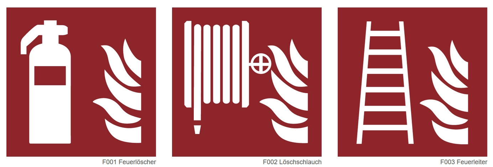
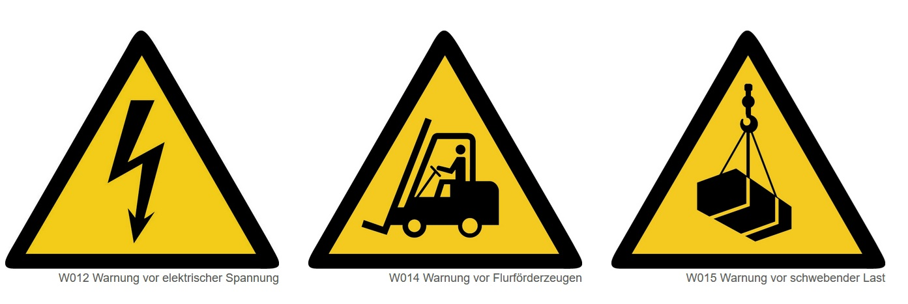
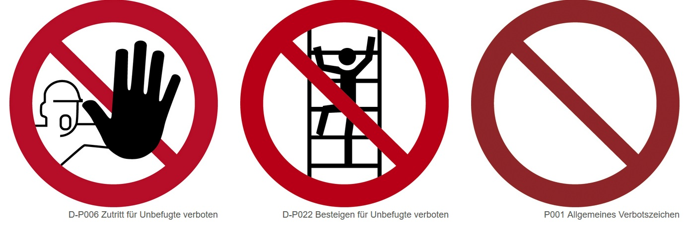
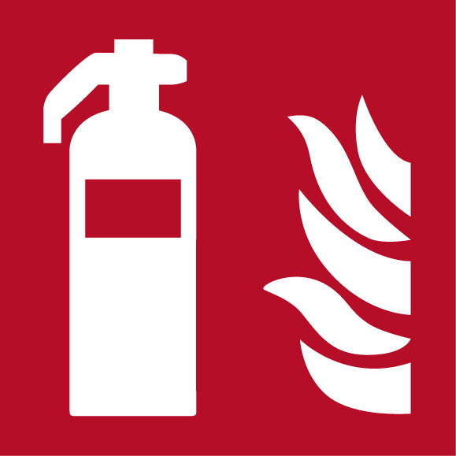

<!--

author: Hilke Domsch; Volker Göhler

email:    hilke.domsch@gkz-ev.de

title: Arbeitssicherheit und Gesundheitsschutz

version: 0.0.8

language: de

narrator: Deutsch Female

comment:  Hilkes Kurs mit Fragen zu LiaScript

import: https://raw.githubusercontent.com/wenik35/LiaScript_DragAndDrop_Template/refs/heads/main/README.md
import: https://raw.githubusercontent.com/Ifi-DiAgnostiK-Project/Piktogramme/refs/heads/main/makros.md
import: https://raw.githubusercontent.com/wenik35/LiaScript_ImageQuiz/refs/heads/main/README.md


@style
.flex-container {
    display: flex;[](https://liascript.github.io/LiveEditor/liascript/index.html?#5)
    flex-wrap: wrap; /* Allows the items to wrap as needed */
    align-items: stretch;
    gap: 20px; /* Adds both horizontal and vertical spacing between items */
}

.flex-child { 
    flex: 1;
    margin-right: 20px; /* Adds space between the columns */
}

@media (max-width: 600px) {
    .flex-child {
        flex: 100%; /* Makes the child divs take up the full width on slim devices */
        margin-right: 0; /* Removes the right margin */
    }
}
@end

-->

# Arbeitssicherheit und Gesundheitsschutz

--{{0}}-- 

[](https://liascript.github.io/LiveEditor/liascript/index.html?#1)<!-- --{{0}}--
Arbeitssicherheit und Gesundheitsschutz
-->


Arbeitsbedingte Gesundheitsgefahren, Unfälle und Erkrankungen sollen gar nicht erst entstehen. Dazu ist es wichtig, Gefahrenhinweise und Symbole richtig zu verstehen.
Vor allem junge Menschen sind am Arbeitsplatz besonders gefährdet, weil sie (noch) nicht über alle nötigen Kenntnisse verfügen.
Dieses Quiz zeigt dir, wie gut du dich bereits auskennst!
Wir sind gespannt, wie du die Challange meisterst!

<!-- --{{0}}--
Arbeitsbedingte Gesundheitsgefahren, Unfälle und Erkrankungen sollen gar nicht erst entstehen. Dazu ist es wichtig, Gefahrenhinweise und Symbole richtig zu verstehen.
Vor allem junge Menschen sind am Arbeitsplatz besonders gefährdet, weil sie (noch) nicht über alle nötigen Kenntnisse verfügen.
Dieses Quiz zeigt dir, wie gut du dich bereits auskennst!
Wir sind gespannt, wie du die Challange meisterst!
Viel Erfolg!
-->

__Viel Erfolg!__

>_Auch hier hört sich der vorgelesene Text sehr künstlich an. "Challange" wird deutsch gesprochen. Welche Alternativen gibt es?_

__In welcher Zeile befinden sich Warnschilder?__
===

<!-- --{{1}}--
In welcher Zeile befinden sich Warnschilder? Zeile 1, 2 oder 3?
-->

[[ __Zeile 1__ | (Zeile 2) | __Zeile 3__]]

Zeile 1:  <!-- style="width: 500px" -->

Zeile 2:  <!-- style="width: 500px" -->

Zeile 3:  <!-- style="width: 500px" -->


## 1. Brandschutzzeichen

--{{0}}--  

<!-- --{{}}--
Wie sehen Brandschutzzeichen typischerweise aus?
Blaues Quadrat mit weißem Symbol
Grünes Rechteck mit weißem Symbol
Rotes Quadrat oder Rechteck mit weißem Symbol oder
Gelbes Dreieck mit schwarzem Symbol 
-->

__Wie sehen Brandschutzzeichen typischerweise aus?__
===

<!-- data-randomize -->
- [( )] Blaues Quadrat mit weißem Symbol
- [( )] Grünes Rechteck mit weißem Symbol
- [(X)] Rotes Quadrat oder Rechteck mit weißem Symbol
- [( )] Gelbes Dreieck mit schwarzem Symbol 

--{{1}}--  

<!-- --{{}}--
Was bildet das Zeichen ab?
-->

__Was bildet das Zeichen ab?__
===

 <!-- style="width: 100px" -->

<!-- data-randomize -->
[[ Ein Haus steht in Flammen. | __Fluchtweg erfolgt über Leitern.__ | (Hier befindet sich eine Feuerleiter.) ]]

--{{2}}--  

<!-- --{{}}--
Ordne das jeweilige Symbol im Bild 1, 2 und 3 der richtigen Bedeutung zu. 
-->

__Ordne das jeweilige Symbol der richtigen Bedeutung zu.__
===

<!-- data-randomize -->
[[ <!-- style="width: 100px" -->]        ( <!-- style="width: 100px" -->)                 [ <!-- style="width: 100px" -->]]
- [    ( )              ( )                      ( )     ]  Fluchtweg
- [    (X)              ( )                      ( )     ]  Richtungspfeils rechts
- [    ( )              ( )                      (X)     ]  Brandmelder
- [    ( )              ( )                      ( )     ]  Notruftelefon
- [    ( )              (X)                      ( )     ]  Brandmeldetelefon

>_Die Auswertung funktioniert leider nicht durch die 2 weiteren möglichen Antworten._


## 2. Rettungszeichen

--{{0}}--  

<!-- --{{}}--
Welches dieser Zeichen ist ein Rettungszeichen?
-->

__Welches dieser Zeichen ist ein Rettungszeichen?__
===

<!-- data-randomize -->
- [[ <!-- style="width: 100px" -->] ( <!-- style="width: 100px" -->) [ <!-- style="width: 100px" -->]]
- [    [X]           [ ]             [ ]     ]  Rettungszeichen

>_Klappt das mit dem Randomize auch bei einer Matrixaufgabe?_

>_Wo kann ich den Rückmeldetext ändern?_

--{{1}}--  

<!-- --{{}}--
Fülle den Lückentext aus. Nutze dafür folgende Worte:
Erste Hilfe, S
-->

__Fülle den Lückentext aus.__
===

<!-- data-randomize -->
Das Rettungszeichen für den [[ Sammelpunkt | (Notausgang) | Sani-Kasten]] ist grün und zeigt eine laufende Person mit einem Pfeil.
Rettungszeichen sind immer in der Farbe [[ rot |   blau   | (grün) ]] gehalten.
Die Bedeutung der Rettungszeichen ist europaweit [[ unterschiedlich |   in den meisten Symbolen gleich   | (standardisiert) ]].
Die Rettungszeichen befinden sich in der Regel [[ in öffentlichen Gebäuden |   (in Fluren und Ausgängen)  | in Lagerräumen ]].


>_Wie kann ich einen Absatz zwischen den Sätzen schalten? Geht eine Aufgabe wie Lückentext auch mit Randomizen?_

--{{2}}--  

<!-- --{{}}--
Ordne das jeweilige Symbol im Bild 1, 2 und 3 der richtigen Bedeutung zu. 
-->

__Ordne das jeweilige Symbol der richtigen Bedeutung zu.__
===

<!-- data-randomize -->
-   [[ <!-- style="width: 100px" -->]        ( <!-- style="width: 100px" -->)                 [ <!-- style="width: 100px" -->]]
- [    ( )              ( )                      ( )     ]  Fluchtweg links
- [    (X)              ( )                      ( )     ]  Fluchtweg rechts
- [    ( )              ( )                      ( )     ]  Rettungsring
- [    ( )              (X)                      ( )     ]  öffentliche Schutzausrüstung
- [    ( )              ( )                      (X)     ]  Arzt

>_Hier kommt wieder der Fehler, dass die beiden leeren Felder als "nicht richtig" gewertet werden._

## 3. Kennst du die Sicherheitszeichen?

--{{0}}--  

<!-- --{{0}}--
Ordne die Zeichen den passenden Beschreibungen zu.
Warnung vor elektrischer Spannung
Aufforderung, Handschuhe zu tragen
Verbot von offenem Feuer
-->

3.1 __Ordne die Zeichen den passenden Beschreibungen zu.__
===

<!-- data-randomize -->
-   [[ <!-- style="width: 100px" -->]        ( <!-- style="width: 100px" -->)                 [ <!-- style="width: 100px" -->]]
- [    (X)                                     ( )                                      ( )     ]  Warnung vor elektrischer Spannung
- [    ( )                                     (X)                                      ( )     ]  Aufforderung, Handschuhe zu tragen
- [    ( )                                     ( )                                      (X)     ]  Verbot von offenem Feuer


--{{1}}--  

<!-- --{{0}}--
Wahr oder falsch?
Das Symbol "Schutzbrille tragen" ist ein blaues, rundes Gebotszeichen.
-->

3.2 __Wahr oder falsch?__
===
__Das Symbol "Schutzbrille tragen" ist ein blaues, rundes Gebotszeichen.__
===

- [(X)] Wahr
- [( )] Falsch

> _"Gebotszeichen" wird von KI seltsam ausgesprochen._

--{{2}}--  

<!-- --{{0}}--
Was bedeutet das folgende Zeichen?
a) Brandmelder
b) Erste-Hilfe-Kasten
c) Feuerlöscher
-->

3.3 __Was bedeutet das folgende Zeichen?__
===

<!-- data-randomize -->
 <!-- style="width: 100px" -->

- [( )] Brandmelder
- [( )] Erste-Hilfe-Kasten
- [(X)] Feuerlöscher

--{{3}}--  

<!-- --{{0}}--
Lückentext:
Das Zeichen mit einer laufenden Person und einem Pfeil auf grünem Hintergrund kennzeichnet einen Rettungsweg, Notausstieg oder Notausgang. Wähle das richtige Wort aus.
-->

3.4 __Lückentext:__
===

Das Zeichen mit einer laufenden Person und einem Pfeil auf grünem Hintergrund kennzeichnet einen [[ Sammelpunkt | (Notausgang) | Sani-Kasten]]. 


--{{4}}--  

<!-- --{{0}}--
Ordne die abgebildeten Sicherheitszeichen dem richtigen Begriff zu:
-->

3.5 __Ordne die abgebildeten Sicherheitszeichen dem richtigen Begriff zu:__
===

<!-- data-randomize -->
-   [[ <!-- style="width: 100px" -->]        ( <!-- style="width: 100px" -->)                 [ <!-- style="width: 100px" -->]]
- [    ( )              ( )                      ( )     ]  Warnung vor einer Gefahr
- [    (X)              ( )                      ( )     ]  Notruftelefon
- [    ( )              ( )                      (X)     ]  Warnung vor Gefahrstoffen - ätzend
- [    ( )              ( )                      ( )     ]  Brandmelder
- [    ( )              (X)                      ( )     ]  Schutzhelm tragen

>_Ich wollte gern  2 falsche Auswahlantworten mit angeben. Leider wird die Antwort als nicht richtig gewertet. Wie kann das erreicht werden?_

--{{5}}--  

<!-- --{{0}}--
Wofür steht dieses Zeichen?
-->

3.6. __Wofür steht dieses Zeichen?__
===

 <!-- style="width: 150px" -->

<!-- data-randomize -->
- [( )] Achtung: Komprimierte Gase!
- [(X)] Achtung: Explosiv!
- [( )] Achtung: Entzündlich!

## 4. Aussagen rund um den Arbeits- und Gesundheitsschutz

--{{0}}--  

<!-- --{{0}}--
Die nächsten Aussagen drehen sich rund um den Arbeits- und Gesundheitsschutz. 
Entscheide, ob die folgenden Aussagen wahr oder falsch sind.
--> 

__Die nächsten Aussagen drehen sich rund um den Arbeits- und Gesundheitsschutz. Entscheide, ob die folgenden Aussagen wahr oder falsch sind!__
===

>_Ich habe in der Vertonung die Fragennummern mit eingesprochen, möchte aber gern, dass zukünftig das Quiz in beliebiger Reihenfolge abgespielt wird. Bitte angeben, wie ich das ändern/verbessern kann._

--{{1}}--  

<!-- --{{0}}--
Erstens. Das Bild mit einer Person auf der Leiter und einer Zahl zeigt an, dass die Leiter von insgesamt drei Personen zu nutzen ist: Eine Person, die hinaufsteigt, und zwei Personen, welche die Leiter sichern. Wahr oder falsch? 
-->

 <!-- style="width: 130px" -->

__1. Das Bild mit einer Person auf der Leiter und einer Zahl zeigt an, dass die Leiter von insgesamt drei Personen zu nutzen ist: Eine Person, die hinaufsteigt, und zwei Personen, welche die Leiter sichern. __ 

[[ wahr | (falsch) ]]


>_Wie kann ich einen Absatz in der Textanleitung generieren?_


--{{2}}--  

<!-- --{{}}--
Zweitens. Brandschutzzeichen sind immer orange-schwarz. Wahr oder falsch?
-->

__2. Brandschutzzeichen sind immer orange-schwarz. __

[[ wahr | (falsch) ]]


--{{3}}--  

<!-- --{{}}--
Drittens. Das Bild bedeutet, dass Leitern nur bei entsprechenden Witterungsbedingungen genutzt werden dürfen. Wahr oder falsch?
-->

 <!-- style="width: 130px" -->

__3. Das Bild bedeutet, dass Leitern nur bei entsprechenden Witterungsbedingungen genutzt werden dürfen. __

[[ (wahr) | falsch ]]

--{{4}}--  

<!-- --{{}}--
Viertens. Diese Abbildung zeigt, dass bei der Arbeit kein Wasser aus dem Gartenschlauch entnommen werden darf. Wahr oder falsch?
-->

 <!-- style="width: 130px" -->


__4. Diese Abbildung zeigt, dass bei der Arbeit kein Wasser aus dem Gartenschlauch entnommen werden darf.__

[[ wahr | (falsch) ]]

--{{5}}--  

<!-- --{{}}--
Fünftens. Dieses Symbol meint: Achtung: Diebstahlgefahr! Wahr oder falsch?
-->

 <!-- style="width: 130px" -->

__5. Dieses Symbol meint: Achtung: Diebstahlgefahr!__

[[ wahr | (falsch) ]]

--{{6}}--  

<!-- --{{}}--
Sechstens. Warum sind Brandschutzzeichen wichtig? Wahr oder falsch?
-->

__6. Warum sind Brandschutzzeichen wichtig?__

- [[ ]]  Sie dienen der Dekoration
- [[X]]  Sie helfen, im Brandfall schnell die richtigen Hilfsmittel zu finden
- [[ ]]  Sie zeigen Fluchtwege an
- [[X]]  Sie sind gesetzlich vorgeschrieben

--{{7}}--  

<!-- --{{}}--
Siebentens. Wo müssen Brandschutzzeichen angebracht werden?
-->

__7. Wo müssen Brandschutzzeichen angebracht werden?__

- [( )] Nur im Büro
- [(X)] Überall, wo sich Brandschutzeinrichtungen befinden
- [( )] Nur in der Werkstatt
- [( )] Nur im Lager

--{{8}}--  

<!-- --{{}}--
Wenn du noch mehr wissen willst, findest du mehr Informationen und alle Sicherheitszeichen auf der BGHM-Website - siehe Link.
-->

__Tipp:__ 
Weitere Informationen und alle Sicherheitszeichen findest du auf der BGHM-Webseite: https://www.bghm.de/arbeitsschuetzer/praxishilfen/sicherheitszeichen 


## 5. Arbeitssicherheit und Gesundheitsschutz: Leitern
<!--
language: de
narrator: Deutsch Male
-->

>_Ich würde ab hier eine männliche Stimme haben. Leider funktioniert das bei mir nicht.  Des Weiteren möchte ich im nachfolgenden Text Absätze schalten. Wie macht man das?._

> **den narrator an der Überschrift festzulegen sollte gehen, machts aber nicht: BUG**

<!-- --{{0}}--
Arbeits- und Gesundheitsschutz: Schwerpunkt Leitern.
--> 

--{{1}}--

Leitern werden im Arbeitsalltag häufig genutzt. Sie sind oft Auslöser für Unfälle. Es ist wichtig, die grundlegenden Sicherheitsregeln zu kennen und zu beachten. Schau dir das nachfolgende Video an.
-----------------------------------

---

--{{2}}--   

<!-- --{{}}--
Schau dir das nachfolgende Video an.
--> 


**Schau dir das nachfolgende Video an.**


!?[Leitern Lehre to Go](https://www.youtube.com/watch?v=zyfX3ZtkrMI)

_Quelle: ibis acam Bildungs GmbH_

--{{3}}--   

<!-- --{{}}--
Teste nachfolgend dein Wissen! Wähle jeweils die richtige Antwort aus.
--> 


__Teste nachfolgend dein Wissen! Wähle jeweils die richtige Antwort aus.__

---

## Quiz: Sicherer Umgang mit Leitern I

    --{{0}}--

<!-- --{{0}}--
Erstens. Welche Maßnahme ist vor jeder Benutzung einer Leiter zwingend erforderlich? a) Die Leiter darf nur in sauberem Zustand genutzt werden. b) Die Leiter ist auf Beschädigungen und Standsicherheit zu kontrollieren. c) Es braucht immer eine zweite Person, um die Leiter zu sichern. 
--> 

>_Wie kann ich die Reihenfolge mischen - auch in den Antworten - wenn ich aber die a), b) und c) vorlesen lasse?_

__1. Welche Maßnahme ist vor jeder Benutzung einer Leiter zwingend erforderlich?__

- [( )] a) Die Leiter darf nur in sauberem Zustand genutzt werden.
- [(x)] b) Die Leiter ist auf Beschädigungen und Standsicherheit zu kontrollieren.
- [( )] c) Es braucht immer eine zweite Person, um die Leiter zu sichern. 

---

--{{1}}--   

<!-- --{{0}}--
Zweitens. Wie sollte eine Anlegeleiter aufgestellt werden? a) Mit einem relativ steilem Anstellwinkel, damit sie wenig Platz braucht. b) Mit einem beliebigen Anstellwinkel - Hauptsache sie steht! c) Mit einem Anstellwinkel von ca. 70 Grad.
--> 


__2. Wie sollte eine Anlegeleiter aufgestellt werden?__

- [( )] a) Mit einem relativ steilem Anstellwinkel, damit sie wenig Platz braucht.
- [( )] b) Mit einem beliebigen Anstellwinkel - Hauptsache sie steht!  
- [(x)] c) Mit einem Anstellwinkel von ca. 70 Grad.

---

--{{2}}--   

<!-- --{{0}}--
Drittens. Was ist beim Transport von Werkzeugen auf der Leiter zu beachten? a) Werkzeug darf in den Hosentaschen und am Gürtel getragen werden. b) Leichtes Werkzeug darf mitgenommen werden, wenn beide Hände zum Festhalten frei bleiben. c) Es dürfen alle für die Arbeit benötigten Werkzeuge auf die Leiter mitgenommen werden. 
--> 


__3. Was ist beim Transport von Werkzeugen auf der Leiter zu beachten?__

- [( )] a) Werkzeug darf in den Hosentaschen und am Gürtel getragen werden.
- [(x)] b) Leichtes Werkzeug darf mitgenommen werden, wenn beide Hände zum Festhalten frei bleiben.
- [( )] c) Es dürfen alle für die Arbeit benötigten Werkzeuge auf die Leiter mitgenommen werden. 

---

--{{3}}--   

<!-- --{{0}}--
Viertens. Wann darf eine Leiter als Arbeitsplatz genutzt werden? a) Immer, wenn sie verfügbar ist. Damit ist flexibles Arbeiten möglich. b) Im Ausnahmefall auch für längere Arbeiten, wenn kein Gerüst da ist und flexibel gearbeitet werden soll. c) Nur für kurzzeitige Arbeiten, wenn keine andere Alternative möglich ist.
--> 

__4. Wann darf eine Leiter als Arbeitsplatz genutzt werden?__

- [( )] a) Immer, wenn sie verfügbar ist. Damit ist flexibles Arbeiten möglich.
- [( )] b) Im Ausnahmefall auch für längere Arbeiten, wenn kein Gerüst da ist und flexibel gearbeitet werden soll.
- [(x)] c) Nur für kurzzeitige Arbeiten, wenn keine andere Alternative möglich ist.

---

--{{4}}--   

<!-- --{{0}}--
Fünftens. Wie sollte eine Leiter gekennzeichnet sein, um sie für die Arbeit zu nutzen? a) Die Leiter muss das GS-Zeichen (geprüfte Sicherheit) und zusätzlich die EN 131-Kennzeichnung tragen. b) Die Leiter muss das GS-Zeichen (geprüfte Sicherheit) haben. c) Die Leiter braucht ein Prüfkennzeichen des Firmeninhabers oder Vorarbeiters, dass die Leiter sicher ist. 
--> 


__5. Wie sollte eine Leiter gekennzeichnet sein, um sie für die Arbeit zu nutzen?__

- [(X)] a) Die Leiter muss das GS-Zeichen (geprüfte Sicherheit) und zusätzlich die EN 131-Kennzeichnung tragen.
- [( )] b) Die Leiter muss das GS-Zeichen (geprüfte Sicherheit) haben.
- [( )] c) Die Leiter braucht ein Prüfkennzeichen des Firmeninhabers oder Vorarbeiters, dass die Leiter sicher ist. 

---

--{{5}}--   

<!-- --{{0}}--
Sechstens. Was ist bei Arbeiten über drei Meter zusätzlich zu beachten? a) Es braucht eine zweite Person, die die andere sichert.  b) Es muss eine Absturzsicherung vorhanden sein. c) Die Leiter darf nicht verwendet werden.
--> 


<section class="flex-container">

<div class="flex-child" style="min-width: 250px">

__6. Was ist bei Arbeiten über drei Meter zusätzlich zu beachten?__

- [( )] a) Es braucht eine zweite Person, die die andere sichert. 
- [(x)] b) Es muss eine Absturzsicherung vorhanden sein.
- [( )] c) Die Leiter darf nicht verwendet werden.

</div>

<div class="flex-child" style="min-width: 150px">
@Verbotszeichen.Fuer_Fussgaenger_verboten(25)
</div>

</section>


>_Können Bilder zur Illustration eingefügt werden - sozusagen rechts neben den Fragen?_
>
> **so?** geht mit den flex-containern, ist aber nicht sonderlich nutzerfreundlich :/

---

## Quiz: Sicherer Umgang mit Leitern II

--{{0}}--   

<!-- --{{0}}--
Beachte bei der Verwendung von Leitern immer die relevanten Sicherheitsregeln und Vorschriften. Durch regelmäßige Kontrolle, richtige Auswahl und sachgemäßen Umgang lassen sich Unfälle vermeiden und die Gesundheit schützen.
--> 

> ```
> <!-- --{{0}}--
> Beachte bei der Verwendung von Leitern immer die relevanten Sicherheitsregeln und Vorschriften. Durch regelmäßige Kontrolle, richtige Auswahl und sachgemäßen Umgang lassen sich Unfälle vermeiden und die Gesundheit schützen.
> --> 
> ```
> Die Vorlesekommentare brauchen zwingend eine 0 in den Klammern!!!


Beachte bei der Verwendung von Leitern immer die relevanten Sicherheitsregeln und Vorschriften. Durch regelmäßige Kontrolle, richtige Auswahl und sachgemäßen Umgang lassen sich Unfälle vermeiden und die Gesundheit schützen. 

---
__Kannst du die Bilder der richtigen Bedeutung zuordnen?__ 🤔

<!-- data-randomize -->
-   [[ <!-- style="width: 100px" -->]        ( <!-- style="width: 100px" -->)                 [ <!-- style="width: 100px" -->]]
- [    ( )              ( )                      ( )     ]  Die obersten 3 Sprossen nicht benutzen
- [    ( )              ( )                      ( )     ]  Nicht auf die obersten Sprossen treten
- [    ( )              (X)                      ( )     ]  Nicht übertreten
- [    ( )              ( )                      (x)     ]  ebener und tragfähiger Untergrund
- [    (X)              ( )                      ( )     ]  Nur an sichere Flächen anlegen

>_Ich wollte gern  2 falsche Auswahlantworten mit angeben. Leider wird die Antwort als nicht richtig gewertet. Wie kann das erreicht werden?_

> **hat Andre geändert geht jetzt, ist aber immer noch buggy. einfach [] anstelle der () verwenden !?**
---

<!-- data-randomize -->
-   [[ <!-- style="width: 100px" -->]        ( <!-- style="width: 100px" -->)                 [ <!-- style="width: 100px" -->]]
- [    (X)              ( )                      ( )     ]  Maximale Belastung
- [    ( )              (X)                      ( )     ]  Nicht übersteigen
- [    ( )              ( )                      ( )     ]  Nicht übertreten
- [    ( )              ( )                      (x)     ]  Anlegewinkel beachten
- [    ( )              ( )                      ( )     ]  Achtung! Leiter kippt!

---

<!-- data-randomize -->
__Welches der Symbole warnt: Spreizsicherung einlegen!__ 🤔

<section class="flex-container">
<div class="flex-child" style="min-width: 100px">
Bild a) @Leitern.Spreizsicherung_einlegen(10)
</div>
<div class="flex-child" style="min-width: 100px">
Bild b) @Leitern.Nicht_als_Anlegeleiter_nutzen(10)
</div>
<div class="flex-child" style="min-width: 100px">
Bild c) @Leitern.Stahlspitzen_auf_nachgiebigem_Untergrund(10)
</div>
</section>

- [[X]] Bild a
- [[ ]] Bild b
- [[ ]] Bild c


----

<!-- data-randomize -->
__Welches der Symbole zeigt an, dass die Leiter nicht als Anlegeleiter genutzt werden darf?__

<section class="flex-container">
<div class="flex-child" style="min-width: 100px">
Bild a) @Leitern.Anlegewinkel_beachten(10)
</div>
<div class="flex-child" style="min-width: 100px">
Bild b) @Leitern.Nur_eine_Person(10)
</div>
<div class="flex-child" style="min-width: 100px">
Bild c) @Leitern.Nicht_als_Anlegeleiter_nutzen(10)
</div>
</section>

- [[ ]] Bild a
- [[ ]] Bild b
- [[x]] Bild c

---

<!-- data-randomize -->
__Welches der Symbole zeigt an, dass nicht übertreten werden darf?__

<section class="flex-container">
<div class="flex-child" style="min-width: 100px">
Bild a) @Leitern.Die_obersten_3_Sprossen_nicht_besteigen(10)
</div>
<div class="flex-child" style="min-width: 100px">
Bild b) @Leitern.Nicht_uebersteigen(10)
</div>
<div class="flex-child" style="min-width: 100px">
Bild c) @Leitern.Nicht_uebertreten(10)
</div>
</section>

- [[ ]] Bild a
- [[x]] Bild b
- [[ ]] Bild c

---

<!-- data-randomize -->
__Welches der Symbole zeigt an, dass die Leiter nur von einer Person genutzt werden darf?__ 🤔

<section class="flex-container">
<div class="flex-child" style="min-width: 100px">
Bild a) @Leitern.Anlegewinkel_beachten(10)
</div>
<div class="flex-child" style="min-width: 100px">
Bild b) @Leitern.Nur_eine_Person(10)
</div>
<div class="flex-child" style="min-width: 100px">
Bild c) @Leitern.Nicht_als_Anlegeleiter_nutzen(10)
</div>
</section>

- [[ ]] Bild a
- [[x]] Bild b
- [[ ]] Bild c


---

<!-- data-randomize -->
__Welche Symbole regeln den Umgang mit Leitern?__ 🤔

>_Ich habe leider noch nicht geschnallt, wie ich festlege, welche Symbole die richtigen sind._

@dragdropmultipleimages(@uid, @Warnzeichen.Laserstrahl.src|@Warnzeichen.Automatischer_Anlauf.src|@Brandschutzzeichen.Brandbekaempfung.src|@Rettungszeichen.Erste_Hilfe.src, @Leitern.Nur_eine_Person.src)


__Welche Symbole regeln den Umgang mit Leitern?__ 🤔

>_Ich habe leider noch nicht geschnallt, wie ich festlege, welche Symbole die richtigen sind._
> 
> Hier ist die Anleitung: `@dragdropmultipleimages(@uid, falsche, richtige)`
> Die Bilder mit | aneinandreihen und immer die src Varianten verwenden
> Ist aber noch sehr Buggy, ich frag mal Niklas !

@dragdropmultipleimages(@uid,@Warnzeichen.Laserstrahl.src|@Warnzeichen.Automatischer_Anlauf.src|@Brandschutzzeichen.Brandbekaempfung.src|@Rettungszeichen.Erste_Hilfe.src,@Leitern.Nur_eine_Person.src|@Leitern.Anlegewinkel_beachten.src|@Leitern.Mindestens_1_m_Ueberstand.src)

testquiz
====

@dragdropmultipleimages(@uid, @Warnzeichen.Laserstrahl.src, @Leitern.Nur_eine_Person.src)

---
Geschafft! 🙌
