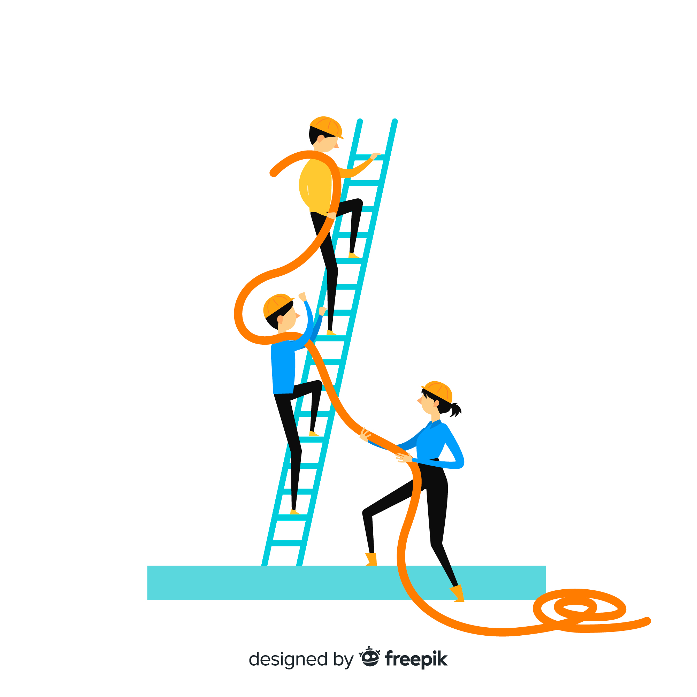

<!--

author: Hilke Domsch; Volker Göhler

email:    hilke.domsch@gkz-ev.de

version: 0.1.0

language: de

narrator: Deutsch Female

edit: true
date: 2025-06-15
logo: https://raw.githubusercontent.com/Ifi-DiAgnostiK-Project/LiaScript-Courses/refs/heads/main/img/Logo_234px.png

comment:  Arbeitssicherheit & Gesundheitsschutz

attribute: Sicherheitszeichen von [Berufsgenossenschaft Holz und Metall](https://www.bghm.de/arbeitsschuetzer/praxishilfen/sicherheitszeichen)

import: https://raw.githubusercontent.com/Ifi-DiAgnostiK-Project/LiaScript_DragAndDrop_Template/refs/heads/main/README.md
import: https://raw.githubusercontent.com/Ifi-DiAgnostiK-Project/Piktogramme/refs/heads/main/makros.md
import: https://raw.githubusercontent.com/Ifi-DiAgnostiK-Project/LiaScript_ImageQuiz/refs/heads/main/README.md

title: Arbeitssicherheit und Gesundheitsschutz - Sammlung

tags:
    - Arbeitssicherheit
    - Gesundheitsschutz

@style
.flex-container {
    display: flex;
    flex-wrap: wrap; /* Allows the items to wrap as needed */
    align-items: stretch;
    gap: 20px; /* Adds both horizontal and vertical spacing between items */
}

.flex-child { 
    flex: 1;
    margin-right: 20px; /* Adds space between the columns */
}

@media (max-width: 600px) {
    .flex-child {
        flex: 100%; /* Makes the child divs take up the full width on slim devices */
        margin-right: 0; /* Removes the right margin */
    }
}

.image_matrix img {
    padding: 3px;
    margin: 5px;
    width: 100px;
    border: 1px black solid;
    display:inline-block;
}

@end

-->

# Arbeitssicherheit und Gesundheitsschutz

--{{0}}-- 

<!-- --{{0}}--
Arbeitssicherheit und Gesundheitsschutz
-->

>_Wie oft darf eine Frage falsch beantwortet werden, bevor die Lösung angezeigt wird? Wie wird im Hintergrund für den Lehrer registriert, wie viele Versuche es gab?_

Arbeitsbedingte Gesundheitsgefahren, Unfälle und Erkrankungen sollen gar nicht erst entstehen. Dazu ist es wichtig, Gefahrenhinweise und Symbole richtig zu verstehen.
Vor allem junge Menschen sind am Arbeitsplatz besonders gefährdet, weil sie (noch) nicht über alle nötigen Kenntnisse verfügen.
Dieses Quiz zeigt Ihnen, wie gut Sie sich bereits auskennen!
Wir sind gespannt, wie du die Challenge meisterst!

<!-- --{{0}}--
Arbeitsbedingte Gesundheitsgefahren, Unfälle und Erkrankungen sollen gar nicht erst entstehen. Dazu ist es wichtig, Gefahrenhinweise und Symbole richtig zu verstehen.
Vor allem junge Menschen sind am Arbeitsplatz besonders gefährdet, weil sie (noch) nicht über alle nötigen Kenntnisse verfügen.
Dieses Quiz zeigt Ihnen, wie gut Sie sich bereits auskennst!
Wir sind gespannt, wie Sie die Challenge meistern!
Viel Erfolg!
-->

__Viel Erfolg!__

>_Auch hier hört sich der vorgelesene Text sehr künstlich an. "Challenge" wird deutsch gesprochen. Welche Alternativen gibt es?_

__In welcher Zeile befinden sich Warnschilder?__
===

<!-- --{{1}}--
In welcher Zeile befinden sich Warnschilder? Zeile 1, 2 oder 3?
-->

<section class="flex-container" style="padding: 1rem;">

__Zeile 1:__

@Brandschutzzeichen.Feuerloescher(10)

@Brandschutzzeichen.Loeschschlauch(10)

@Brandschutzzeichen.Feuerleiter(10)

</section>

<section class="flex-container" style="padding: 1rem;">

__Zeile 2:__

@Warnzeichen.Elektrische_Spannung(10)

@Warnzeichen.Flurfoerderzeugen(10)

@Warnzeichen.Schwebende_Last(10)

</section>

<section class="flex-container" style="padding: 1rem;">

__Zeile 3:__

@Verbotszeichen.Zutritt_fuer_Unbefugte_verboten(10)

@Verbotszeichen.Besteigen_fuer_Unbefugte_verboten(10)

@Verbotszeichen.Allgemeines_Verbotszeichen(10)

</section>

[[ __Zeile 1__ | (__Zeile 2__) | __Zeile 3__]]

## 1. Brandschutzzeichen

--{{0}}--  

<!-- --{{}}--
Wie sehen Brandschutzzeichen typischerweise aus?
Blaues Quadrat mit weißem Symbol
Grünes Rechteck mit weißem Symbol
Rotes Quadrat oder Rechteck mit weißem Symbol oder
Gelbes Dreieck mit schwarzem Symbol 
-->

__Wie sehen Brandschutzzeichen typischerweise aus?__
===

<!-- data-randomize -->
- [( )] Blaues Quadrat mit weißem Symbol
- [( )] Grünes Rechteck mit weißem Symbol
- [(X)] Rotes Quadrat oder Rechteck mit weißem Symbol
- [( )] Gelbes Dreieck mit schwarzem Symbol 

--{{1}}--  

<!-- --{{}}--
Was bildet das Zeichen ab?
-->

__Was bildet das Zeichen ab?__
===

 <!-- style="width: 100px" -->

<!-- data-randomize -->
[[ Ein Haus steht in Flammen. | __Fluchtweg erfolgt über Leitern.__ | (Hier befindet sich eine Feuerleiter.) ]]

--{{2}}--  

<!-- --{{}}--
Ordnen Sie das jeweilige Symbol im Bild 1, 2 und 3 der richtigen Bedeutung zu. 
-->

__Ordnen Sie das jeweilige Symbol der richtigen Bedeutung zu.__
===

<!-- data-randomize -->
[[ <!-- style="width: 100px" -->]        ( <!-- style="width: 100px" -->)                 [ <!-- style="width: 100px" -->]]
- [    ( )              ( )                      ( )     ]  Fluchtweg
- [    (X)              ( )                      ( )     ]  Richtungspfeils rechts
- [    ( )              ( )                      (X)     ]  Brandmelder
- [    ( )              ( )                      ( )     ]  Notruftelefon
- [    ( )              (X)                      ( )     ]  Brandmeldetelefon

>_Die Auswertung funktioniert leider nicht durch die 2 weiteren möglichen Antworten._

## 2. Rettungszeichen

--{{0}}--  

<!-- --{{}}--
Welches dieser Zeichen ist ein Rettungszeichen?
-->

__Welches dieser Zeichen ist ein Rettungszeichen?__
===

<!-- data-randomize -->
- [[ <!-- style="width: 100px" -->] ( <!-- style="width: 100px" -->) [ <!-- style="width: 100px" -->]]
- [    [X]           [ ]             [ ]     ]  Rettungszeichen

>_Klappt das mit dem Randomize auch bei einer Matrixaufgabe?_

>_Wo kann ich den Rückmeldetext ändern? Ich hätte gern bei einer falschen Antwort: "Das war leider nicht richtig. Versuch's nochmal!👋"_

--{{1}}--  

<!-- --{{}}--
Füllen Sie den Lückentext aus.
-->

__Füllen Sie den Lückentext aus.__
===

<!-- data-randomize -->
Das Rettungszeichen für den [[ Sammelpunkt | (Notausgang) | Sani-Kasten]] ist grün und zeigt eine laufende Person mit einem Pfeil.
Rettungszeichen sind immer in der Farbe [[ rot |   blau   | (grün) ]] gehalten. 

Die Bedeutung der Rettungszeichen ist europaweit [[ unterschiedlich |   in den meisten Symbolen gleich   | (standardisiert) ]].
Die Rettungszeichen befinden sich in der Regel [[ in öffentlichen Gebäuden |   (in Fluren und Ausgängen)  | in Lagerräumen ]].

>_Wie kann ich einen Absatz zwischen den Sätzen schalten? Geht eine Aufgabe wie Lückentext auch mit Randomizen?_

--{{2}}--  

<!-- --{{}}--
Ordnen Sie das jeweilige Symbol im Bild 1, 2 und 3 der richtigen Bedeutung zu. 
-->

__Ordnen Sie das jeweilige Symbol der richtigen Bedeutung zu.__
===

<!-- data-randomize -->
-   [[ <!-- style="width: 100px" -->]        ( <!-- style="width: 100px" -->)                 [ <!-- style="width: 100px" -->]]
- [    ( )              ( )                      ( )     ]  Fluchtweg links
- [    (X)              ( )                      ( )     ]  Fluchtweg rechts
- [    ( )              ( )                      ( )     ]  Rettungsring
- [    ( )              (X)                      ( )     ]  öffentliche Schutzausrüstung
- [    ( )              ( )                      (X)     ]  Arzt

## 3. Kennen Sie die Sicherheitszeichen?

--{{0}}--  

<!-- --{{}}--
Ordnen Sie die Zeichen den passenden Beschreibungen zu.
Warnung vor elektrischer Spannung
Aufforderung, Handschuhe zu tragen
Verbot von offenem Feuer
-->

3.1 __Ordnen Sie die Zeichen den passenden Beschreibungen zu.__
===

<!-- data-randomize -->
-   [[ <!-- style="width: 100px" -->]        ( <!-- style="width: 100px" -->)                 [ <!-- style="width: 100px" -->]]
- [    (X)                                     ( )                                      ( )     ]  Warnung vor elektrischer Spannung
- [    ( )                                     (X)                                      ( )     ]  Aufforderung, Handschuhe zu tragen
- [    ( )                                     ( )                                      (X)     ]  Verbot von offenem Feuer

--{{1}}--  

<!-- --{{0}}--
Wahr oder falsch?
Das Symbol "Schutzbrille tragen" ist ein blaues, rundes Gebotszeichen.
-->

3.2 __Wahr oder falsch?__
===
__Das Symbol "Schutzbrille tragen" ist ein blaues, rundes Gebotszeichen.__
===

- [(X)] wahr
- [( )] falsch

> _"Gebotszeichen" wird von KI seltsam ausgesprochen._

--{{2}}--  

<!-- --{{0}}--
Was bedeutet das folgende Zeichen?
a) Brandmelder
b) Erste-Hilfe-Kasten
c) Feuerlöscher
-->

3.3 __Was bedeutet das folgende Zeichen?__
===

<!-- data-randomize -->
@Brandschutzzeichen.Feuerloescher(10)

- [( )] Brandmelder
- [( )] Erste-Hilfe-Kasten
- [(X)] Feuerlöscher

--{{3}}--  

<!-- --{{0}}--
Lückentext:
Das Zeichen mit einer laufenden Person und einem Pfeil auf grünem Hintergrund kennzeichnet einen Rettungsweg, Notausstieg oder Notausgang. Wählen Sie das richtige Wort aus.
-->

3.4 __Lückentext:__
===

Das Zeichen mit einer laufenden Person und einem Pfeil auf grünem Hintergrund kennzeichnet einen [[ Sammelpunkt | (Notausgang) | Sani-Kasten]]. 

--{{4}}--  

<!-- --{{}}--
Ordnen Sie die abgebildeten Sicherheitszeichen dem richtigen Begriff zu:
-->

3.5 __Ordnen Sie die abgebildeten Sicherheitszeichen dem richtigen Begriff zu:__
===

<!-- data-randomize -->
-   [[ <!-- style="width: 100px" -->]        ( <!-- style="width: 100px" -->)                 [ <!-- style="width: 100px" -->]]
- [    ( )              ( )                      ( )     ]  Warnung vor einer Gefahr
- [    (X)              ( )                      ( )     ]  Notruftelefon
- [    ( )              ( )                      (X)     ]  Warnung vor Gefahrstoffen - ätzend
- [    ( )              ( )                      ( )     ]  Brandmelder
- [    ( )              (X)                      ( )     ]  Schutzhelm tragen

--{{5}}--  

<!-- --{{0}}--
Wofür steht dieses Zeichen?
-->

3.6. __Wofür steht dieses Zeichen?__
===

 <!-- style="width: 150px" -->

<!-- data-randomize -->
- [( )] Achtung: Komprimierte Gase!
- [(X)] Achtung: Explosiv!
- [( )] Achtung: Entzündlich!

## 4. Aussagen rund um den Arbeits- und Gesundheitsschutz

--{{0}}--  

<!-- --{{0}}--
Die nächsten Aussagen drehen sich rund um den Arbeits- und Gesundheitsschutz. 
Entscheiden Sie, ob die folgenden Aussagen wahr oder falsch sind. Es können mehrere Antworten richtig sein.
--> 

__Die nächsten Aussagen drehen sich rund um den Arbeits- und Gesundheitsschutz. Entscheiden Sie, ob die folgenden Aussagen wahr oder falsch sind! Es können mehrere Antworten richtig sein.__
===

>_Ich habe in der Vertonung die Fragennummern mit eingesprochen, möchte aber gern, dass zukünftig das Quiz in beliebiger Reihenfolge abgespielt wird. Bitte angeben, wie ich das ändern/verbessern kann._

>_Die Aussage "Es können mehrere Antworten richtig sein." hätte ich gern wieder auf einer neuen Zeile = Zeilenumbruch. Wie geht das?_

--- 

--{{1}}--  

<!-- --{{0}}--
Erstens. Das Bild mit einer Person auf der Leiter und einer Zahl zeigt an, dass die Leiter von insgesamt drei Personen zu nutzen ist: Eine Person, die hinaufsteigt, und zwei Personen, welche die Leiter sichern. Wahr oder falsch? 
-->

 <!-- style="width: 130px" -->

__1. Das Bild mit einer Person auf der Leiter und einer Zahl zeigt an, dass die Leiter von insgesamt drei Personen zu nutzen ist: Eine Person, die hinaufsteigt, und zwei Personen, welche die Leiter sichern. __ 

[[ wahr | (falsch) ]]

>_Wie kann ich einen Absatz in der Textanleitung generieren?_

---

--{{2}}--  

<!-- --{{}}--
Zweitens. Brandschutzzeichen sind immer orange-schwarz. Wahr oder falsch?
-->

__2. Brandschutzzeichen sind immer orange-schwarz. __

[[ wahr | (falsch) ]]

---

--{{3}}--  

<!-- --{{}}--
Drittens. Das Bild bedeutet, dass Leitern nur bei entsprechenden Witterungsbedingungen genutzt werden dürfen. Wahr oder falsch?
-->

 <!-- style="width: 130px" -->

__3. Das Bild bedeutet, dass Leitern nur bei entsprechenden Witterungsbedingungen genutzt werden dürfen. __

[[ (wahr) | falsch ]]

---

--{{4}}--  

<!-- --{{}}--
Viertens. Diese Abbildung zeigt, dass bei der Arbeit kein Wasser aus dem Gartenschlauch entnommen werden darf. Wahr oder falsch?
-->

 <!-- style="width: 130px" -->

__4. Diese Abbildung zeigt, dass kein Wasser versprüht werden darf.__

[[ wahr | (falsch) ]]

---

--{{5}}--  

<!-- --{{}}--
Fünftens. Dieses Symbol meint: Achtung: Diebstahlgefahr! Wahr oder falsch?
-->

 <!-- style="width: 130px" -->

__5. Dieses Symbol meint: Achtung: Diebstahlgefahr!__

[[ wahr | (falsch) ]]

---

--{{6}}--  

<!-- --{{}}--
Sechstens. Warum sind Brandschutzzeichen wichtig? Wahr oder falsch?
-->

__6. Warum sind Brandschutzzeichen wichtig?__
====

<section class="flex-container">

- [[ ]]  Sie dienen der Dekoration.
- [[X]]  Sie helfen, im Brandfall schnell die richtigen Hilfsmittel zu finden.
- [[ ]]  Sie zeigen Fluchtwege an.
- [[X]]  Sie sind gesetzlich vorgeschrieben.

@Brandschutzzeichen.Feuerloescher(10)
@Brandschutzzeichen.Loeschschlauch(10)
@Brandschutzzeichen.Brandmeldetelefon(10)
@Brandschutzzeichen.Richtungspfeil_Rechts(10)

@Brandschutzzeichen.Brandbekaempfung(10)
@Brandschutzzeichen.Brandmelder(10)
@Brandschutzzeichen.Feuerleiter(10)
@Brandschutzzeichen.Richtungspfeil_Rechts_unten(10)

</section>

---

--{{7}}--  

<!-- --{{}}--
Siebentens. Was bedeutet dieses Schild? Entweder: Klappbügel befindet sich hier. Oder: Fluchttür befindet sich hier. Oder: Wartung beziehungsweise Reparatur freischalten.
-->

__7. Was bedeutet dieses Schild?__

 <!-- style="width: 130px" -->

<!-- data-randomize -->
[[ Klappbügel befindet sich hier. | __Fluchttür befindet sich hier.__ | (Wartung oder Reparatur freischalten.) ]]

---

--{{8}}--  

<!-- --{{}}--
Achtens. Ordnen Sie die Schilder den richtigen Begriffen zu!
-->

__8. Ordnen Sie die Schilder den richtigen Begriffen zu!__

<!-- data-randomize -->
-   [[ <!-- style="width: 100px" -->]        ( <!-- style="width: 100px" -->)                 [ <!-- style="width: 100px" -->]       ( <!-- style="width: 100px" -->)                 [ <!-- style="width: 100px" -->]       ( <!-- style="width: 100px" -->)]
- [    ( )              ( )                      ( )      (X)              ( )                      ( )     ]  Brandschutzzeichen
- [    ( )              (X)                      ( )      ( )              ( )                      ( )     ]  Gebotszeichen
- [    ( )              ( )                      ( )      ( )              ( )                      (X)     ]  Gefahrstoffe
- [    ( )              ( )                      (X)      ( )              ( )                      ( )     ]  Verbotszeichen
- [    (X)              ( )                      ( )      ( )              ( )                      ( )     ]  Warnzeichen
- [    ( )              ( )                      ( )      ( )              (X)                      ( )     ]  Rettungszeichen

---

--{{9}}--  

<!-- --{{}}--
Neuntens. Wo müssen Brandschutzzeichen angebracht werden? Entweder: Nur im Büro. Oder: Überall, wo sich Brandschutzeinrichtungen befinden. Oder: Nur in der Werkstatt. Oder: Nur im Lager.
-->

__9. Wo müssen Brandschutzzeichen angebracht werden?__

- [( )] Nur im Büro.
- [(X)] Überall, wo sich Brandschutzeinrichtungen befinden.
- [( )] Nur in der Werkstatt.
- [( )] Nur im Lager.

---

--{{10}}--  

<!-- --{{}}--
Zehntens. Füllen Sie den Lückentext richtig aus. 
-->

__10. Füllen Sie den Lückentext richtig aus:__

>_Kann der Lückentext sinnvoll vorgelesen werden, dass die Lücken offensichtlich werden?_

<!-- data-randomize -->
Arbeits- und Gesundheitsschutz ist ein wichtiger Bestandteil im Berufsleben. Ziel ist es, die [[ (Sicherheit) | __Gefährdung__ | Unfall | __Krankheit__  ]] und Gesundheit aller Beschäftigten am Arbeitsplatz zu gewährleisten. Zu den wichtigsten Maßnahmen gehören die [[ __Pausenregelung__ |  (Gefährdungsbeurteilung) | __Urlaubsplanung__ | Gehaltsabrechnung  ]] und das Ergreifen geeigneter Schutzmaßnahmen.

Eine wichtige Rolle spielt auch die [[ (__Unterweisung__) |  Entlassung | __Versetzung__ | Beförderung  ]] der Mitarbeiter und Mitarbeiterinnen. Sie müssen regelmäßig über Gefahren und Schutzmaßnahmen informiert werden. Das Tragen von persönlicher [[ __Freizeitkleidung__ |  Bürobedarf | __Werkzeug__ | (Schutzausrüstung)  ]] kann in bestimmten Bereichen vorgeschrieben sein.

Arbeitgeber sind verpflichtet, Arbeitsunfälle und [[ Feiertage |  __Überstunden__ | Fehlzeiten | (__Berufskrankheiten__)  ]] zu melden. Beschäftigte sollten bei Gefahr sofort ihren [[ Kollegen |  __Hausmeister__ | (Vorgesetzten) | __Kunden__  ]] informieren.

---

--{{10}}--  

<!-- --{{}}--
Können Sie  diese Zuordnungsaufgabe lösen? - Ziehen Sie alle Gebotszeichen in das Antwortfeld.
-->

__11. Ziehen Sie alle Gebotszeichen in das Antwortfeld!__ 🤔

<!-- data-randomize -->
@dragdropmultipleimages(@uid,@Gebotszeichen.Uebergang.src,@Rettungszeichen.Arzt.src|@Leitern.Maximale_Belastung.src|@Warnzeichen.Absturzgefahr.src|@Brandschutzzeichen.Richtungspfeil_Rechts_unten.src|) 

>_Ich habe herausgefunden, dass Drag&Drop funktioniert, wenn ich ganz oben in der Internetleiste den Button "Seite neu laden" drücke._

----

--{{11}}--  

<!-- --{{}}--
Wenn Sie noch mehr wissen wollen, finden Sie mehr Informationen und alle Sicherheitszeichen auf der BGHM-Website - siehe Link.
-->

__Tipp:__ 
Weitere Informationen und alle Sicherheitszeichen finden Sie auf der BGHM-Webseite: https://www.bghm.de/arbeitsschuetzer/praxishilfen/sicherheitszeichen 

## 5. Arbeitssicherheit und Gesundheitsschutz: Leitern
<!--
language: de
narrator: Deutsch Male
-->

>_Ich würde ab hier eine männliche Stimme haben. Leider funktioniert das bei mir nicht. </article> Des Weiteren möchte ich im nachfolgenden Text Absätze schalten. Wie macht man das?._

  

<!-- --{{0}}--
Arbeits- und Gesundheitsschutz: Schwerpunkt Leitern.
--> 

--{{1 Deutsch Male}}--   

<!-- --{{}}--
Leitern werden im Arbeitsalltag häufig genutzt. Sie sind oft Auslöser für Unfälle. Es ist wichtig, die grundlegenden Sicherheitsregeln zu kennen und zu beachten.
--> 

Leitern werden im Arbeitsalltag häufig genutzt. Sie sind oft Auslöser für Unfälle. Es ist wichtig, die grundlegenden Sicherheitsregeln zu kennen und zu beachten. 
-----------------------------------

---

--{{2}}--   

<!-- --{{}}--
Schau dir das nachfolgende Video an.
--> 

**Schauen Sie sich als Erstes das Video an.**

!?[Leitern Lehre to Go](https://www.youtube.com/watch?v=zyfX3ZtkrMI)

_Quelle: Lehre fördern_

--{{3}}--   

<!-- --{{}}--
Testen Sie nun Ihr Wissen! 
--> 

__Testen Sie nun Ihr Wissen!__

---

## Quiz: Sicherer Umgang mit Leitern I

    --{{0}}--

<!-- --{{0}}--
Erstens. Welche Maßnahme ist vor jeder Benutzung einer Leiter zwingend erforderlich? a) Die Leiter darf nur in sauberem Zustand genutzt werden. b) Die Leiter ist auf Beschädigungen und Standsicherheit zu kontrollieren. c) Es braucht immer eine zweite Person, um die Leiter zu sichern. 
--> 

>_Wie kann ich die Reihenfolge mischen - auch in den Antworten - wenn ich aber die a), b) und c) vorlesen lasse?_

<section class="flex-container">

__1. Welche Maßnahme ist vor jeder Benutzung einer Leiter zwingend erforderlich?__

- [( )] a) Die Leiter darf nur in sauberem Zustand genutzt werden.
- [(x)] b) Die Leiter ist auf Beschädigungen und Standsicherheit zu kontrollieren.
- [( )] c) Es braucht immer eine zweite Person, um die Leiter zu sichern. 

 <!-- style="width: 150px" -->

<a  href="https://www.freepik.com/free-ai-image/variety-people-multitasking-3d-cartoon-scene_152374121.htm" target=_blank>Quelle: Freepik</a>

</section> 

---

--{{1}}--   

<!-- --{{0}}--
Zweitens. Wie sollte eine Anlegeleiter aufgestellt werden? a) Mit einem relativ steilem Anstellwinkel, damit sie wenig Platz braucht. b) Mit einem beliebigen Anstellwinkel - Hauptsache sie steht! c) Mit einem Anstellwinkel von ca. 70 Grad.
--> 

__2. Wie sollte eine Anlegeleiter aufgestellt werden?__

- [( )] a) Mit einem relativ steilem Anstellwinkel, damit sie wenig Platz braucht.
- [( )] b) Mit einem beliebigen Anstellwinkel - Hauptsache sie steht!  
- [(x)] c) Mit einem Anstellwinkel von ca. 70 Grad.

---

--{{2}}--   

<!-- --{{0}}--
Drittens. Was ist beim Transport von Werkzeugen auf der Leiter zu beachten? a) Werkzeug darf in den Hosentaschen und am Gürtel getragen werden. b) Leichtes Werkzeug darf mitgenommen werden, wenn beide Hände zum Festhalten frei bleiben. c) Es dürfen alle für die Arbeit benötigten Werkzeuge auf die Leiter mitgenommen werden. 
--> 

<section class="flex-container">

__3. Was ist beim Transport von Werkzeugen auf der Leiter zu beachten?__

- [( )] a) Werkzeug darf in den Hosentaschen und am Gürtel getragen werden.
- [(x)] b) Leichtes Werkzeug darf mitgenommen werden, wenn beide Hände zum Festhalten frei bleiben.
- [( )] c) Es dürfen alle für die Arbeit benötigten Werkzeuge auf die Leiter mitgenommen werden. 

 <!-- style="width: 250px" -->

<a  href="https://www.freepik.com/free-ai-image/3d-cartoon-scene-depicting-variety-people-multitasking_152373509.htm" target=_blank>Quelle: Freepik</a>

</section> 

---

--{{3}}--   

<!-- --{{0}}--
Viertens. Wann darf eine Leiter als Arbeitsplatz genutzt werden? a) Immer, wenn sie verfügbar ist. Damit ist flexibles Arbeiten möglich. b) Im Ausnahmefall auch für längere Arbeiten, wenn kein Gerüst da ist und flexibel gearbeitet werden soll. c) Nur für kurzzeitige Arbeiten, wenn keine andere Alternative möglich ist.
--> 

__4. Wann darf eine Leiter als Arbeitsplatz genutzt werden?__

- [( )] a) Immer, wenn sie verfügbar ist. Damit ist flexibles Arbeiten möglich.
- [( )] b) Im Ausnahmefall auch für längere Arbeiten, wenn kein Gerüst da ist und flexibel gearbeitet werden soll.
- [(x)] c) Nur für kurzzeitige Arbeiten, wenn keine andere Alternative möglich ist.

---

--{{4}}--   

<!-- --{{0}}--
Fünftens. Wie sollte eine Leiter gekennzeichnet sein, um sie für die Arbeit zu nutzen? a) Die Leiter muss das GS-Zeichen (geprüfte Sicherheit) und zusätzlich die EN 131-Kennzeichnung tragen. b) Die Leiter muss das GS-Zeichen (geprüfte Sicherheit) haben. c) Die Leiter braucht ein Prüfkennzeichen des Firmeninhabers oder Vorarbeiters, dass die Leiter sicher ist. 
--> 

__5. Wie sollte eine Leiter gekennzeichnet sein, um sie für die Arbeit zu nutzen?__

- [(X)] a) Die Leiter muss das GS-Zeichen (geprüfte Sicherheit) und zusätzlich die EN 131-Kennzeichnung tragen.
- [( )] b) Die Leiter muss das GS-Zeichen (geprüfte Sicherheit) haben.
- [( )] c) Die Leiter braucht ein Prüfkennzeichen des Firmeninhabers oder Vorarbeiters, dass die Leiter sicher ist. 

---

--{{5}}--   

<!-- --{{0}}--
Sechstens. Was ist bei Arbeiten über drei Meter zusätzlich zu beachten? a) Es braucht eine zweite Person, die die andere sichert.  b) Es muss eine Absturzsicherung vorhanden sein. c) Die Leiter darf nicht verwendet werden.
--> 

<section class="flex-container">

__6. Was ist bei Arbeiten über drei Meter zusätzlich zu beachten?__

- [( )] a) Es braucht eine zweite Person, die die andere sichert. 
- [(x)] b) Es muss eine Absturzsicherung vorhanden sein.
- [( )] c) Die Leiter darf nicht verwendet werden.

 <!-- style="width: 250px" -->
<a  href="https://de.freepik.com/vektoren-kostenlos/fuehrung-konzept-in-flachen-stil_3198072.htm" target=_blank>Quelle: Freepik</a>

</section> 

---

## Quiz: Sicherer Umgang mit Leitern II

--{{0}}--   

<!-- --{{}}--
Beachten Sie bei der Verwendung von Leitern immer die relevanten Sicherheitsregeln und Vorschriften. Durch regelmäßige Kontrolle, richtige Auswahl und sachgemäßen Umgang lassen sich Unfälle vermeiden und die Gesundheit schützen.
--> 

Beachten Sie bei der Verwendung von Leitern immer die relevanten Sicherheitsregeln und Vorschriften. Durch regelmäßige Kontrolle, richtige Auswahl und sachgemäßen Umgang lassen sich Unfälle vermeiden und die Gesundheit schützen. 

---
__Können Sie die Bilder der richtigen Bedeutung zuordnen?__ 🤔

<!-- data-randomize -->
-   [[ <!-- style="width: 100px" -->]        ( <!-- style="width: 100px" -->)                 [ <!-- style="width: 100px" -->]]
- [    ( )              ( )                      ( )     ]  Die obersten 3 Sprossen nicht benutzen
- [    ( )              ( )                      ( )     ]  Nicht auf die obersten Sprossen treten
- [    ( )              (X)                      ( )     ]  Nicht übertreten
- [    ( )              ( )                      (x)     ]  ebener und tragfähiger Untergrund
- [    (X)              ( )                      ( )     ]  Nur an sichere Flächen anlegen

---

<!-- data-randomize -->
-   [[ <!-- style="width: 100px" -->]        ( <!-- style="width: 100px" -->)                 [ <!-- style="width: 100px" -->]]
- [    (X)              ( )                      ( )     ]  Maximale Belastung
- [    ( )              (X)                      ( )     ]  Nicht übersteigen
- [    ( )              ( )                      ( )     ]  Nicht übertreten
- [    ( )              ( )                      (x)     ]  Anlegewinkel beachten
- [    ( )              ( )                      ( )     ]  Achtung! Leiter kippt!

---

<!-- data-randomize -->
__Welches der Symbole warnt: Spreizsicherung einlegen!__ 🤔

<section class="flex-container">

Bild a) @Leitern.Spreizsicherung_einlegen(10)

Bild b) @Leitern.Nicht_als_Anlegeleiter_nutzen(10)

Bild c) @Leitern.Stahlspitzen_auf_nachgiebigem_Untergrund(10)

</section>

- [[X]] Bild a
- [[ ]] Bild b
- [[ ]] Bild c

----

<!-- data-randomize -->
__Welches der Symbole zeigt an, dass die Leiter nicht als Anlegeleiter genutzt werden darf?__

<section class="flex-container">

Bild a) @Leitern.Anlegewinkel_beachten(10)

Bild b) @Leitern.Nur_eine_Person(10)

Bild c) @Leitern.Nicht_als_Anlegeleiter_nutzen(10)

</section>

- [[ ]] Bild a
- [[ ]] Bild b
- [[x]] Bild c

---

<!-- data-randomize -->
__Welches der Symbole zeigt an, dass nicht übertreten werden darf?__

<section class="flex-container">

Bild a) @Leitern.Die_obersten_3_Sprossen_nicht_besteigen(10)

Bild b) @Leitern.Nicht_uebersteigen(10)

Bild c) @Leitern.Nicht_uebertreten(10)

</section>

- [[ ]] Bild a
- [[x]] Bild b
- [[ ]] Bild c

---

<!-- data-randomize -->
__Welches der Symbole zeigt an, dass die Leiter nur von einer Person genutzt werden darf?__ 🤔

<section class="flex-container">

Bild a) @Leitern.Anlegewinkel_beachten(10)

Bild b) @Leitern.Nur_eine_Person(10)

Bild c) @Leitern.Nicht_als_Anlegeleiter_nutzen(10)

</section>

- [[ ]] Bild a
- [[x]] Bild b
- [[ ]] Bild c

---

__Welche Symbole regeln den Umgang mit Leitern?__ 🤔

>_Leider funktioniert diese Anleitung bei mir nicht zuverlässig. 😥__
> 
> Hier ist die Anleitung: `@dragdropmultipleimages(@uid, richtige, falsche)`
> Die Bilder mit | aneinandreihen und immer die src Varianten verwenden `@Leitern.Anlegewinkel_beachten.src` z.B.
> Ist aber noch sehr Buggy, ich frag mal Niklas !

<!-- data-randomize -->
@dragdropmultipleimages(@uid,@Leitern.Nur_eine_Person.src|@Leitern.Anlegewinkel_beachten.src|@Leitern.Mindestens_1_m_Ueberstand.src,@Warnzeichen.Hindernisse_am_Boden.src|@Warnzeichen.Automatischer_Anlauf.src|@Gebotszeichen.Handlauf.src|@Rettungszeichen.Erste_Hilfe.src)

---

__Die Bilder gehören zu Warn-, Verbots- oder Gebotszeichen. Aber welche Symbole regeln den Umgang mit Leitern bei der Arbeit?__ 🤔

<!-- data-randomize -->
@dragdropmultipleimages(@uid,@Leitern.Witterungsbedingungen.src|@Leitern.Stahlspitzen_auf_nachgiebigem_Untergrund.src,@Verbotszeichen.Besteigen_fuer_Unbefugte_verboten.src|@Warnzeichen.Absturzgefahr.src|@Brandschutzzeichen.Feuerleiter.src|@Gebotszeichen.Uebergang.src) 

---
Geschafft! 🙌
===
