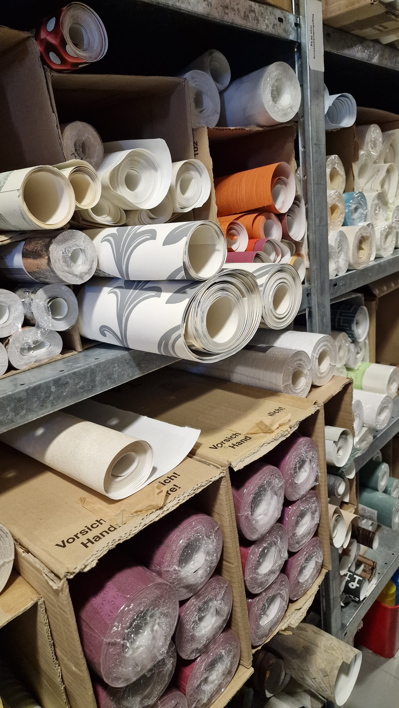
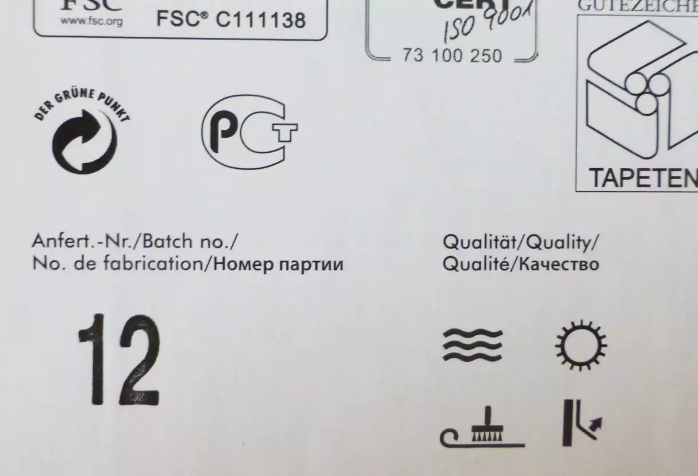

<!--

author:   Hilke Domsch
email:    hilke.domsch@gkz-ev.de
version:  0.0.1
language: de
narrator: Deutsch Female

edit: true
date: 2026-01-19

icon: https://raw.githubusercontent.com/Ifi-DiAgnostiK-Project/LiaScript-Courses/refs/heads/main/img/Logo_234px.png
logo: img/tapete_freepik_logo.png
comment:  Kurs mit den Piktogrammen zur Kennzeichnung von Tapeten im Raumausstatter- und Maler-/Lackiererhandwerk

title: Tapetenzeichen. Kennzeichen & Symbole

link: https://raw.githubusercontent.com/Ifi-DiAgnostiK-Project/LiaScript-Courses/refs/heads/main/courses/style.css

import: https://raw.githubusercontent.com/Ifi-DiAgnostiK-Project/LiaScript_DragAndDrop_Template/refs/heads/main/README.md
        https://raw.githubusercontent.com/Ifi-DiAgnostiK-Project/Piktogramme/refs/heads/main/makros.md
        https://raw.githubusercontent.com/Ifi-DiAgnostiK-Project/Textilpflegesymbole/refs/heads/main/makros.md
        https://raw.githubusercontent.com/Ifi-DiAgnostiK-Project/LiaScript_ImageQuiz/refs/heads/main/README.md
        https://raw.githubusercontent.com/Ifi-DiAgnostiK-Project/Bildersammlung/refs/heads/main/makros.md
        https://raw.githubusercontent.com/Ifi-DiAgnostiK-Project/Tapetensymbole/refs/heads/main/makros.md

tags: [Tapezieren, Tapeten, Maler, Lackierer, Raumausstatter]

-->

# Tapetenzeichen - Kennzeichnung und Symbole 

Während Ihrer Arbeit im Betrieb oder in der überbetrieblichen Ausbildung haben Sie sich mit der Verarbeitung von Tapeten beschäftigt.   Zur Kennzeichnung von Wandbekleidungen gilt die DIN<!-- style="font-weight: bolder; font-size: 12pt; color: green;"--> EN<!-- style="font-weight: bolder; font-size: 12pt; color: green;"--> 235<!-- style="font-weight: bolder; font-size: 12pt; color: green"-->.  

Sie umfasst im Wesentlichen Angaben über

<!-- class="book"-->
- __Waschbarkeit__
- __Lichtbeständigkeit__
- __Muteransatz und Rapport__
- __Verarbeitung__
- __die richtige Methode des Entfernens__

Die nachfolgenden Fragen zeigen Ihnen, ob Sie sicher die verschiedenen Kennzeichen und Symbole für Tapeten kennen.

<!--class="highlight"-->
Viel Erfolg!
------------

   

 

")<!-- style="max-width: 350px; width: 100%" -->

 

## 1. Warum gibt es Tapetenkennzeichen?

<section class="flex-container border">

<!-- class="highlight" -->
Welche Aussagen über Tapetensymbole sind richtig?

><!--style="color: red; font-weight: bolder"-->Es stimmen vier Aussagen!

<!-- data-randomize -->
- [[X]] Die Tapetenkennzeichen informieren über Produkt- und Verarbeitungseigenschaften.
- [[X]] Die Tapetenkennzeichen sind genormt und sehen immer gleich aus.
- [[X]] Die Symbole sind rechtlich geschützt.
- [[X]] Die Tapetensymbole informieren u. a. über spezielle Eigenschaften sowie über den Musteransatz.
- [[ ]] Die Tapetensymbole variieren von Hersteller zu Hersteller.
- [[ ]] Die Kennzeichen bestätigen die Echtheit der Tapete eines Herstellers.
- [[ ]] Die Symbole zeigen an, in welchem Land die Tapete verkauft werden darf.
- [[ ]] Es gibt unterschiedliche Kennzeichnungen in Europa.

<!-- style="max-width: 250px; width: 100%; margin-left: 80px; margin-top:50px;" -->

</section>

## 2. Was sagt eine Anfertigungsnummer aus?

<section class="flex-container border">

<!-- class="highlight" -->
Jede Tapetenrolle ist mit einer Anfertigungsnummer, auch Batch-No. oder Chargennummer genannt, gekennzeichnet.\
Was sagt diese Nummer aus?

><!--style="color: red; font-weight: bolder"-->Es stimmen drei Aussagen!

<!-- data-randomize -->
- [[X]] Sie kennzeichnet die Herstellungscharge der Tapete. 
- [[X]] Eine gleiche Anfertigungsnummer stellt sicher, dass die damit gekennzeichneten Tapetenrollen farb- und mustergleich sind.
- [[X]] Stimmt die Chargennummer nicht überein, sind Farb- oder Musterabweichungen selbst bei gleichen Rollen wahrscheinlich.
- [[ ]] Die Anfertigungsnummer gibt die Haltbarkeit der Tapete an.
- [[ ]] Die Chargennummer zeigt an, wie viele Rollen einer Sorte angefertigt worden sind. 
- [[ ]] Die Anfertigungsnummern werden den Tapetenherstellern vom landeseigenen Tapeten-Institut zugeordnet. 
- [[ ]] Sie beschreibt den Rapport in Zentimetern. 

</section>

 
 

 

<!-- style="max-width: 350px; width: 100%" -->

 

## 3. Tapetensymbole - Wasser und Licht

<section class="flex-container border">

<!-- class="highlight" -->
Welche Symbole geben die Wasser- und Waschbeständigkeit an?\
Ziehen Sie die richtigen Piktogramme ins Antwortfeld.

<!-- data-randomize -->
@dragdropmultiple(@uid,@Pflegeeigenschaft.Wasserbestaendig_bis_zum_Zeitpunkt_der_Verarbeitung.src|@Pflegeeigenschaft.Waschbestaendig.src,@Reinigungssymbole.Professionelle_Reinigung_Grundsymbol.src|@Waschsymbole.Waschen_Grundsymbol.src|@Farbbestaendigkeit_gegen_Licht.Ausgezeichnet_Lichtbestaendig.src)

</section>

<!-- class="highlight" -->
Welche Symbole sagen etwas über die Lichtbeständigkeit aus?\
Ziehen Sie die richtigen Piktogramme ins Antwortfeld.

<!-- data-randomize -->
@dragdropmultiple(@uid,@Farbbestaendigkeit_gegen_Licht.Ausgezeichnet_Lichtbestaendig.src|@Farbbestaendigkeit_gegen_Licht.Befriedigend_Lichtbestaendig.src, @Trocknersymbole.Trocknen_Grundsymbol.src|@Pflegeeigenschaft.Waschbestaendig.src|@Verschiedenes.Dupliert.src)

## 4. Tapetensymbole - Verarbeitung und Entfernen

<section class="flex-container border">

<!-- class="highlight" -->
Welche Symbole geben Hinweise zur Verarbeitung der Tapete?\
Ziehen Sie die richtigen Piktogramme ins Antwortfeld.

<!-- data-randomize -->
@dragdropmultiple(@uid,@Verarbeitung.Wand_einkleistern.src|@Verarbeitung.Vorgekleistert.src|@Verarbeitung.Tapete_einkleistern.src,@Verfahren_fuer_das_Entfernen.Nass_zu_entfernen.src|@Verfahren_fuer_das_Entfernen.Spaltbar_trocken_abziehbar.src|@Verschiedenes.Stossfest.src)

</section>

<!-- class="highlight" -->
Welche Symbole zeigen das Verfahren für das Entfernen der Wandbekleidung an?\
Ziehen Sie die richtigen Piktogramme ins Antwortfeld.

<!-- data-randomize -->
@dragdropmultiple(@uid,@Verfahren_fuer_das_Entfernen.Nass_zu_entfernen.src|@Verfahren_fuer_das_Entfernen.Spaltbar_trocken_abziehbar.src,@Bleichsymbole.Chlor_oder_Sauerstoffbleichen.src|@Verschiedenes.Stossfest.src|@Verarbeitung.Wand_einkleistern.src)

## 5. Tapetensymbole - Musteransatz und Verschiedenes

<section class="flex-container border">

<!-- class="highlight" -->
Es gibt Symbole, welche den Ansatz des Musters beschreiben. Welche sind das?\
Ziehen Sie die richtigen Piktogramme ins Antwortfeld.

<!-- data-randomize -->
@dragdropmultiple(@uid,@Ansatz_des_Musters.Ansatzfrei.src|@Ansatz_des_Musters.Gestuerztes_Kleben.src|@Ansatz_des_Musters.Gerader_Ansatz.src, @Farbbestaendigkeit_gegen_Licht.Befriedigend_Lichtbestaendig.src|@Verschiedenes.Dupliert.src)

</section>

<!-- class="highlight" -->
Welche Symbole gehören nicht in die Kategorien "Wasser & Licht", "Verarbeitung und Entfernen", "Ansatz des Musters?\
Ziehen Sie die Piktogramme, die "Spezialaussagen" liefern, ins Antwortfeld.

<!-- data-randomize -->
@dragdropmultiple(@uid,@Verschiedenes.Dupliert.src|@Verschiedenes.Doppelnahtschnitt.src|@Verschiedenes.Stossfest.src, @Pflegeeigenschaft.Hochscheuerbestaendig.src|@Bleichsymbole.Chlor_oder_Sauerstoffbleichen.src)

## 6. Tapetenkennzeichen - Vermischtes Quiz 1

<section class="flex-container border">

<!-- class="highlight" -->
Was bedeutet dieses Symbol?

<!-- data-randomize -->
- [( )] Die Tapete ist wasserbeständig.
- [(X)] Die Tapete ist ausreichend lichtbeständig.
- [( )] Die Tapete ist gut lichtbeständig.
- [( )] Die Tapete verfügt über versetzte Ansätze. 

@Farbbestaendigkeit_gegen_Licht.Ausreichend_Lichtbestaendig(15)

</section>

<section class="flex-container border">

<!-- class="highlight" -->
Was zeigt Ihnen das Symbol mit mehreren Wasserlinien an?

><!--style="color: red; font-weight: bolder"-->Es sind zwei Antworten richtig!

<!-- data-randomize -->
- [( )] Die Tapete ist wasserbeständig.
- [(X)] Die Tapete ist waschbeständig.
- [(X)] Die Tapete ist hochwaschbeständig.
- [( )] Die Tapete ist nicht lichtbeständig.
- [( )] Die Tapete ist für außen geeignet.
- [( )] Die Tapete ist ansatzfrei.

@Pflegeeigenschaft.Hochwaschbestaendig(15)

</section>

## 7. Tapetenkennzeichen - Vermischtes Quiz 3

<section class="flex-container border">

<!-- class="highlight" -->
Welche Bedeutung hat das Symbol "vorgekleistert"?

<!-- data-randomize -->
- [( )] Der Kleister wird direkt auf die Wand aufgetragen. 
- [(X)] Die Tapete hat schon Kleister auf der Rückseite, der durch Wasser aktiviert wird.
- [( )] Die Tapete eignet sich insbesondere für feuchte Räume.
- [( )] Die Tapete braucht keinen Rapport.
- [( )] Die Tapete lässt sich trocken abziehen.

@Verarbeitung.Vorgekleistert(15)

</section>

<section class="flex-container border">

<!-- class="highlight" -->
Was bedeutet dieses Symbol?

<!-- data-randomize -->
- [( )] Die Tapete lässt sich nass entfernen.
- [(X)] Die Tapete lässt sich ohne Rückstände trocken von der Wand abziehen.
- [( )] Die Tapete hat einen versetzten Ansatz.
- [( )] Die Tapete braucht einen versetzten Ansatz.
- [( )] Die Tapete ist nicht waschbeständig.

@Verfahren_fuer_das_Entfernen.Restlos_trocken_abziehbar(15)

</section>

## 8. Tapetenkennzeichen - Zuordnungsaufgabe

<section class="flex-container border">

<!-- class="highlight" style="margin-bottom:40px;"-->
Ordnen Sie den richtigen Begriff dem leeren Textfeld zu, um die Aussage passend zu vervollständigen.

<!-- data-randomize -->
[->[ (Tapetensymbole) | Die Chargennummern]] ermöglichen eine schnelle Orientierung zu Verarbeitung und Pflege einer Tapete.

------------------------------------------

 

<!-- data-randomize -->
Die Chargennummer wird auch [->[ (Anfertigungsnummer) | Tapetennummer ]] genannt.  und kennzeichnet die [->[ (Herstellungsserie) | Produktionszahl ]].

------------------------------------------

 

<!-- data-randomize -->
Die Anfertigungsnummer kennzeichnet die [->[ (Herstellungsserie) | Produktionszahl ]] einer Tapete.

</section>

   

 

<!-- style="max-width: 550px; width: 100%" -->

 

## Geschafft 🎉

