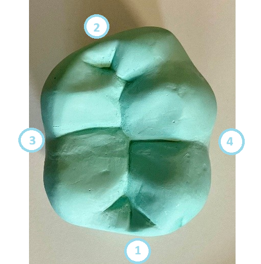
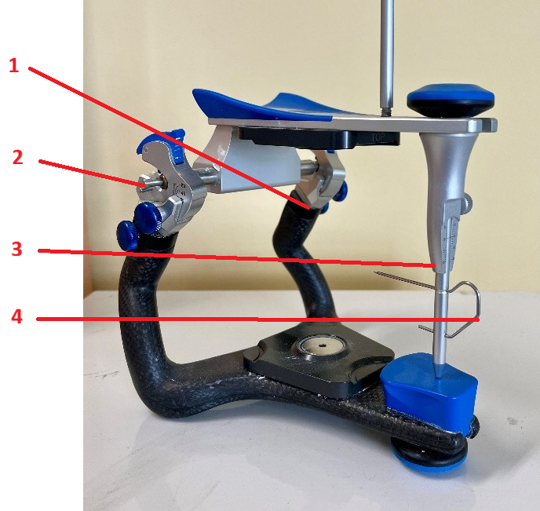
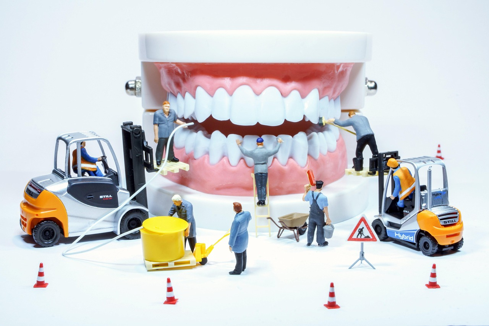

<!--

author: Hilke Domsch; Alexander Meiwald

email:    hilke.domsch@gkz-ev.de

version: 0.0.1

language: de

narrator: Deutsch Female

edit: true
date: 2025-10-06
icon: https://raw.githubusercontent.com/Ifi-DiAgnostiK-Project/LiaScript-Courses/refs/heads/main/img/Logo_234px.png
logo: img/point_to_teeth.jpg
attribute: https://unsplash.com/de/fotos/ein-mann-und-eine-frau-mit-einem-touchscreen-gerat-Bd0RmCsJOCc 

comment:  G-ZAHN 23 Arbeitsunterlagen und zahntechnische Vorprodukte erstellen

link: https://raw.githubusercontent.com/Ifi-DiAgnostiK-Project/LiaScript-Courses/refs/heads/main/courses/style.css

import: https://raw.githubusercontent.com/Ifi-DiAgnostiK-Project/LiaScript_DragAndDrop_Template/refs/heads/main/README.md
        https://raw.githubusercontent.com/Ifi-DiAgnostiK-Project/Piktogramme/refs/heads/main/makros.md
        https://raw.githubusercontent.com/Ifi-DiAgnostiK-Project/Textilpflegesymbole/refs/heads/main/makros.md
        https://raw.githubusercontent.com/Ifi-DiAgnostiK-Project/LiaScript_ImageQuiz/refs/heads/main/README.md
        https://raw.githubusercontent.com/Ifi-DiAgnostiK-Project/Bildersammlung/refs/heads/main/makros.md

title: Grundkurs ZAHN 23: Krone / CAD-Schiene

tags:
    - Zahntechniker
    - Zahnersatz
    - Prothese
    - Zahnprothese
    - Krone
    - CAD-Schiene

@style
.flex-container {
    display: flex;
    flex-wrap: wrap; /* Allows the items to wrap as needed */
    align-items: stretch;
    gap: 20px; /* Adds both horizontal and vertical spacing between items */
}

.flex-child { 
    flex: 1;
    margin-right: 20px; /* Adds space between the columns */
}

@media (max-width: 600px) {
    .flex-child {
        flex: 100%; /* Makes the child divs take up the full width on slim devices */
        margin-right: 0; /* Removes the right margin */
    }
}

.image-container {
  width: 200px;
  height: 200px;
  border: 1px solid #ccc;
  display: flex;
  justify-content: center;
  align-items: center;
  overflow: hidden;
  background-color: #f8f8f8;
}

.image-container img {
  width: fit-content;
  height: fit-content;
  object-fit: cover;
  display: block;
}

@end

-->

# Kurs G-ZAHN 23: Krone / CAD-Schiene

Sie haben in den letzten Tagen verschiedene Fachbegriffe aus der Morphologie der Zähne wiederholt, den Umgang mit einem Artikulator geübt sowie mittels CAD eine Schiene konstruiert.      __Überprüfen Sie Ihr Wissen.__

<!-- class="highlight" -->
Wir wünschen Ihnen viel Erfolg und Spaß beim Beantworten der Fragen! 

 

")<!-- style="width: 400px" -->

 

## 1. Topografie des Zahnes 

<section class="flex-container border">

<!-- class="highlight"-->
Ordnen Sie den Zahlen 1 - 4 im Bild den jeweils richtigen Fachbegriff zu.  

 

<!-- data-randomize -->
1<!--style="color: green; font-weight: bolder"-->  =  [[palatinal | (mesial)   | distal  |   bukkal]]

 

<!-- data-randomize -->
2<!--style="color: green; font-weight: bolder"-->  =  [[palatinal | mesial   |  (distal)  |   bukkal]]

 

<!-- data-randomize -->
3<!--style="color: green; font-weight: bolder"-->  =  [[ (palatinal) | mesial   | distal  |   bukkal]]

 

<!-- data-randomize -->
4<!--style="color: green; font-weight: bolder"-->  =  [[palatinal | mesial   | distal  |   (bukkal) ]]

<!-- style="max-width: 350px; width: 100%" -->

</section>

## 2. Der Artikulator

<section class="flex-container border">

<!-- class="highlight"-->
Ziehen Sie die jeweils richtige Antwort in das entsprechende Feld.

<!-- data-randomize -->
Die Zahl 1<!--style="color: red; font-weight: bolder"--> bezeichnet [->[  (den Bennetwinkel) | die Kondylführung ]].
 
Die Zahl 2<!--style="color: red; font-weight: bolder"--> meint  [->[  (die Kondylartrommel) | die Fixierschraube ]].

------------

<!-- data-randomize -->
Die Zahl 3<!--style="color: red; font-weight: bolder"--> zeigt zum [->[  (Stützstift) | Quersteg]].   
Die Zahl 4<!--style="color: red; font-weight: bolder"--> bezeichnet den [->[  (Inzisalzeiger) | Inzisalstift ]].

<!-- style="max-width: 350px; width: 100%" -->

</section>

## 3. Die Kauebene

<section class="flex-container border">

<!-- class="highlight"-->
Welche Begriffe werden synonym für "Kauebene" verwendet?

<!--style="color: red"-->Es sind mehrere Antworten möglich.

<!-- data-randomize -->
- [[X]] Okklusionsebene
- [[X]] Bissebene
- [[ ]] Campersche Ebene
- [[ ]] Inzisalebene
- [[ ]] Kauachse

</section>

 

<!-- style="width: 400px" -->

 

## 4. CAD und CAM

<!--style="color: blue; font-weight: bolder"-->Ziehen Sie die jeweils richtige Antwort in das entsprechende Feld.

<section class="flex-container border">

<!-- data-randomize -->
Mittels CAD<!--style="color: green; font-weight: bolder"--> erfolgt die [->[  (digitale Konstruktion) | automatisierte Fertigung ]] von Objekten. 

</section>

<section class="flex-container border">

<!-- data-randomize -->
Mit Hilfe von CAM<!--style="color: green; font-weight: bolder"--> erfolgt die [->[  (maschinelle Fertigung) | digitale Planung und Gestaltung ]] des Zahnersatzes.

</section>

<section class="flex-container border">

<!-- class="highlight"-->
Die Abkürzung CAD steht für...

<!-- data-randomize -->
- [( )] Computer Assisted Dentistry
- [(X)] Computer Aided Design
- [( )] Computer Automatic Drafting
- [( )] Computer Artifical Design

</section>

<section class="flex-container border">

<!-- class="highlight"-->
Die Abkürzung CAM steht für...

<!-- data-randomize -->
- [( )] Computer Animated Modeling
- [(X)] Computer Aided Manufacturing
- [( )] Computer Adjustment Mechanism
- [( )] Computer Assisted Milling

</section>

## 5. Mindestabstand Schiene - Parodontium

<section class="flex-container border">

<!-- class="highlight"-->
Wie groß sollte der Mindestabstand einer digital konstruierten Schiene zum marginalen Parodontium sein?

<!-- data-randomize -->
- [( )] 0,5 mm
- [(X)] 1 mm
- [( )] 1,5 mm
- [( )] 2 mm

</section>

 

<!-- style="max-width: 200px; width: 100%" -->

## Super gemacht! 🙌

