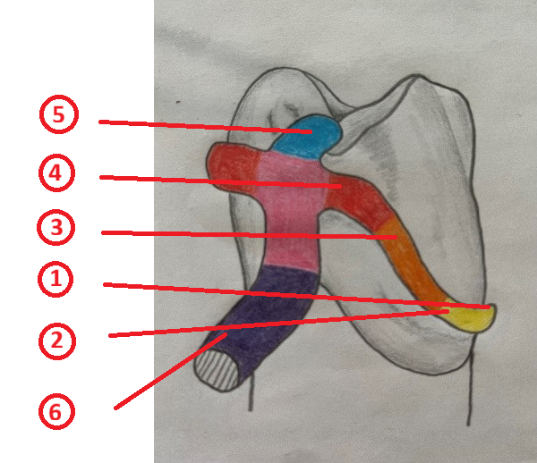
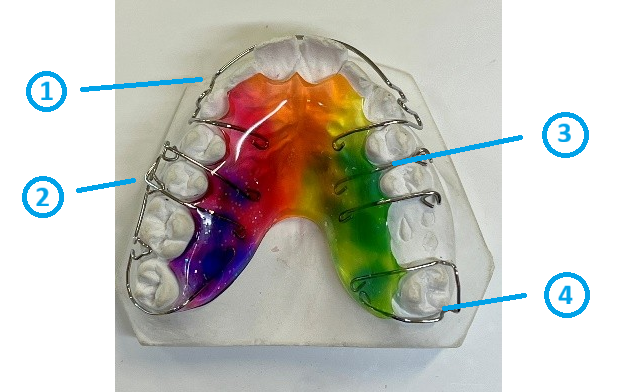

<!--

author: Hilke Domsch; Alexander Meiwald

email:    hilke.domsch@gkz-ev.de

version: 0.0.5

language: de

narrator: Deutsch Male

edit: true
date: 2025-10-13
icon: https://raw.githubusercontent.com/Ifi-DiAgnostiK-Project/LiaScript-Courses/refs/heads/main/img/Logo_234px.png
logo: img/bracket_closeup.jpg

attribute: image by pixabay https://pixabay.com/de/photos/zahnarzt-kieferorthop%C3%A4die-542252/

comment:  ZAHN 1-23 Kieferorthopädische Geräte und temporäre Interimsprothesen herstellen

link: https://raw.githubusercontent.com/Ifi-DiAgnostiK-Project/LiaScript-Courses/refs/heads/main/courses/style.css

import: https://raw.githubusercontent.com/Ifi-DiAgnostiK-Project/LiaScript_DragAndDrop_Template/refs/heads/main/README.md
        https://raw.githubusercontent.com/Ifi-DiAgnostiK-Project/Piktogramme/refs/heads/main/makros.md
        https://raw.githubusercontent.com/Ifi-DiAgnostiK-Project/Textilpflegesymbole/refs/heads/main/makros.md
        https://raw.githubusercontent.com/Ifi-DiAgnostiK-Project/LiaScript_ImageQuiz/refs/heads/main/README.md
        https://raw.githubusercontent.com/Ifi-DiAgnostiK-Project/Bildersammlung/refs/heads/main/makros.md

title: ZAHN 1-23: Kieferorthopäische Geräte und temporäre Interimsprothesen

tags: [ Zahntechniker, Kieferorthopädie, Zahnersatz, Zahnklammer, Zahnprothese ]

-->

# Kurs ZAHN 1-23: Kieferorthopädische Geräte und temporäre Interimsprothesen

Sie haben in den letzten Tagen verschiedene fachpraktische Tätigkeiten aus dem Bereich der zahntechnischen Kieferorthopädie durchgeführt.      __Überprüfen Sie Ihr Wissen.__

<!-- class="highlight" -->
Wir wünschen Ihnen viel Erfolg beim Beantworten der Fragen! 

 

")<!-- style="width: 400px" -->

 

## 1. Typische Klammerarten in der Zahntechnik

<section class="flex-container border">

<!-- class="highlight"-->
Welche Klammertypen sind in der Zahntechnik üblich?

<!--style="color: red"-->Es sind mehrere Antworten möglich.

<!-- data-randomize -->
- [[X]] Adamsklammer
- [[X]] Ösen- oder Dreiecksklammer
- [[X]] Pfeilklammer
- [[ ]] Brückenklammer
- [[ ]] Inlayklammer
- [[ ]] Fixierbügel

</section>

<section class="flex-container border">

<!-- class="highlight"-->
Welche der genannten Klammern ist kein Halte- und Stützelement?

<!-- data-randomize -->
- [( )] G-Klammer
- [(X)] C-Klammer
- [( )] L-Klammer um Überwurf
- [( )] E-Klammer

</section>

<section class="flex-container border">

<!-- class="highlight"-->
Die verschiedenen Bestandteile einer gebogenen Klammer erfüllen jeweils eine bestimmte Funktion.\
Welche Aussage ist richtig?

<!--style="color: red"-->Es sind mehrere Antworten möglich.

<!-- data-randomize -->
- [[X]] Die Auflage dient der Stabilisierung und Kraftübertragung.
- [[X]] Die Klammerschulter gibt Form und Richtung vor.
- [[X]] Die Klammerspitze sorg für die sichere Fixierung am Zahn.
- [[ ]] Der Klammerunterarm ist als reines Deko-Element integriert.
- [[ ]] Der Appendix erzeugt Druck auf das Zahnfleich für Zahnbewegungen. 
- [[ ]] Die Klammerschulter entfernt aktiv Plaque. 

</section>

## 2. Die Bestandteile einer gebogenen Klammer

<section class="flex-container border">

<!-- class="highlight"-->
Ordnen Sie den Zahlen 1 - 6 im Bild den jeweils richtigen Fachbegriff zu.  

 

<!-- data-randomize -->
1<!--style="color: red; font-weight: bolder"-->  =  [[ Klammerunterarm | (Klammerspitze)   | Klammeroberarm  |   Klammerschulter |  Appendix  |  Auflage ]]

 

<!-- data-randomize -->
2<!--style="color: red; font-weight: bolder"-->  =  [[ (Klammerunterarm) | Klammerspitze   | Klammeroberarm  |     Klammerschulter |  Appendix  |  Auflage ]]

 

<!-- data-randomize -->
3<!--style="color: red; font-weight: bolder"-->  =  [[Klammerunterarm | Klammerspitze  | (Klammeroberarm)  |      Klammerschulter |  Appendix  |  Auflage ]]

 

<!-- data-randomize -->
4<!--style="color: red; font-weight: bolder"-->  =  [[Klammerunterarm | Klammerspitze   | Klammeroberarm  |     (Klammerschulter) |  Appendix  |  Auflage ]]

<!-- data-randomize -->
5<!--style="color: red; font-weight: bolder"-->  =  [[Klammerunterarm | Klammerspitze   | Klammeroberarm  |     Klammerschulter |  Appendix  |  (Auflage) ]]

<!-- data-randomize -->
6<!--style="color: red; font-weight: bolder"-->  =  [[Klammerunterarm | Klammerspitze   | Klammeroberarm  |     Klammerschulter |  (Appendix)  |  Auflage ]]

<!-- style="max-width: 350px; width: 100%" -->

</section>

## 3. Die Teile einer aktiven Platte

<section class="flex-container border">

<!-- class="highlight"-->
Ordnen Sie den Zahlen 1 - 4 im Bild den jeweils richtigen Fachbegriff zu.  

 

<!-- data-randomize -->
1<!--style="color: blue; font-weight: bolder"-->  =  [[ Dreiecksklammer | (Labialbogen)   | Pfeilklammer  |   Adamsklammer ]]

 

<!-- data-randomize -->
2<!--style="color: blue; font-weight: bolder"-->  =  [[ Dreiecksklammer | Labialbogen   |  (Pfeilklammer)  |   Adamsklammer ]]

 

<!-- data-randomize -->
3<!--style="color: blue; font-weight: bolder"-->  =  [[ (Dreiecksklammer) | Labialbogen   | Pfeilklammer  |   Adamsklammer ]]

 

<!-- data-randomize -->
4<!--style="color: blue; font-weight: bolder"-->  =  [[ Dreiecksklammer | Labialbogen   | Pfeilklammer  |   (Adamsklammer) ]]

<!-- style="max-width: 350px; width: 100%" -->

</section>

<section class="flex-container border">

<!-- class="highlight"-->
Welche Aussagen zu den einzelnen Elementen der abnehmbaren kieferorthopädischen Platte sind richtig? 

<!--style="color: red"-->Es sind mehrere Antworten möglich.

<!-- data-randomize -->
- [[X]] Der Labialbogen dient der Zahnführung und Stabilisierung.
- [[X]] Die Adamsklammer bewirkt eine stabile Verankerung an den Molaren.
- [[X]] Die Pfeilklammer dient der Führung und Fixierung einzelner Zähne.
- [[ ]] Die Dreiecksklammer ist ein reines Stützelement.
- [[ ]] Die Adamsklammer löst gezielt die Gaumennaht auf. 
- [[ ]] Der Labialbogen sorgt für die Verbesserung der Kiefergelenksfunktion.

</section>

## 4. Die Herstellung einer aktiven Platte

<section class="flex-container border">

<!-- class="highlight"-->
In welcher Reihenfolge führen Sie die Herstellung einer aktiven Platte korrekt aus?\
Ziehen Sie die einzelnen Arbeitsschritte in die richtige Reihenfolge.\
An oberster Stelle seht der erste Arbeitsschritt.

<!-- data-randomize -->
@dragdroporder(@uid,Modelltradierung|Halteelemente biegen|Dehnschraube platzieren|Halteelemente am Modell fixieren|Modell wässern und isolieren|Kunststoff streuen|Polymerisieren|Ausarbeiten der Platte|Politur und Fertigstellung)

<!-- style="max-width: 200px; width: 100%" -->

</section>

## 5. Sofortprothese / Interimsprothese

<section class="flex-container border">

<!-- class="highlight"-->
Welche Aussagen treffen auf Interimsprothesen (Sofortprothesen) zu? 

<!--style="color: red"-->Es sind mehrere Antworten möglich.

<!-- data-randomize -->
- [[X]] Wundverschluss nach Exraktion
- [[X]] Erhalt der Sprachfunktion
- [[X]] Erhalt der Bisshöhe
- [[X]] ästhetischer Ersatz
- [[ ]] dauerhafte Stabilisierung der Kieferknochen nach Extraktion
- [[ ]] Förderung der Osseointegraton für Zahnimplanttate
- [[ ]] langfristige Druckverteilung und Vermeidung von Knochenabbau

</section>

 

<!-- style="max-width: 350px; width: 100%" -->

## Super gemacht! 🙌

