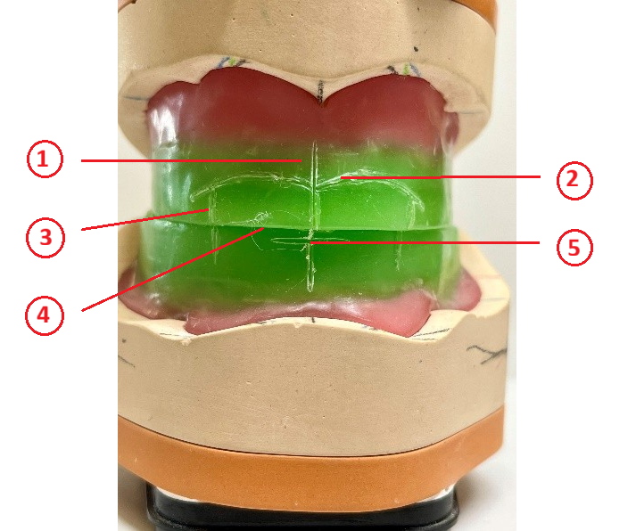
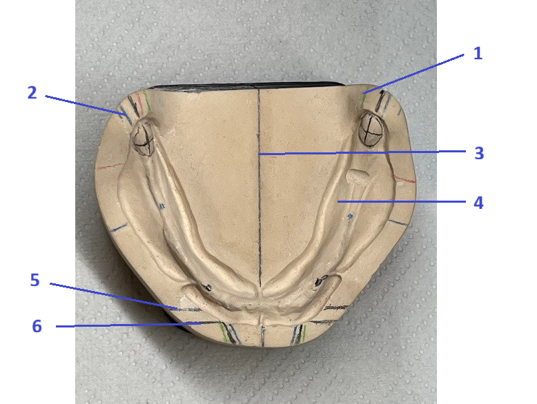

<!--

author: Hilke Domsch; Alexander Meiwald

email:    hilke.domsch@gkz-ev.de

version: 0.0.8

language: de

narrator: Deutsch Male

edit: true
date: 2025-10-14
icon: https://raw.githubusercontent.com/Ifi-DiAgnostiK-Project/LiaScript-Courses/refs/heads/main/img/Logo_234px.png
logo: img/orthodontic.jpg

attribute: https://pixabay.com/photos/orthodontic-aids-mouth-guard-315784/

comment:  ZAHN 3-23 Totalen Zahnersatz nach System herstellen

link: https://raw.githubusercontent.com/Ifi-DiAgnostiK-Project/LiaScript-Courses/refs/heads/main/courses/style.css

import: https://raw.githubusercontent.com/Ifi-DiAgnostiK-Project/LiaScript_DragAndDrop_Template/refs/heads/main/README.md
        https://raw.githubusercontent.com/Ifi-DiAgnostiK-Project/Piktogramme/refs/heads/main/makros.md
        https://raw.githubusercontent.com/Ifi-DiAgnostiK-Project/Textilpflegesymbole/refs/heads/main/makros.md
        https://raw.githubusercontent.com/Ifi-DiAgnostiK-Project/LiaScript_ImageQuiz/refs/heads/main/README.md
        https://raw.githubusercontent.com/Ifi-DiAgnostiK-Project/Bildersammlung/refs/heads/main/makros.md

title: ZAHN 3-23 - Herstellen eines totalen Zahnersatzes nach System

tags:
    - Zahntechniker
    - Zahnersatz
    - Kieferorthopädie
    - Zahnklammer
    - Zahnprothese

-->

# ZAHN 3-23: Herstellen eines totalen Zahnersatzes nach System

Sie haben in den letzten Tagen verschiedene fachpraktische Tätigkeiten zum Herstellen einer Vollprothese durchgeführt.      __Überprüfen Sie Ihr Wissen.__

<!-- class="highlight" -->
Wir wünschen Ihnen viel Erfolg beim Beantworten der Fragen! 

   

")<!-- style="width: 500px" -->

 

## 1. Die Bissschablone

<section class="flex-container border">

<!-- class="highlight"-->
Ordnen Sie den Zahlen 1 - 5 im Bild den jeweils richtigen Fachbegriff zu.  

 

<!-- data-randomize -->
1<!--style="color: red; font-weight: bolder"-->  =  [[ Okklusionsebene/Lippenschlusslinie | (Gesichtsmitte)   | Eckzahnpunkte  |   Schneidezahnlinie |  Lachlinie ]]

 

<!-- data-randomize -->
2<!--style="color: red; font-weight: bolder"-->  =  [[ Okklusionsebene/Lippenschlusslinie | Gesichtsmitte   | Eckzahnpunkte  |   Schneidezahnlinie |  (Lachlinie) ]]

 

<!-- data-randomize -->
3<!--style="color: red; font-weight: bolder"-->  =  [[Okklusionsebene/Lippenschlusslinie | Gesichtsmitte   | (Eckzahnpunkte)  |   Schneidezahnlinie |  Lachlinie ]]
 

<!-- data-randomize -->
4<!--style="color: red; font-weight: bolder"-->  =  [[ (Okklusionsebene/Lippenschlusslinie) | Gesichtsmitte   | Eckzahnpunkte  |   Schneidezahnlinie |  Lachlinie ]]

<!-- data-randomize -->
5<!--style="color: red; font-weight: bolder"-->  =  [[Okklusionsebene/Lippenschlusslinie | Gesichtsmitte   | Eckzahnpunkte  |   (Schneidezahnlinie) |  Lachlinie ]]

<!-- style="max-width: 350px; width: 100%" -->

</section>

## 2. Die Camper'sche Ebene

<section class="flex-container border">

<!-- class="highlight"-->
Welche Aussage zur Anatomie und räumlichen Orentierung der Camper'schen Ebene trifft zu?\
Wie heißen der Anfangs- und Endpunkt richtig?

<!-- data-randomize -->
- [( )] Tragus -- Orbitalpunkt
- [(X)] Tragus -- Subnasalpunkt
- [( )] Inzisalpunkt -- disto-bukkaler Höcker
- [( )] Tragus -- Spina nasalis anterior

</section>

<section class="flex-container border">

<!-- class="highlight"-->
Welche Funktion hat der Camper'sche Ebene bei der Herstellung einer Vollprothese?

<!--style="color: red"-->Es sind mehrere Antworten möglich.

<!-- data-randomize -->
- [[X]] Sie dient als Orientierungshilfe zur Bestimmung der Okklusionsebene.
- [[X]] Sie sorgt für eine harmonische Ästhetik und Lautbildung.
- [[ ]] Sie gibt die Lage der Kauebene im Unterkiefer exakt anatomisch vor.
- [[ ]] Sie wird zur Bestimmung der Zahnfarben verwendet.
- [[ ]] Sie ersetzt die Kauebene im Artikulator vollständig. 

<!-- style="max-width: 250px; width: 100%" -->

</section>

<section class="flex-container border">

<!-- class="highlight"-->
Wie wird die Camper'sche Ebene in der Praxis überprüft oder eingestellt?

<!--style="color: red"-->Es sind mehrere Antworten möglich.

<!-- data-randomize -->
- [[X]] Mit Hilfe des Gesichtsbogens oder einer Fox-Ebene.
- [[X]] Durch Sichtkontrolle, dass die Okklusionsebene parallel zur Camper'schen Ebene verläuft. 
- [[ ]] Durch Anzeichnen der Ebene auf dem Modellgips mit einem Zirkel.
- [[ ]] Sie wird ausschließlich im Artikulator eingestellt. 
- [[ ]] Sie orientiert sich parallel zur Pupillenlinie. 

</section>

## 3. Die Ruheschwebelage

<section class="flex-container border">

<!-- class="highlight"-->
Was versteht man unter der Ruheschwebelage (auch "Ruhelage" oder "physiologische Ruheposition") in der Zahntechnik?\
Welche Aussagen sind richtig? 

<!--style="color: red"-->Es sind mehrere Antworten möglich.

<!-- data-randomize -->
- [[X]] Eine Position des Unterkiefers, in der die Kaumuskulatur entspannt ist.
- [[X]] Zwischen den Zahnreihen besteht ein kleiner Abstand (ca. 3 mm).
- [[X]] Sie ist eine individuelle, muskelgeführte Position des Unterkiefers ohne Zahnkontakt.
- [[ ]] Die Zähne stehen in maximalem Vielpunktkontakt (Okklusion).
- [[ ]] Sie entspricht der Zentrik des Kiefergelenks.
- [[ ]] Sie beschreibt die Kaubewegung beim Schlucken.

</section>

<section class="flex-container border">

<!-- class="highlight"-->
Ordnen Sie die richtigen Begriffe den Aussagen zu!

<!-- data-randomize -->
Die Ruheschwebelage ist eine [->[ (muskulär) | aktiv ]] bestimmte Lage des [->[ (Oberkiefers) | Unterkiefers ]].

<!-- data-randomize -->
Sie ist [->[ identisch | (nicht identisch) ]] mit der Zentrik. Sie wird genutzt, um die [->[ (Bisshöhe) | Kaubewegung ]] bei der Herstellung von Vollprothesen festzustellen. 

</section>

<section class="flex-container border">

<!-- class="highlight"-->
Wie kann die Ruheschwebelage in der Praxis bestimmt oder überprüft werden?

<!--style="color: red"-->Es sind mehrere Antworten möglich.

<!-- data-randomize -->
- [[X]] Durch Beobachtung der Unterkieferposition beim entspannten Sprechen („M“-Laut-Methode).  
- [[X]] Indem der Patient einige Male schluckt und anschließend locker die Lippen schließt. 
- [[X]] Durch Messung des Abstands zwischen zwei Referenzpunkten (z. B. Nasenspitze und Kinn) in Ruhe. 
- [[ ]] Durch Zusammenbeißen in maximaler Interkuspidation. 
- [[ ]] Durch manuelles Vorschieben des Unterkiefers in die Protrusion.
- [[ ]] Mit einer Gesichtsbogenübertragung allein, ohne Patientenbeteiligung. 
- [[X]] Durch wiederholte Entspannungsübungen, um die natürliche Ruhesituation zu erfassen. 

</section>

## 4. Die Stützstiftregistrierung

<section class="flex-container border">

<!-- class="highlight"-->
Wann wird die Stützstiftregistrierung eingesetzt?\
Ordnen Sie die richtigen Begriffe den Aussagen zu!

<!-- data-randomize -->
Die Methode wird besonders bei [->[ (zahnlosen) | vollbezahnten ]] Patienten eingesetzt, um die  [->[ (zentrische) | okkulare ]] Kieferrelation zu bestimmen.

<!-- data-randomize -->
Sie gehört zu einer [->[ enddiagnostischen | (funktionsdiagnostischen) ]] Untersuchung  [->[ (vor) | nach ]] der Herstellung von Vollprothesen. 

</section>

<section class="flex-container border">

<!-- class="highlight"-->
Welche Werte können aus einer Stützregistrierung ermittelt werden?

<!--style="color: red"-->Es sind mehrere Antworten möglich.

<!-- data-randomize -->
- [[X]] die zentrale Relation des Unterkiefers zum Oberkiefer
- [[X]] die individuellen Bewegungen des Unterkiefers
- [[X]] die Bisshöhe
- [[ ]] die Farbbestimmung für die Prothese 
- [[ ]] die Abdrucknahme der Kieferverhältnisse
- [[ ]] die Position der Kondylen in maximaler Interkuspidation

<!-- style="max-width: 200px; width: 100%" -->

</section>

<section class="flex-container border">

<!-- class="highlight"-->
Was entsteht während der Stützstiftregistrierung bei den Unterkieferbewegungen?

<!--style="color: red"-->Es sind mehrere Antworten möglich.

<!-- data-randomize -->
- [[X]] Eine grafische Darstellung der Kieferbewegungen, meist in Form eines Dreiecks.   
- [[X]] Ein sogenanntes „Gothisches Bogenbild“. 
- [[ ]] Eine Aufnahme der Zahnkontakte in Zentrik. 
- [[ ]] Ein dreidimensionales Röntgenbild. 
- [[X]] Eine Linie, die die Bewegungsrichtung des Kondylus zeigt. 
- [[ ]] Das "Gothische Bogenbild" entsteht durch Bewegungen der Kaumuskulator beim Sprechen.

</section>

## 5. Die Modellanalyse

<section class="flex-container border">

<!-- class="highlight"-->
Ordnen Sie den Zahlen 1 - 6 im Bild den jeweils richtigen Fachbegriff zu.  

 

<!-- data-randomize -->
1<!--style="color: red; font-weight: bolder"-->  =  [[ Außenkorrektur | (Innenkorrektur)   | Frontale Kieferkammmitte  |   Modellmitte |  Mitte der Umschlagfalte  |  6er-Position ]]

 

<!-- data-randomize -->
2<!--style="color: red; font-weight: bolder"-->  =  [[ (Außenkorrektur) | Innenkorrektur   | Frontale Kieferkammmitte  |   Modellmitte |  Mitte der Umschlagfalte  |  6er-Position ]]

 

<!-- data-randomize -->
3<!--style="color: red; font-weight: bolder"-->  =  [[ Außenkorrektur | Innenkorrektur   | Frontale Kieferkammmitte  |   (Modellmitte) |  Mitte der Umschlagfalte  |  6er-Position ]]

 

<!-- data-randomize -->
4<!--style="color: red; font-weight: bolder"-->  =  [[ Außenkorrektur | Innenkorrektur   | Frontale Kieferkammmitte  |   Modellmitte |  Mitte der Umschlagfalte  |  (6er-Position) ]]

<!-- data-randomize -->
5<!--style="color: red; font-weight: bolder"-->  =  [[ Außenkorrektur | Innenkorrektur   | (Frontale Kieferkammmitte)  |   Modellmitte |  Mitte der Umschlagfalte  |  6er-Position ]]

<!-- data-randomize -->
6<!--style="color: red; font-weight: bolder"-->  =  [[ Außenkorrektur | Innenkorrektur   | Frontale Kieferkammmitte  |   Modellmitte |  (Mitte der Umschlagfalte)  |  6er-Position ]]

<!-- style="max-width: 350px; width: 100%" -->

</section>

## Super gemacht! 🙌

